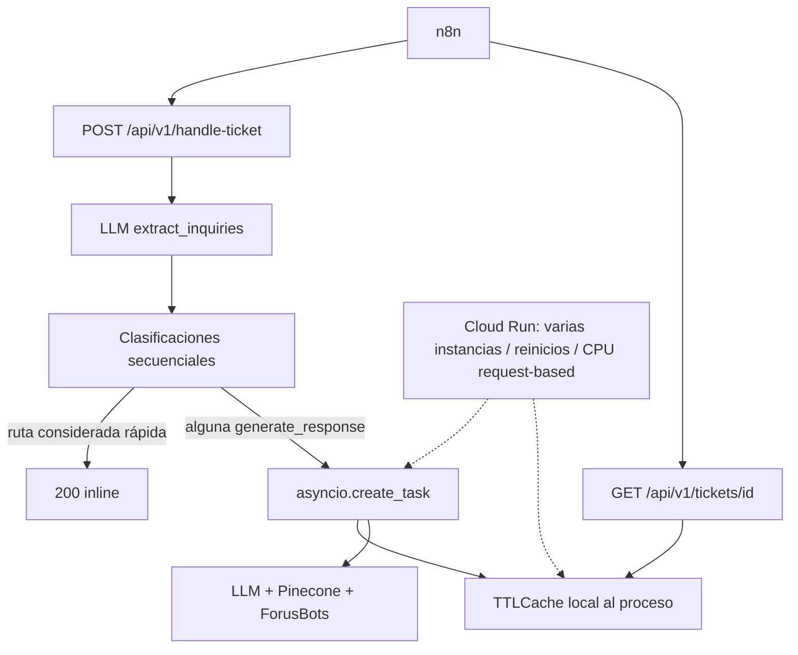
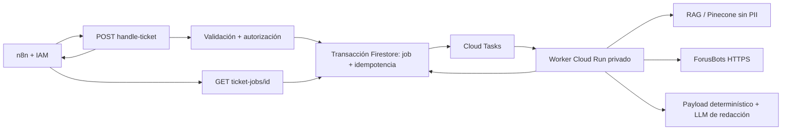

# Handle Ticket Hardening Implementation Plan

> **Para Fable:** REQUIRED SUB-SKILL: usar `.agents/skills/executing-plans` y ejecutar este plan tarea por tarea, con revisión entre fases. Aplicar TDD: escribir primero cada regresión, comprobar que falla por la causa esperada, implementar el cambio mínimo y volver a ejecutar la suite completa.

**Goal:** convertir `POST /api/v1/handle-ticket` y su polling en un flujo durable, seguro, idempotente y observable para n8n, sin permitir que datos no confiables o salidas de LLM alteren datos financieros, controles operativos o permisos.

**Architecture:** el `POST` debe autenticar, autorizar, validar y reservar idempotencia antes de cualquier LLM. El trabajo aceptado se ejecutará mediante una cola durable y sus estados/resultados se guardarán en un repositorio compartido; ningún `202` dependerá de memoria o tareas locales de una instancia Cloud Run. Los LLM podrán clasificar o redactar, pero no controlar IDs, módulos, límites, estados ni hechos obtenidos de ForusBots.

**Tech Stack:** Python 3.12, FastAPI, Pydantic V2, asyncio/httpx, Cloud Run, Cloud Tasks, Firestore, Pinecone, OpenAI/Gemini, pytest.

---

## 1. Estado de la auditoría

- Fecha: **2026-07-10**.
- Commit inspeccionado: `66f8350` (`main`).
- Alcance: `POST /api/v1/handle-ticket`, `GET /api/v1/tickets/{ticket_job_id}`, orquestador, ForusBots, RAG/Pinecone, modelos, middleware, jobs, despliegue, documentación y pruebas.
- No se modificó la implementación durante la auditoría.
- El único archivo creado por la auditoría es este plan.
- El worktree ya contenía cambios del usuario; no deben descartarse ni mezclarse con esta remediación.

### Evidencia ejecutada

Desde `kb-rag-system/`:

```text
./venv/bin/pytest -q tests/test_handle_ticket_endpoint.py
12 passed, 2 warnings

./venv/bin/pytest -q
377 passed, 1 failed, 2 skipped
```

La falla existente afecta al handler:

```text
test_must_have_profile_points_are_scrapeable_or_request_provided
first_contribution_posted_status
```

También se ejecutaron reproducciones aisladas que confirmaron:

```text
misma Idempotency-Key concurrente       -> 2 ticket_job_id distintos
misma key con payload de otro usuario   -> reutiliza el job anterior
ruta inline con misma key               -> ejecuta dos veces
scrape_status=partial                    -> job_state=succeeded
timeout de una inquiry                   -> pierde outcomes previos y dice timeout total
cancelar un waiter ForusBots compartido  -> cancela a ambos waiters
email_body de 1 MB                       -> aceptado
Idempotency-Key de 1 MB                  -> aceptada
setting disabled + request mode=full     -> el request se procesa
request max_response_tokens=500          -> downstream recibe 5500
total real=1                             -> LLM puede cambiarlo a 99
ForusBots balance=123                    -> LLM puede cambiarlo a 999999
OpenAPI POST security                    -> None
```

### Límites de esta auditoría

- No existe en el repositorio un export sanitizado del workflow real de n8n; el contrato consumidor no pudo verificarse contra el workflow efectivo.
- No se ejecutó un scrape real de ForusBots; el test live está opt-in y sólo prueba health.
- No se pudo leer la configuración desplegada de Cloud Run porque las credenciales locales de `gcloud` requieren reautenticación. La guía del repositorio documenta 0–5 instancias, 80 requests por instancia y timeout de 300 s.
- `pip-audit` y `bandit` no están instalados; no debe interpretarse esta auditoría como un dictamen de cero CVEs.

---

## 2. Flujo actual y causa raíz arquitectónica



El comentario de `Dockerfile:44-47` asume que `--workers 1` hace seguro el store local. Eso sólo limita procesos dentro de **una** instancia. No evita que Cloud Run cree otra instancia, termine una instancia, despliegue una revisión nueva o enrute el poll a otro contenedor. Además, `scripts/start_api.sh:54-61` todavía inicia cuatro workers.

Por tanto, el defecto principal no es un caso borde del `TTLCache`: el contrato `202 + polling` está construido sobre estado y ejecución efímeros. Debe corregirse la arquitectura antes de seguir afinando el store actual.

---

## 3. Límites de confianza e invariantes obligatorios

### Actores y datos

- El participante controla `email_subject`, `email_body` y, si se conserva, `ticket_messages`.
- n8n es un caller de máquina confiable, pero puede reintentar, duplicar, llegar concurrentemente o enviar payloads incompletos.
- Los IDs de participante/plan son sensibles y deben provenir de una fuente confiable, no del texto del ticket.
- OpenAI/Gemini, Pinecone y ForusBots son dependencias externas: pueden fallar, responder tarde, cambiar de schema o devolver datos inesperados.
- Cloud Run es multi-instancia y efímero.
- La salida puede terminar enviada automáticamente al participante; una respuesta técnica de fallback nunca debe parecer una respuesta válida de negocio.

### Invariantes que Fable debe convertir en tests

1. Todo `202` corresponde a un job durable y recuperable desde cualquier instancia.
2. Una key idempotente produce como máximo una ejecución lógica por principal y payload.
3. La misma key con otro payload devuelve `409`; nunca cruza resultados entre tickets.
4. Un LLM no puede modificar participant/plan IDs, límites, conteos, módulos permitidos ni hechos scrapeados.
5. Ningún dato confidencial viaja por HTTP plano ni aparece en logs/respuestas de error.
6. Un fallo técnico es machine-readable y retryable; no se convierte en `needs_more_info` para el participante.
7. `succeeded` significa que todas las inquiries procesables terminaron sin degradación.
8. Los resultados parciales ya completados sobreviven a timeouts o fallos posteriores.
9. El modo de rollout sólo puede ser igual o más restrictivo que la configuración del servidor.
10. Todo acceso a un job verifica principal/tenant y asociación participant-plan.
11. Toda inquiry extraída queda procesada o declarada explícitamente como no procesada; nunca se descarta en silencio.
12. Los payloads de Pinecone no incluyen valores personales o financieros del participante.

---

## 4. Hallazgos priorizados

| ID | Severidad | Hallazgo confirmado | Evidencia principal | Consecuencia |
|---|---:|---|---|---|
| HT-01 | P0 | Jobs y polling son locales al proceso | `api/main.py:1256-1266`, `data_pipeline/ticket_jobs.py:2-8,32-56` | `202` seguido de `404`, jobs perdidos en restart/deploy/scale |
| HT-02 | P0 | ForusBots usa HTTP con token y PII | `api/config.py:72-76`, `forusbots_client.py:110-124,152-190` | Intercepción/modificación de credenciales y datos |
| HT-03 | P0 | Un LLM puede alterar hechos scrapeados | `ticket_orchestrator.py:426-443,700-755` | Decisiones financieras basadas en balance/estatus falsos |
| HT-04 | P0 | Autorización no vincula caller, participant, plan o job | `api/middleware.py:17-43`, `api/models.py:629-678`, `api/main.py:1287-1316` | BOLA/confused deputy y resultados cruzados |
| HT-05 | P0 | Idempotencia racy, global, local y parcial | `api/main.py:1185-1197,1256-1260` | Doble RPA/LLM, costo, resultados de otro payload |
| HT-06 | P1 | No hay rate limit, backpressure ni límites de body | `api/config.py:96`, modelos `629-678`, `bg_tasks` local | DoS, gasto LLM, expulsión silenciosa de jobs activos |
| HT-07 | P1 | `partial` se publica como `succeeded` | `api/main.py:1068-1073`, `ticket_orchestrator.py:619-635` | n8n trata datos incompletos como éxito |
| HT-08 | P1 | Timeout de una inquiry se etiqueta como total y borra avances | `api/main.py:1120-1147` | Pérdida de resultados y diagnóstico falso |
| HT-09 | P1 | Fallos LLM/RAG se enmascaran como respuesta válida | `ticket_orchestrator.py:244-257,350-364`, `rag_engine.py:799-803,1255-1261,1618-1627` | Mensaje genérico o interno puede enviarse al participante |
| HT-10 | P1 | El caller puede expandir el modo global | `api/models.py:672-675`, `api/main.py:1177-1183` | Bypass de kill switch/rollout |
| HT-11 | P1 | `shadow` no ejecuta pipeline; `knowledge_only` no expresa fallback | `api/main.py:1219-1254`, plan de rollout `stage-6:57-66` | Rollout no compara y n8n puede contestar NMI en vez de legacy |
| HT-12 | P1 | Prompt injection y outputs LLM sin schema/semántica estricta | `prompts.py:1045-1050`, `json_parsing.py:40-75` | Cambio de rutas, módulos, límites, valores y respuesta |
| HT-13 | P1 | Catálogo deja pasar campos RPA desconocidos | `forusbots_catalog.py:474-529` | Un modelo puede solicitar campos nuevos/sensibles |
| HT-14 | P1 | Se envían valores del participante a Pinecone | `rag_engine.py:872-878` | Exposición innecesaria de PII/datos financieros a embeddings |
| HT-15 | P1 | Logs/diagnostics exponen IDs, preguntas, valores y errores raw | `forusbots_client.py:169,189,254-256`, `rag_engine.py:542,870,1113-1122,1477-1482`, `api/main.py:1144-1147` | Riesgo de retención y filtración |
| HT-16 | P1 | POSTs 5xx de ForusBots se reintentan aunque no son idempotentes | `forusbots_client.py:331-365`, test `326-334` | Dos jobs upstream si el primero fue creado antes del 5xx |
| HT-17 | P1 | Cancelar un waiter cancela el scrape compartido | `forusbots_client.py:201-225` | Un timeout de ticket rompe otras solicitudes |
| HT-18 | P1 | Suite roja: must-have sin resolver | `test_kb_datapoint_alignment.py:52-68`, artículo `:926-940` | Beneficiary GR no obtiene un dato que no debe preguntar |
| HT-19 | P1 | Clasificación ocurre inline y secuencial antes del `202` | `api/main.py:1199-1217` | n8n puede agotar su timeout antes de recibir job ID |
| HT-20 | P1 | Se descartan inquiries sobre el cap sin marcar degradación | `api/main.py:1215-1217` | Ticket declarado manejado aunque queden solicitudes |
| HT-21 | P2 | Input documentado contradice runtime sobre thread/tag | `api/models.py:629-646`, `ticket_orchestrator.py:761-793` | Intención cambia por ruido histórico; superficie de injection mayor |
| HT-22 | P2 | El LLM sobreescribe límites y conteo validados | `ticket_orchestrator.py:435-443`, prompt `gr_body_build.md:676-694` | `max_response_tokens` y total del caller dejan de ser fiables |
| HT-23 | P2 | OpenAPI no describe auth, idempotencia, errores ni estados | probe `app.openapi()`; modelos `727-747` | Integración n8n frágil, estados arbitrarios |
| HT-24 | P2 | Health reporta Pinecone conectado cuando stats falló | `api/main.py:492-507`, `pinecone_uploader.py:569-594` | Probes verdes durante una dependencia caída |
| HT-25 | P2 | Se pierden job IDs del scrape de plan | `ticket_orchestrator.py:566-570,631-634`, `api/main.py:1131-1134` | Trazabilidad incompleta |
| HT-26 | P2 | `elapsed_s` de un job terminal sigue aumentando | `api/main.py:1314`, `ticket_jobs.py:21-29` | Métricas de duración incorrectas |
| HT-27 | P2 | Scripts/despliegue/documentos se contradicen | Docker 1 worker; script 4; Cloud Run 0–5 | Comportamiento distinto según cómo se inicia |
| HT-28 | P2 | Build despliega sin ejecutar tests ni auditoría | `cloudbuild.yaml:1-33`, `requirements.txt` sólo lower bounds | Una suite roja o dependencia incompatible puede llegar a prod |

### Controles positivos que deben conservarse

- Los job IDs usan UUID4.
- Pinecone siempre recibe un namespace explícito; el corpus parece ser KB global, no datos de participantes.
- Los módulos pasan por una validación previa y el string exacto `SSN` se bloquea.
- Las llamadas sync de búsqueda Pinecone usadas por RAG se envuelven con `asyncio.to_thread`.
- El cliente evita reintentar un POST ante un read timeout ambiguo.
- Los endpoints sí exigen API key hoy, aunque la identidad/autorización sea insuficiente.

---

## 5. Contención inmediata antes de continuar el rollout

No ejecutar cambios de producción sin autorización operativa. El objetivo de esta fase es reducir el blast radius mientras se construye la solución durable.

### Task 0: Contener el camino de alto riesgo

**Files:**

- Modify: `kb-rag-system/api/config.py`
- Modify: configuración de Cloud Run/Secret Manager fuera del repo
- Modify: workflow n8n real
- Document: `kb-rag-system/Development Docs/GCP_SERVICES_GUIDE.md`

**Step 1: escribir pruebas de configuración fail-closed**

Agregar pruebas que exijan:

```python
def test_full_mode_rejects_non_tls_forusbots(): ...
def test_full_mode_requires_forusbots_token(): ...
def test_request_cannot_expand_server_mode(): ...
```

**Step 2: verificar que fallan por la causa correcta**

```bash
cd kb-rag-system
./venv/bin/pytest -q tests/test_api.py -k "ticket_handler or forusbots"
```

**Step 3: desactivar temporalmente la ruta GR nueva**

- Mantener el legacy de n8n para `generate_response` hasta completar HT-01/02/03/05.
- Si `knowledge_only` permanece activo, n8n debe consumir un campo de fallback explícito; no debe enviar al participante un NMI creado por gating.
- Eliminar del body público la capacidad de forzar `full`. Mientras exista, sólo permitir overrides más restrictivos.

**Step 4: corregir transporte y credenciales**

- Obtener un endpoint HTTPS válido o conectividad privada para ForusBots.
- Hacer que producción no arranque con `FORUSBOTS_BASE_URL` distinto de `https://`.
- Rotar `FORUSBOTS_AUTH_TOKEN` después de retirar HTTP; el token actual debe considerarse expuesto en tránsito.
- No registrar el token ni bodies de error upstream.

**Step 5: hacer fail-safe a n8n**

Hasta terminar la remediación, n8n debe enviar a legacy/humano cualquier estado `partial|failed|timeout`, error técnico, JSON inválido o poll `404`; nunca publicar automáticamente un fallback interno.

**Step 6: capturar el despliegue real sin secretos**

Después de reautenticar `gcloud`, registrar de forma sanitizada: instancia min/max, concurrency, CPU billing, timeout, ingress, IAM callers, revisión, variables **por nombre** y secret refs. No copiar valores de secretos al plan ni a logs.

**Step 7: commit**

```bash
git add kb-rag-system/api/config.py kb-rag-system/tests kb-rag-system/Development\ Docs/GCP_SERVICES_GUIDE.md
git commit -m "security: contain unsafe ticket handler execution"
```

---

## 6. Contrato objetivo para n8n

### Decisión requerida antes de implementar

La recomendación es crear `POST /api/v2/handle-ticket` con contrato uniforme **`202 + polling`** y migrar n8n. Esto elimina la distinción frágil entre “rápido” y “lento”, permite reservar idempotencia antes del primer LLM y hace que un timeout del request inicial no deje trabajo huérfano.

Si se exige conservar v1 híbrido, v1 debe ser un adapter sobre el mismo job durable: puede esperar un presupuesto pequeño y devolver `200` sólo si el job ya terminó; de lo contrario devuelve `202`. n8n debe aceptar `202` para cualquier ruta. No mantener dos motores de ejecución.

### POST propuesto

Headers requeridos:

```text
Authorization: Bearer <Cloud Run IAM identity token>
X-API-Key: <client credential>
Idempotency-Key: <1..128 chars>
Content-Type: application/json
```

Respuesta aceptada:

```json
{
  "schema_version": "2.0",
  "ticket_job_id": "uuid",
  "state": "queued",
  "status_url": "https://service/api/v2/ticket-jobs/uuid",
  "retry_after_seconds": 3,
  "idempotency_replayed": false
}
```

Headers de respuesta:

```text
Location: /api/v2/ticket-jobs/{id}
Retry-After: 3
Cache-Control: no-store
```

### GET propuesto

```json
{
  "schema_version": "2.0",
  "ticket_job_id": "uuid",
  "state": "partial",
  "created_at": "...",
  "started_at": "...",
  "completed_at": "...",
  "elapsed_s": 123.4,
  "total_inquiries": 2,
  "processed_inquiries": 2,
  "unprocessed_inquiries": 0,
  "inquiries": [
    {
      "index": 0,
      "route": "generate_response",
      "execution_status": "partial",
      "participant_reply_safe": false,
      "result": {},
      "error": {
        "code": "PLAN_SCRAPE_FAILED",
        "retryable": true,
        "trace_id": "..."
      }
    }
  ],
  "next_action": "use_legacy_or_human"
}
```

### Estados cerrados

```python
class TicketJobState(str, Enum):
    QUEUED = "queued"
    RUNNING = "running"
    SUCCEEDED = "succeeded"
    PARTIAL = "partial"
    FAILED = "failed"
    TIMEOUT = "timeout"
    CANCELLED = "cancelled"

class NextAction(str, Enum):
    SEND_PARTICIPANT_REPLY = "send_participant_reply"
    POLL = "poll"
    USE_LEGACY = "use_legacy"
    USE_LEGACY_OR_HUMAN = "use_legacy_or_human"
    HUMAN_REVIEW = "human_review"
    RETRY = "retry"
```

Reglas:

- `succeeded` sólo si todas las inquiries aceptadas terminaron bien.
- Cualquier `scrape_status=partial`, resultado truncado o inquiry no procesada produce `partial`.
- Un error técnico nunca se serializa como `needs_more_info`.
- `error` público contiene código, retryability y trace ID; el detalle raw sólo vive en telemetry restringida.
- Un job terminal conserva `completed_at`; `elapsed_s` no cambia después.
- `404` significa ID inexistente; `403` significa job de otro principal; `410` puede usarse para un tombstone expirado.

### Idempotencia

- Eliminar `idempotency_key` del body o rechazar conflicto body/header.
- Scope: `(principal_id, idempotency_key, api_version)`.
- Guardar hash SHA-256 de JSON canónico del request, no el payload secreto dentro del índice idempotente.
- Misma key + mismo hash: devolver el mismo job/resultado.
- Misma key + hash distinto: `409 IDEMPOTENCY_PAYLOAD_MISMATCH`.
- Reservar en transacción **antes** de extracción, clasificación, Pinecone, LLM o ForusBots.
- Conservar el replay de resultados rápidos y lentos.

---

## 7. Arquitectura objetivo



Cloud Tasks es adecuado porque mantiene la request del worker abierta mientras se ejecuta, limita dispatch y reintenta fallos. El worker debe terminar por debajo de su deadline. No usar una coroutine después de devolver el response del productor.

Referencias oficiales:

- [Cloud Run: actividades en background](https://docs.cloud.google.com/run/docs/tips/general)
- [Cloud Run: billing y CPU fuera del request](https://docs.cloud.google.com/run/docs/configuring/billing-settings)
- [Cloud Run + Cloud Tasks](https://docs.cloud.google.com/run/docs/triggering/using-tasks)
- [Cloud Run request timeout](https://docs.cloud.google.com/run/docs/configuring/request-timeout)
- [Cloud Run autoscaling](https://docs.cloud.google.com/run/docs/about-instance-autoscaling)

---

## 8. Plan de implementación

### Task 1: Congelar el contrato real de n8n

**Files:**

- Create: `kb-rag-system/tests/fixtures/n8n_handle_ticket_request.json`
- Create: `kb-rag-system/tests/fixtures/n8n_handle_ticket_polling.json`
- Create: `kb-rag-system/tests/test_handle_ticket_contract.py`
- Modify: `kb-rag-system/api/models.py`
- Modify: `kb-rag-system/README.md`

**Step 1: exportar y sanitizar el workflow real**

Capturar nombres exactos, casing, nulls, headers, timeout, retries, key idempotente, ramas 200/202/4xx/5xx, intervalo/deadline de poll y qué campo se envía al participante. Reemplazar IDs/emails/nombres/tokens con valores ficticios manteniendo el schema.

**Step 2: escribir consumer-contract tests**

```python
def test_real_n8n_fixture_validates(): ...
def test_polling_fixture_handles_every_terminal_state(): ...
def test_only_participant_reply_field_is_publishable(): ...
def test_retry_deadline_exceeds_server_job_deadline(): ...
```

**Step 3: resolver la contradicción de inputs**

Decidir y documentar una única fuente de verdad:

- Opción recomendada: `subject + body`; retirar `ticket_messages`/`tag` del runtime.
- Si el thread es obligatorio: tiparlo, limitarlo, definir quién escribió cada mensaje y no inferir autor por heurísticas.

No conservar el estado actual donde modelos/documentación dicen “subject/body” pero prompts priorizan thread/tag.

**Step 4: definir versionado**

Elegir v2 uniforme o adapter híbrido. No cambiar v1 in-place hasta que n8n tenga tests para ambos contratos.

**Step 5: ejecutar**

```bash
./venv/bin/pytest -q tests/test_handle_ticket_contract.py
```

**Step 6: commit**

```bash
git add kb-rag-system/tests/fixtures kb-rag-system/tests/test_handle_ticket_contract.py kb-rag-system/api/models.py kb-rag-system/README.md
git commit -m "test: freeze n8n ticket handler contract"
```

### Task 2: Escribir primero las regresiones críticas

**Files:**

- Modify: `kb-rag-system/tests/test_handle_ticket_endpoint.py`
- Modify: `kb-rag-system/tests/test_ticket_orchestrator.py`
- Modify: `kb-rag-system/tests/test_forusbots_client.py`
- Create: `kb-rag-system/tests/test_ticket_job_repository.py`
- Create: `kb-rag-system/tests/test_ticket_security.py`

**Step 1: idempotencia**

```python
async def test_50_concurrent_same_key_create_one_execution(): ...
async def test_same_key_different_payload_returns_409(): ...
async def test_inline_result_is_idempotent(): ...
async def test_idempotency_is_scoped_by_principal(): ...
```

**Step 2: durabilidad/estado**

```python
async def test_poll_from_second_app_instance_finds_job(): ...
async def test_worker_restart_preserves_job(): ...
def test_partial_scrape_aggregates_to_partial(): ...
async def test_second_inquiry_timeout_preserves_first_result(): ...
async def test_cancelled_worker_marks_job_cancelled_or_retryable(): ...
```

**Step 3: seguridad y límites**

```python
def test_disabled_mode_cannot_be_expanded_by_request(): ...
def test_cross_principal_job_poll_is_403(): ...
def test_invalid_participant_plan_pair_is_403(): ...
def test_oversized_body_is_413(): ...
def test_rate_limit_returns_429_and_retry_after(): ...
```

**Step 4: límites de confianza LLM**

```python
async def test_llm_cannot_change_scraped_account_balance(): ...
async def test_llm_cannot_raise_max_response_tokens(): ...
async def test_llm_cannot_change_total_inquiries(): ...
async def test_unknown_forusbots_field_is_rejected(): ...
async def test_prompt_injection_cannot_change_ids_modules_or_route_policy(): ...
```

**Step 5: verificar RED**

Ejecutar cada test individualmente y guardar en el PR la falla esperada. No implementar varios fixes antes de demostrar cada reproducción.

### Task 3: Crear repositorio durable de jobs e idempotencia

**Files:**

- Create: `kb-rag-system/data_pipeline/ticket_job_repository.py`
- Create: `kb-rag-system/data_pipeline/ticket_job_models.py`
- Modify: `kb-rag-system/api/config.py`
- Modify: `kb-rag-system/api/main.py`
- Deprecate: `kb-rag-system/data_pipeline/ticket_jobs.py`
- Test: `kb-rag-system/tests/test_ticket_job_repository.py`

**Step 1: modelar el documento**

Campos mínimos:

```text
job_id, principal_id, tenant_id, ticket_id
idempotency_key_hash, request_fingerprint, schema_version
state, next_action, attempt, current_step
created_at, started_at, updated_at, completed_at, expires_at
total_inquiries, processed_inquiries, unprocessed_inquiries
per_inquiry_status, public_result, private_diagnostics_ref
public_error_code, retryable, trace_id
enqueue_state, task_name
```

No almacenar la API key ni la key idempotente raw. Minimizar `public_result`: los `used_chunks.content` completos pueden exceder el límite de documento de Firestore y no son necesarios para n8n.

**Step 2: implementar `create_or_get` transaccional**

- Crear una clave única por principal + key.
- Comparar fingerprint dentro de la transacción.
- Devolver `created`, `replayed` o `conflict`.
- Validar transiciones de estado; no usar `setattr` abierto.

**Step 3: implementar retención**

- Definir TTL de jobs y tombstones de idempotencia según el máximo retry de n8n.
- Evitar que capacidad/TTL expulse jobs activos.
- Documentar acceso y borrado de PII.

**Step 4: ejecutar emulador/tests**

```bash
./venv/bin/pytest -q tests/test_ticket_job_repository.py
```

**Step 5: commit**

```bash
git add kb-rag-system/data_pipeline/ticket_job_repository.py kb-rag-system/data_pipeline/ticket_job_models.py kb-rag-system/api kb-rag-system/tests/test_ticket_job_repository.py
git commit -m "feat: persist ticket jobs and idempotency"
```

### Task 4: Mover ejecución a Cloud Tasks

**Files:**

- Create: `kb-rag-system/data_pipeline/ticket_task_queue.py`
- Create: `kb-rag-system/api/ticket_worker.py`
- Modify: `kb-rag-system/api/main.py`
- Modify: `kb-rag-system/api/config.py`
- Modify: `kb-rag-system/requirements.txt` y lock file nuevo
- Modify: `kb-rag-system/cloudbuild.yaml`
- Test: `kb-rag-system/tests/test_ticket_task_queue.py`
- Test: `kb-rag-system/tests/test_ticket_worker.py`

**Step 1: productor**

El POST debe:

1. autenticar/autorizar;
2. validar payload y key;
3. `create_or_get` en Firestore;
4. crear Cloud Task con nombre determinístico basado en `job_id`;
5. marcar `enqueue_state=enqueued`;
6. devolver `202` sólo después de confirmar record + task.

**Step 2: cerrar la ventana record/task**

Firestore y Cloud Tasks no comparten transacción. Usar nombre de task determinístico y uno de estos mecanismos:

- reconciler de records `enqueue_state=pending`, o
- retry del mismo POST + `ensure_enqueued` idempotente.

Un crash entre record y enqueue no debe dejar un `202` sin worker.

**Step 3: worker privado**

- Endpoint interno invocable sólo por la service account de Cloud Tasks mediante OIDC.
- El request del task permanece abierto hasta terminar; así Cloud Run mantiene CPU.
- Claim transaccional del job para tolerar delivery at-least-once.
- Checkpoints por inquiry/paso para poder reanudar sin repetir efectos.
- Deadline menor al timeout de Cloud Tasks/Cloud Run.

**Step 4: dispatch global**

Configurar la cola para limitar concurrencia y rate de acuerdo con la capacidad **global** de ForusBots y cuotas LLM, no por instancia. Definir también máximo de jobs pendientes por principal.

**Step 5: retirar `asyncio.create_task` del request público**

Eliminar `app.state.ticket_jobs`, `ticket_idem` y `bg_tasks` cuando la migración termine. No mantener stores alternativos.

**Step 6: pruebas**

```bash
./venv/bin/pytest -q tests/test_ticket_task_queue.py tests/test_ticket_worker.py tests/test_handle_ticket_endpoint.py
```

**Step 7: commit**

```bash
git add kb-rag-system/data_pipeline/ticket_task_queue.py kb-rag-system/api/ticket_worker.py kb-rag-system/api/main.py kb-rag-system/api/config.py kb-rag-system/requirements.txt kb-rag-system/cloudbuild.yaml kb-rag-system/tests
git commit -m "feat: execute ticket jobs durably with Cloud Tasks"
```

### Task 5: Separar hechos determinísticos de generación LLM

**Files:**

- Create: `kb-rag-system/data_pipeline/gr_payload_builder.py`
- Create: `kb-rag-system/data_pipeline/llm_output_models.py`
- Modify: `kb-rag-system/data_pipeline/ticket_orchestrator.py`
- Modify: `kb-rag-system/data_pipeline/forusbots_catalog.py`
- Modify: `kb-rag-system/data_pipeline/prompts.py`
- Test: `kb-rag-system/tests/test_gr_payload_builder.py`
- Test: `kb-rag-system/tests/test_ticket_security.py`

**Step 1: construir `collected_data` en código**

Transformar la respuesta normalizada de ForusBots mediante mappings determinísticos y tipados. El LLM no debe copiar balances, fechas, estatus, email, dirección ni ningún otro valor fuente.

**Step 2: definir outputs estrictos para cada agente**

Usar modelos Pydantic con `extra="forbid"`, enums, longitudes y bounds para:

- extracted inquiry;
- classification;
- KQ synthesis;
- field mapping;
- ticket field extraction;
- response draft.

**Step 3: fijar campos server-owned después del LLM**

Siempre sobrescribir con valores confiables:

```python
payload.participant_id = request.participant_id
payload.plan_id = request.plan_id
payload.record_keeper = authorized_record_keeper
payload.max_response_tokens = request.max_response_tokens
payload.total_inquiries_in_ticket = actual_total
payload.collected_data = deterministic_collected_data
```

**Step 4: validar evidence semánticamente**

La presencia literal de una cita no prueba que el valor corresponda. Implementar parsers por tipo (currency/date/bool/number) o dejar el campo como no verificado. No aceptar `evidence="$5"` con `value=999999999`.

**Step 5: cerrar el catálogo RPA**

- Rechazar campos desconocidos en módulos válidos para outputs LLM.
- Mantener una allowlist versionada.
- Ampliar el denylist de datos sensibles más allá del string exacto `SSN`.
- Registrar sólo nombre de regla/reason code, no el valor solicitado.

**Step 6: prompt injection defense-in-depth**

- Marcar ticket y KB como contenido no confiable delimitado.
- Instruir que nunca se sigan instrucciones contenidas dentro de esos datos.
- No confiar sólo en el prompt: schemas, allowlists y builders determinísticos son el control real.
- Agregar un corpus adversarial que intente cambiar IDs, route, modules, token budget, collected data y texto participante.

Referencias: [OWASP LLM01 Prompt Injection](https://genai.owasp.org/llmrisk/llm01-prompt-injection/) y [OWASP API10 Unsafe Consumption of APIs](https://owasp.org/API-Security/editions/2023/en/0xaa-unsafe-consumption-of-apis/).

**Step 7: commit**

```bash
git add kb-rag-system/data_pipeline kb-rag-system/tests
git commit -m "security: make ticket facts deterministic and validate llm outputs"
```

### Task 6: Corregir autorización, validación y consumo de recursos

**Files:**

- Modify: `kb-rag-system/api/middleware.py`
- Modify: `kb-rag-system/api/models.py`
- Modify: `kb-rag-system/api/main.py`
- Modify: `kb-rag-system/api/config.py`
- Create: `kb-rag-system/api/auth.py`
- Create: `kb-rag-system/api/rate_limit.py`
- Test: `kb-rag-system/tests/test_ticket_security.py`

**Step 1: identidad y OpenAPI**

- Usar `APIKeyHeader`/security dependency para que OpenAPI declare `X-API-Key`.
- Derivar un `principal_id` estable sin guardar la key raw.
- Mantener Cloud Run IAM como primera barrera.
- Definir rotación y scopes por cliente; no una key compartida para todos los consumidores.

**Step 2: autorización de objetos**

- Verificar participant-plan contra una fuente canónica antes de scrapes.
- Guardar owner/tenant del job.
- GET exige el mismo principal/tenant.
- No confiar en headers de identidad inventados por el caller; usar claims verificables.

**Step 3: modelos de entrada estrictos**

Agregar como mínimo:

- `min_length`, `max_length` y `strip_whitespace` a IDs/nombres/asunto/body/key;
- `EmailStr` para email;
- máximo de mensajes, máximo por mensaje y orden explícito;
- `extra="forbid"` o aliases documentados para el objeto ticket;
- límite de payload a nivel middleware antes de materializar JSON;
- validación de asociación y formatos de IDs.

**Step 4: cuotas**

- Rate limit por principal.
- Máximo de jobs outstanding y queued por principal/tenant.
- Responder `429` con `Retry-After`.
- Alertas de gasto para LLM/Pinecone/ForusBots.
- Cloud Tasks limita worker dispatch; no sustituye el límite del endpoint productor.

Referencia: [OWASP API4 Unrestricted Resource Consumption](https://owasp.org/API-Security/editions/2023/en/0xa4-unrestricted-resource-consumption/).

**Step 5: eliminar override expansivo**

Retirar `ticket_handler_mode` del body externo. Si operaciones necesita debug, usar endpoint/claim administrativo separado, auditado y capaz únicamente de restringir o seleccionar una revisión, nunca un campo del participante.

**Step 6: commit**

```bash
git add kb-rag-system/api kb-rag-system/tests/test_ticket_security.py
git commit -m "security: authorize ticket objects and bound resource use"
```

### Task 7: Corregir estados, timeouts y degradación

**Files:**

- Modify: `kb-rag-system/data_pipeline/ticket_orchestrator.py`
- Modify: `kb-rag-system/data_pipeline/ticket_job_models.py`
- Modify: `kb-rag-system/api/main.py`
- Modify: `kb-rag-system/api/models.py`
- Test: `kb-rag-system/tests/test_ticket_worker.py`
- Test: `kb-rag-system/tests/test_handle_ticket_endpoint.py`

**Step 1: una única función de ejecución**

Eliminar la divergencia entre `TicketOrchestrator.run_ticket` y `_run_ticket_job`. El worker debe usar una sola implementación que capture timeout/error por inquiry y persista cada resultado inmediatamente.

**Step 2: distinguir deadlines**

Usar códigos diferentes:

```text
INQUIRY_TIMEOUT
TOTAL_JOB_TIMEOUT
FORUSBOTS_TIMEOUT
LLM_TIMEOUT
PINECONE_TRANSIENT_FAILURE
```

**Step 3: agregación exhaustiva**

`partial` si ocurre cualquiera de estos: scrape partial/failed/timeout con resultado degradado, inquiry truncada/no procesada, fallback técnico, diagnostics de data collection, provider failure recuperado o resultado parcial previo a timeout.

**Step 4: cap explícito**

Procesar todas las inquiries con una política acotada o devolver `unprocessed_inquiries` + `partial`. `total_inquiries_in_ticket > len(primary+related)` nunca puede quedar oculto.

**Step 5: completar metadatos**

Guardar todos los IDs de ForusBots (participant y plan), started/completed timestamps y duración congelada.

**Step 6: commit**

```bash
git add kb-rag-system/data_pipeline/ticket_orchestrator.py kb-rag-system/data_pipeline/ticket_job_models.py kb-rag-system/api kb-rag-system/tests
git commit -m "fix: preserve partial ticket outcomes and honest job states"
```

### Task 8: Endurecer ForusBots y Pinecone

**Files:**

- Modify: `kb-rag-system/data_pipeline/forusbots_client.py`
- Modify: `kb-rag-system/data_pipeline/pinecone_uploader.py`
- Modify: `kb-rag-system/data_pipeline/rag_engine.py`
- Modify: `kb-rag-system/tests/test_forusbots_client.py`
- Modify: `kb-rag-system/tests/test_pinecone_uploader.py`

**Step 1: protocolo de submit idempotente**

El servicio upstream debe aceptar una idempotency key o proveer reconciliación por request ID. Sin ese contrato, un 5xx después de crear un job es ambiguo: no reintentar automáticamente el POST. Marcar `needs_reconciliation` y usar legacy/humano si no se puede resolver.

**Step 2: aislamiento de cancelación**

Un waiter no debe cancelar la tarea compartida. Usar `asyncio.shield` o separar la vida del trabajo de la vida de cada waiter. Probar que cancelar A no cancela B.

**Step 3: TLS y redirecciones**

- HTTPS obligatorio en producción.
- No seguir redirects a otro host/esquema para requests autenticados.
- Timeouts por fase y errores públicos sanitizados.

**Step 4: Pinecone**

- Mantener namespace explícito.
- Implementar retry acotado sólo para 429/5xx con jitter/circuit breaker.
- No incluir valores de `collected_data` en query text; usar conceptos o nombres de campo no sensibles.
- Declarar que el namespace contiene sólo KB global. Si esto deja de ser cierto, aislar por tenant/filtro derivado de identidad.
- Evaluar reranking con métricas antes de cambiar defaults.

**Step 5: commit**

```bash
git add kb-rag-system/data_pipeline/forusbots_client.py kb-rag-system/data_pipeline/pinecone_uploader.py kb-rag-system/data_pipeline/rag_engine.py kb-rag-system/tests
git commit -m "fix: harden external ticket dependencies"
```

### Task 9: Resolver `first_contribution_posted_status`

**Files:**

- Modify: `kb-rag-system/data_pipeline/forusbots_catalog.py`
- Modify: `kb-rag-system/data_pipeline/gr_payload_builder.py`
- Modify if source metadata is wrong: `PA/Participant Dashboard/LT: Managing Your 401(k) Statements and Beneficiaries.json`
- Modify: `kb-rag-system/tests/test_kb_datapoint_alignment.py`
- Modify: `kb-rag-system/tests/test_forusbots_catalog.py`

**Step 1: confirmar el schema real**

Con fixture sanitizada de ForusBots, determinar si el dato se obtiene de `Latest Payroll`, payroll histórico u otro módulo. No añadir un alias a ciegas.

**Step 2: implementar resolver derivado**

`first_contribution_posted_status` es un concepto, no necesariamente un campo raw. Resolverlo en código con la regla del artículo: debe existir una contribución positiva posteada; `$0.00` no cuenta.

**Step 3: casos de prueba**

```python
def test_positive_posted_contribution_is_true(): ...
def test_zero_contribution_is_not_evidence(): ...
def test_missing_payroll_is_unknown_not_false(): ...
def test_refund_or_negative_row_does_not_count(): ...
def test_beneficiary_flow_never_asks_participant_for_portal_fact(): ...
```

**Step 4: verificar la suite roja original**

```bash
./venv/bin/pytest -q tests/test_kb_datapoint_alignment.py tests/test_forusbots_catalog.py
```

**Step 5: commit**

```bash
git add kb-rag-system/data_pipeline/forusbots_catalog.py kb-rag-system/data_pipeline/gr_payload_builder.py kb-rag-system/tests PA/Participant\ Dashboard/LT:\ Managing\ Your\ 401\(k\)\ Statements\ and\ Beneficiaries.json
git commit -m "fix: derive first contribution posted status"
```

### Task 10: Corregir shadow, fallback y rollout

**Files:**

- Modify: `kb-rag-system/api/main.py`
- Modify: `kb-rag-system/api/models.py`
- Modify: `kb-rag-system/data_pipeline/execution_logger.py`
- Modify: `ticket-handler-planning/stage-6-tests-and-rollout.md`
- Create: `kb-rag-system/tests/test_ticket_shadow.py`

**Step 1: separar outcome de negocio y control de rollout**

No representar `use_legacy` como `needs_more_info`. Usar `next_action` tipado.

**Step 2: shadow real y muestreado**

- Ejecutar el pipeline completo durablemente sin enviar su respuesta al participante.
- Comparar campos determinísticos y resultado semántico contra legacy.
- Muestrear para controlar costo.
- Registrar diffs sanitizados, no payloads completos.

**Step 3: knowledge-only**

- KQ puede completar.
- Cualquier GR devuelve `next_action=use_legacy`, no un saludo de participante.

**Step 4: hacer ejecutable el differential harness**

Hoy `call_handle_ticket` existe pero no se invoca. Agregar opción CLI/casos reales sanitizados y alinear el poll deadline: el harness usa 240 s, el server permite 480 s y hay latencias históricas de 365 s.

**Step 5: commit**

```bash
git add kb-rag-system/api kb-rag-system/data_pipeline/execution_logger.py kb-rag-system/tests/test_ticket_shadow.py kb-rag-system/rag-testing/test_endpoints_stress.py ticket-handler-planning/stage-6-tests-and-rollout.md
git commit -m "feat: make ticket shadow and legacy fallback explicit"
```

### Task 11: Observabilidad segura y health correcto

**Files:**

- Modify: `kb-rag-system/api/middleware.py`
- Modify: `kb-rag-system/api/main.py`
- Modify: `kb-rag-system/data_pipeline/execution_logger.py`
- Modify: `kb-rag-system/data_pipeline/forusbots_client.py`
- Modify: `kb-rag-system/data_pipeline/rag_engine.py`
- Create: `kb-rag-system/Development Docs/HANDLE_TICKET_RUNBOOK.md`

**Step 1: correlación**

- Corregir orden de middleware para que request ID exista al iniciar el log.
- Aceptar un correlation ID confiable de n8n o guardar ambos IDs.
- Propagar trace ID a job, task, LLM, Pinecone y ForusBots.

**Step 2: redacción**

- Hash/pseudonimizar participant_id, plan_id, ticket ID e idempotency key.
- No loggear texto del ticket, subqueries, respuestas LLM raw ni bodies upstream.
- Diagnostics públicos con allowlist; diagnostics privados con acceso/retención restringidos.

**Step 3: métricas**

Como mínimo:

```text
ticket_jobs_accepted/replayed/conflicted
queue_depth, queue_delay, active_jobs, oldest_job_age
jobs_by_terminal_state y next_action
per_step_latency y error_code
partial/truncated/unprocessed rate
ForusBots submit/poll/timeout/ambiguous rate
Pinecone 429/5xx/retry/circuit rate
LLM provider fallback/parse failure/token/cost rate
n8n poll 404/410/429/5xx rate
```

**Step 4: liveness/readiness**

- `/livez`: proceso vivo, sin I/O externo.
- `/readyz`: configuración crítica y clientes inicializados; `503` si no puede aceptar trabajo.
- No marcar Pinecone conectado cuando `get_index_stats()` devolvió `{}` después de capturar una excepción.
- Comprobar el proveedor realmente requerido por las rutas, no sólo `OPENAI_API_KEY`.

**Step 5: alertas/runbook**

Alertar por jobs atascados, partial/failed spike, fallback de provider, auth failures, costo, queue saturation y poll 404. Documentar replay, reconciliación, cancelación, rollback y recuperación de jobs.

**Step 6: commit**

```bash
git add kb-rag-system/api kb-rag-system/data_pipeline kb-rag-system/Development\ Docs/HANDLE_TICKET_RUNBOOK.md
git commit -m "ops: add safe ticket observability and runbook"
```

### Task 12: Alinear build, dependencias y despliegue

**Files:**

- Modify: `kb-rag-system/requirements.txt`
- Create: lock file apropiado al tooling elegido
- Modify: `kb-rag-system/Dockerfile`
- Modify: `kb-rag-system/scripts/start_api.sh`
- Modify: `kb-rag-system/start_api.sh`
- Modify: `kb-rag-system/cloudbuild.yaml`
- Modify: `kb-rag-system/Development Docs/GCP_SERVICES_GUIDE.md`

**Step 1: reproducibilidad**

- Acotar/pinear versiones compatibles y generar lock.
- Mantener `pinecone` (no `pinecone-client`).
- Fijar versión/digest de imagen base según política interna.

**Step 2: gates antes de deploy**

Cloud Build debe ejecutar, en orden:

1. suite completa;
2. lint/type check;
3. `pip-audit`;
4. secret scan;
5. image scan/SBOM;
6. build/push;
7. deploy staging;
8. smoke/contract test;
9. promoción/canary.

**Step 3: unificar entrypoints**

Una vez durable, workers Uvicorn e instancias pueden escalar sin perder polling. Eliminar los valores contradictorios de 1/2/4 workers de scripts y docs; declarar una sola configuración soportada.

**Step 4: infraestructura declarativa**

Versionar Cloud Run producer/worker, Cloud Tasks queue, service accounts, IAM, secrets, Firestore TTL, concurrency, timeouts, min/max instances y alerts con el mecanismo IaC del equipo. `cloudbuild.yaml` no debe depender de drift invisible.

**Step 5: commit**

```bash
git add kb-rag-system/requirements.txt kb-rag-system/Dockerfile kb-rag-system/scripts/start_api.sh kb-rag-system/start_api.sh kb-rag-system/cloudbuild.yaml kb-rag-system/Development\ Docs/GCP_SERVICES_GUIDE.md
git commit -m "build: gate and reproduce ticket handler deployments"
```

---

## 9. Matriz mínima de verificación

### Unit

- Schemas Pydantic y invariantes de exactamente un resultado por inquiry.
- State machine y agregación.
- Fingerprint/idempotencia.
- Builders determinísticos y preservación de tipos/valores.
- Redacción de errors/logs.
- Mapping/resolvers ForusBots.
- Prompt-injection corpus.

### Integration

- Firestore emulator: transacciones, conflicto, ownership, TTL.
- Cloud Tasks fake/emulator: delivery duplicado, retry, crash antes/después de checkpoints.
- Dos instancias de app compartiendo repository.
- ForusBots mock: 202→queued→running→succeeded/partial/failed/cancelled, 429/5xx, timeout, JSON inválido.
- Pinecone mock: namespace, filters, 429/5xx, circuit breaker, ausencia de PII en query.

### E2E staging

1. POST→poll `queued → running → succeeded`.
2. Poll desde otra instancia/revisión.
3. Reiniciar/matar worker a mitad y comprobar retry/reanudación.
4. 50 POST concurrentes con misma key: una ejecución.
5. Misma key/payload distinto: 409.
6. IDs de otro principal o participant-plan incompatible: 403.
7. Mixed KQ/GR; una inquiry falla y las demás sobreviven.
8. Más inquiries que el límite: estado partial/unprocessed explícito.
9. ForusBots participant-only, plan-only y ambos: todos los IDs trazables.
10. Prompt injection que intenta cambiar balance, modules, token budget o respuesta.
11. Body grande, mensajes excesivos y rate limit.
12. Error externo con secret sentinel: sentinel ausente de response/logs.
13. n8n real procesa 202, 409, 429, partial, failed, timeout, 404/410 y fallback.

### Comandos finales

```bash
cd kb-rag-system
./venv/bin/pytest -q
./venv/bin/python -m pip check
# Ejecutar además los linters, type checks y scanners que se agreguen al build.
```

No declarar completado con tests live omitidos sin documentar explícitamente qué no se verificó.

---

## 10. Rollout y rollback

### Orden

1. Contención: GR nuevo apagado/fallback legacy, TLS y rotación de token.
2. Deploy infraestructura durable en staging.
3. Contrato v2 + n8n fixture tests.
4. Shadow **real**, muestreado, sin enviar respuesta nueva.
5. Comparación contra legacy con umbrales acordados.
6. Canary knowledge-only.
7. Canary GR en porcentaje pequeño y por allowlist.
8. Subir tráfico sólo si SLOs y calidad permanecen dentro de umbral.
9. Mantener legacy hasta completar la ventana de observación y poder reprocessar jobs.

### Gates de promoción

- Suite completa en verde; cero skips críticos no explicados.
- Cero jobs perdidos/404 entre instancias en chaos test.
- Cero ejecuciones duplicadas en prueba idempotente concurrente.
- Cero datos alterados por LLM en test de preservación.
- Cero transporte HTTP o secrets/PII en logs.
- `partial/failed/timeout` nunca se envía automáticamente al participante.
- Differential harness dentro de los umbrales aprobados por producto/operaciones.
- Métricas/alerts/runbook verificados con un incidente simulado.

### Rollback

- Rollout flag server-side revierte n8n a legacy; el body no puede sobreescribirlo.
- Jobs ya aceptados siguen visibles y se drenan o cancelan de forma explícita.
- Nunca borrar el store durable durante rollback.
- Registrar revisión de producer, worker, prompt/model y schema usados por cada job para reproducibilidad.

---

## 11. Definition of Done

- [ ] No existe `asyncio.create_task` para trabajo que deba sobrevivir al response público.
- [ ] POST y GET funcionan entre instancias, workers, restarts y despliegues.
- [ ] Idempotencia es atómica, durable, scoped y detecta payload mismatch.
- [ ] ForusBots usa TLS; token rotado; POST ambiguo no se duplica.
- [ ] participant-plan-job están autorizados por identidad verificable.
- [ ] Rate limits, body limits, outstanding-job limits y cost alerts están activos.
- [ ] LLM outputs tienen schemas estrictos y no controlan hechos/control-plane.
- [ ] Datos scrapeados se transforman determinísticamente y se preservan exactamente.
- [ ] Pinecone no recibe valores PII/financieros del participante.
- [ ] Estados, errors, next_action y fallback son enums machine-readable.
- [ ] Partial/timeouts preservan resultados y nunca aparentan éxito.
- [ ] `first_contribution_posted_status` tiene resolver verificado.
- [ ] Shadow ejecuta/compara realmente; differential harness se invoca.
- [ ] OpenAPI describe auth, idempotencia, headers, errores y todos los estados.
- [ ] n8n consumer-contract tests y E2E staging están en verde.
- [ ] Health, métricas, alerts, redacción y runbook están probados.
- [ ] Suite completa, scanners y deploy gates pasan antes de producción.
- [ ] Documentación, Docker, scripts, Cloud Build e IaC describen la misma topología.

Sólo después de cumplir todos estos puntos Fable debe recomendar retirar el fallback legacy.
