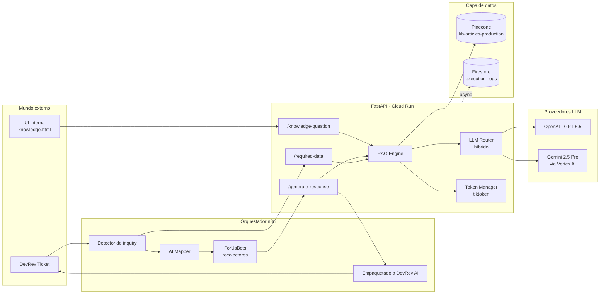
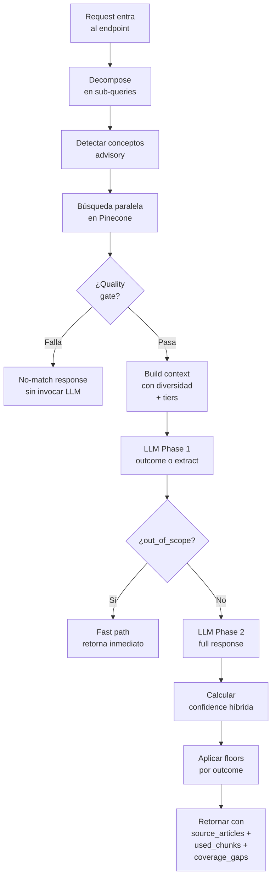
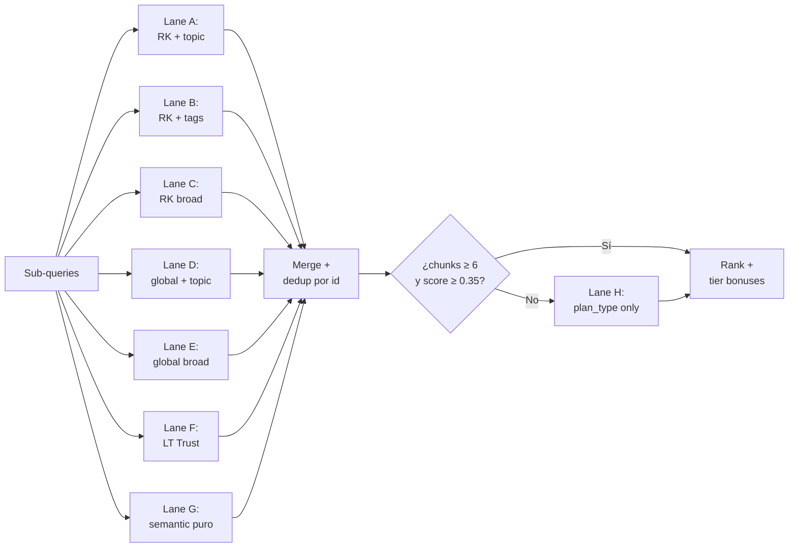
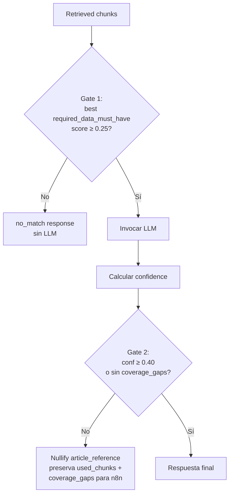
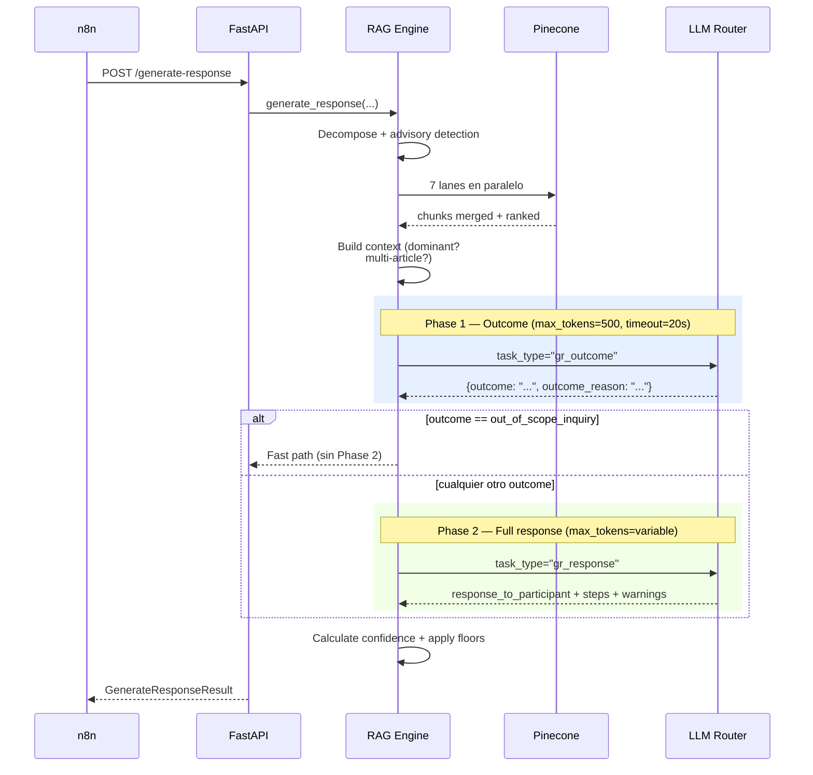
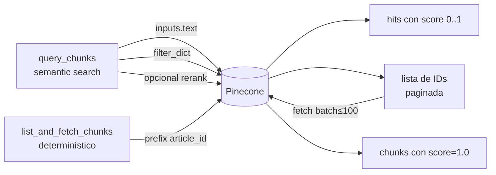
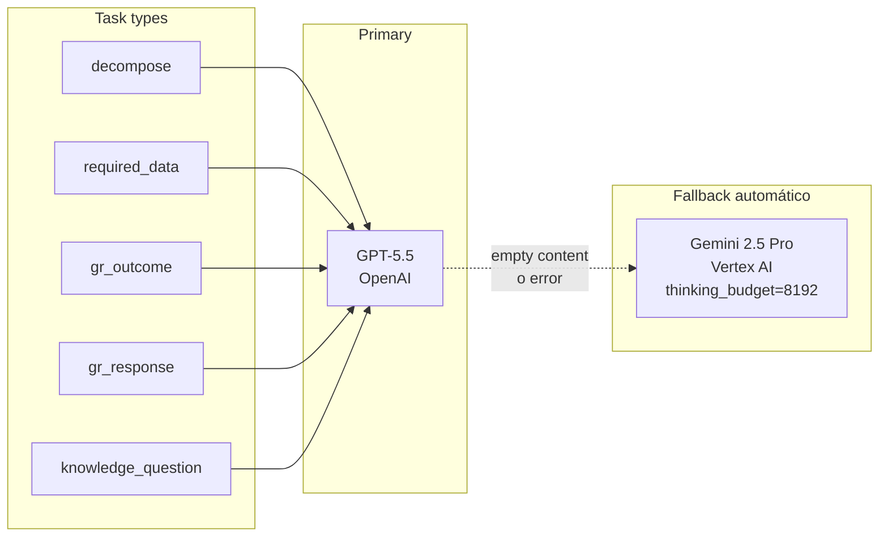
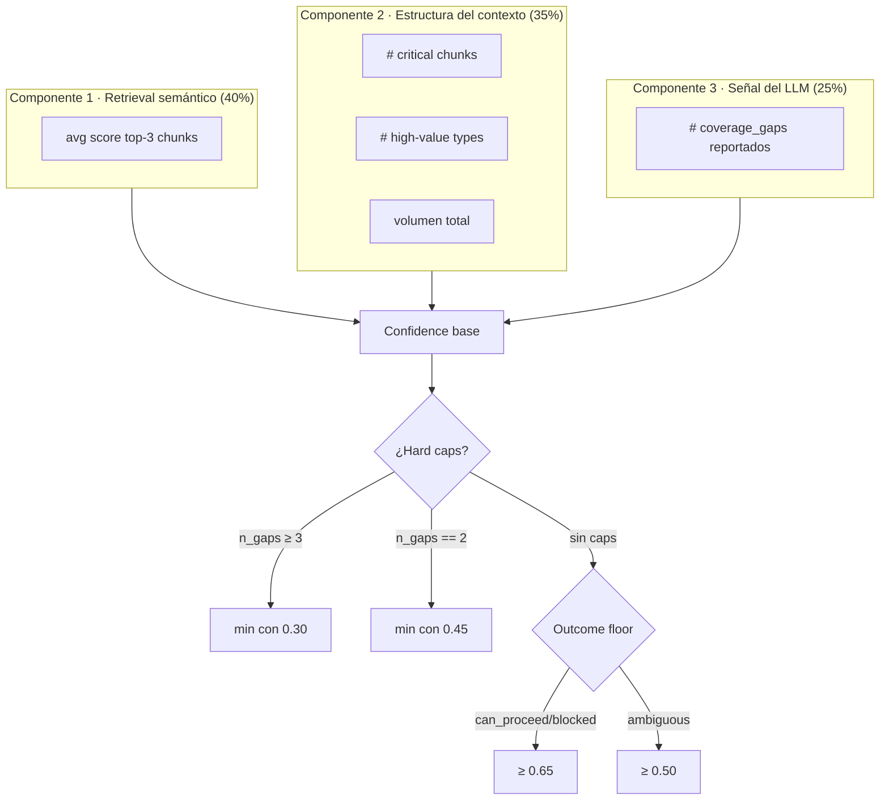
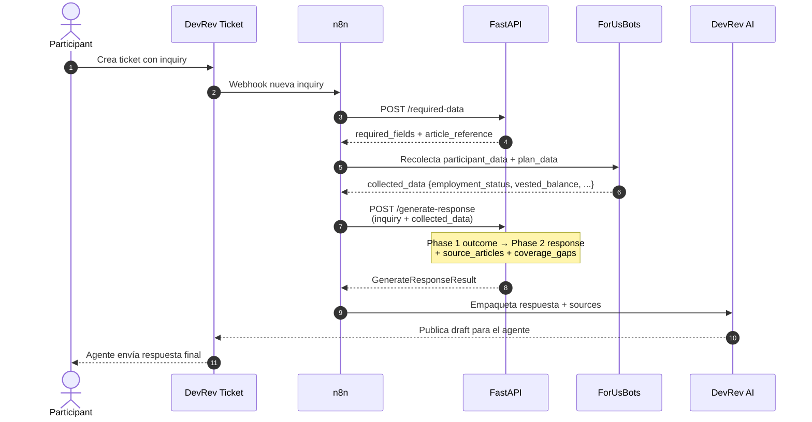
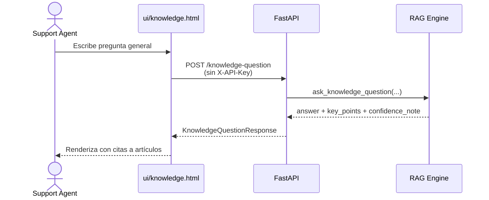

# KB RAG System — Walkthrough Técnico

**Sistema de Knowledge Base con RAG para Participant Advisory**
*Versión 1.0 · Última actualización: 2026-04-28*

---

## TL;DR

El **KB RAG System** es un servicio FastAPI que responde preguntas sobre planes 401(k)/403(b)/457 combinando búsqueda semántica sobre **Pinecone** con generación de respuestas vía un **router híbrido OpenAI ↔ Gemini**. Expone tres endpoints que orquesta **n8n** dentro del flujo de tickets de **DevRev**:

| Endpoint | Propósito | ¿Quién lo llama? |
|---|---|---|
| `POST /api/v1/required-data` | Identifica qué datos del participante/plan necesita la inquiry | n8n (al detectar inquiry) |
| `POST /api/v1/generate-response` | Genera la respuesta contextualizada con los datos ya recolectados | n8n (después de ForUsBots) |
| `POST /api/v1/knowledge-question` | Q&A general sobre la KB (sin contexto de participante) | UI interna / agentes de soporte |

El truco central: **dos llamadas al LLM por respuesta** (Phase 1 = outcome, Phase 2 = redacción) y **7 lanes de búsqueda en paralelo** sobre Pinecone para maximizar recall sin sacrificar precisión.

---

## 1. Arquitectura de alto nivel



### Componentes principales

| Componente | Archivo | Responsabilidad |
|---|---|---|
| **FastAPI app** | `api/main.py` | HTTP layer, lifespan, dependency injection |
| **Middleware** | `api/middleware.py` | API key auth (`X-API-Key`), request ID, logging |
| **Config** | `api/config.py` | Pydantic Settings desde `.env` + validación |
| **RAG Engine** | `data_pipeline/rag_engine.py` | Orquestación retrieval + LLM (3,228 líneas) |
| **LLM Router** | `data_pipeline/llm_router.py` | Routing por task_type, fallback cross-provider |
| **Pinecone Uploader** | `data_pipeline/pinecone_uploader.py` | Embeddings integrados, query, list+fetch |
| **Token Manager** | `data_pipeline/token_manager.py` | Conteo (`tiktoken` GPT-4) y greedy knapsack |
| **Prompts** | `data_pipeline/prompts.py` | System/user prompts versionados por task |
| **Execution Logger** | `data_pipeline/execution_logger.py` | Logging async a Firestore (no-block) |

---

## 2. El RAG Engine: cómo se "responde" realmente

El `RAGEngine` es el cerebro. Cada endpoint público delega en uno de sus tres métodos:



### 2.1 Decomposición de la inquiry

Antes de buscar, el engine pide al LLM (`task_type="decompose"`) que parta la pregunta en **1–3 sub-queries enfocadas**. Esto evita que una inquiry compuesta como *"¿puedo hacer hardship withdrawal y también un loan?"* termine matcheando un solo cluster de chunks.

### 2.2 Detección de conceptos advisory

Análisis **determinístico** (sin LLM, en `_detect_advisory_concepts`, [rag_engine.py:1142-1284](kb-rag-system/data_pipeline/rag_engine.py#L1142-L1284)) que escanea inquiry + collected_data buscando señales:

| Concepto | Señales detectadas |
|---|---|
| `active_participant` | "still working", employment_status="active" |
| `wants_funds` | "cash out", "withdraw", "distribution" |
| `separation_signal` | "quit", "termination", "separation" |
| `hardship_signal` | "eviction", "foreclosure", "rent", "medical", "tuition" |
| `loan_signal` | "401k loan", "borrow", "vested loan" |

Cuando se detecta un concepto, el engine **expande las queries** con frases pre-escritas y **fuerza cuotas mínimas** de chunks de ese tema en el contexto final.

### 2.3 Búsqueda paralela: el "fan-out de 7 lanes"

Para `/generate-response` se ejecutan **7 búsquedas simultáneas** en un único `asyncio.gather()`:

| Lane | Filtros | top_k | Propósito |
|---|---|---|---|
| **A** | RK exacto + topic exacto | 10 | Precisión máxima |
| **B** | RK + variaciones de tags | 8 | Cobertura léxica |
| **C** | RK broad (sin topic) | 12 | Recall por record keeper |
| **D** | scope=global + topic | 10 | Reglas universales |
| **E** | scope=global broad | 10 | Reglas universales sin topic |
| **F** | LT Trust fallback (si RK ≠ default) | 10 | Cuando el RK no tiene cobertura |
| **G** | semantic puro (sin filtros) | 15 | Red de seguridad |

Si el merge resultante tiene `<6 chunks` o `mejor_score < 0.35`, dispara la **Lane H** (sólo `plan_type` filter) como último recurso.



### 2.4 Ranking con bonificaciones

Los chunks recuperados pasan por `_rank_response_chunks` que aplica bonuses sobre el score base de Pinecone:

| Atributo | Bonus |
|---|---|
| `chunk_tier == "critical"` | +0.08 |
| `chunk_type ∈ {decision_guide, business_rules}` | +0.06 |
| Concepto advisory matcheado | +0.08 |
| `topic` matchea exactamente | +0.04 |

### 2.5 Construcción de contexto: dominante vs multi-artículo

El método `_build_context_with_diversity_and_tiers` decide automáticamente entre dos modos:

**Dominant mode** se activa cuando:
- `top_signal ≥ 2.00` (suma de top-3 scores de un mismo artículo)
- `runner_up / top ≤ 0.40` (segundo artículo es <40% del primero)
- El artículo dominante tiene `≥ 4 chunks`

→ Satura con hasta **8 chunks** del artículo dominante + **1 "insurance chunk"** del runner-up.

**Multi-article mode** (default):
- Diversidad forzada: máx **6 chunks por artículo**
- Prioriza por tier: `critical → high → medium → low`
- Greedy knapsack respetando el budget (3,500–4,000 tokens)

Antes de saturar, se aplica una **Phase 0 de cuotas obligatorias**: cada concepto advisory detectado contribuye con al menos 1 chunk al contexto.

### 2.6 Quality gates

El engine tiene **dos puertas** que pueden cortar el pipeline antes de invocar al LLM o invalidar la respuesta:



---

## 3. Endpoint deep-dive

### 3.1 `POST /api/v1/required-data`

**Cuándo se llama:** apenas n8n detecta una inquiry en un ticket de DevRev.
**Qué hace:** identifica qué campos del participante y del plan se necesitan recolectar antes de poder responder.

**Request:**
```json
{
  "inquiry": "I want to roll over my 401(k) to an IRA after leaving the company.",
  "record_keeper": "LT Trust",
  "plan_type": "401(k)",
  "topic": "rollover",
  "related_inquiries": ["What's the timeline?"]
}
```

**Response (resumen):**
```json
{
  "article_reference": { "article_id": "ART-042", "title": "..." },
  "required_fields": {
    "participant_data": [
      { "field": "employment_status", "data_type": "string", "required": true, "why_needed": "..." },
      { "field": "vested_balance", "data_type": "number", "required": true }
    ],
    "plan_data": [...]
  },
  "confidence": 0.78,
  "source_articles": [...],
  "used_chunks": [...],
  "coverage_gaps": [],
  "metadata": { "chunks_used": 9, "context_tokens": 3120, "model": "gpt-5.5" }
}
```

**Pipeline de 7 fases** (con dos quality gates):

1. Decompose → 1–3 sub-queries
2. Detect advisory concepts
3. Search RK-cascade en paralelo (RK específico → global → LT Trust fallback)
4. **Gate 1**: `best_score ≥ RD_RETRIEVAL_MIN_SCORE (0.25)` o no-match
5. Build context con diversidad (`RD_CONTEXT_BUDGET = 3500 tokens`)
6. LLM call (`task_type="required_data"`) con safety net de force_fallback si retorna vacío
7. **Gate 2**: si `confidence < 0.40` y hay `coverage_gaps`, nullify `article_reference`

### 3.2 `POST /api/v1/generate-response`

**Cuándo se llama:** después de que ForUsBots recolectó los datos requeridos.
**Qué hace:** redacta la respuesta final estructurada en outcome + steps + warnings + escalation.

**Request:**
```json
{
  "inquiry": "I want to roll over my 401(k) to an IRA after leaving the company.",
  "record_keeper": "LT Trust",
  "plan_type": "401(k)",
  "topic": "rollover",
  "collected_data": {
    "employment_status": "terminated",
    "vested_balance": 45000,
    "termination_date": "2026-01-15"
  },
  "max_response_tokens": 5000,
  "total_inquiries_in_ticket": 1
}
```

**Response (resumen):**
```json
{
  "decision": "can_proceed",
  "confidence": 0.82,
  "response": {
    "outcome": "can_proceed",
    "outcome_reason": "Participant is terminated and vested balance > $1,000 threshold",
    "response_to_participant": {
      "opening": "...",
      "key_points": [...],
      "steps": [
        { "step_number": 1, "action": "Initiate distribution request", "detail": "..." }
      ],
      "warnings": ["20% mandatory withholding if not direct rollover"]
    },
    "questions_to_ask": [],
    "escalation": { "needed": false },
    "guardrails_applied": [...],
    "data_gaps": [],
    "coverage_gaps": []
  },
  "source_articles": [...],
  "used_chunks": [...],
  "metadata": { ... }
}
```

#### Estrategia de **dos fases de LLM**



#### Los cinco outcomes posibles

| Outcome | Significado | Confidence floor |
|---|---|---|
| `can_proceed` | Cumple todos los core requirements (puede haber pasos/MFA) | 0.65 |
| `blocked_not_eligible` | Bloqueo definitivo (edad, status, rehire window) | 0.65 |
| `blocked_missing_data` | Falta dato crítico para confirmar elegibilidad | 0.65 |
| `ambiguous_plan_rules` | Depende de reglas plan-específicas → escala a Support | 0.50 |
| `out_of_scope_inquiry` | Pregunta no relacionada a planes (cooking, sports) | — (fast path) |

### 3.3 `POST /api/v1/knowledge-question`

**Cuándo se llama:** un agente de soporte busca info general en la UI; no hay participante asociado.
**Qué hace:** Q&A directo sobre la KB sin filtros por RK/topic.

**Pipeline simplificado:**
1. Decompose → 1–3 sub-queries
2. Búsqueda semántica pura (`top_k=15` por sub-query, sin filtros estructurales)
3. Build context multi-artículo (budget 4,000 tokens, máx 6 chunks/artículo)
4. LLM call (`task_type="knowledge_question"`, max_tokens=2,000)
5. Retorna `answer` + `key_points` + `confidence_note` (`well_covered` / `partially_covered` / `limited_coverage`)

> **Nota:** este endpoint **no requiere `X-API-Key`** (es público para la UI interna).

---

## 4. La capa de almacenamiento: Pinecone

### Configuración del índice

| Parámetro | Valor |
|---|---|
| Index name | `kb-articles-production` |
| Namespace | `kb_articles` |
| Embeddings | **Integrados** (Pinecone genera al hacer upsert/query) |
| Modelo subyacente | `llama-text-embed-v2` |
| Batch size upsert | 96 |

### Anatomía de un chunk en Pinecone

```jsonc
{
  "_id": "ART-042__decision_guide__01",
  "content": "When the participant is terminated and vested balance > $1,000...",
  // metadata top-level (Pinecone requiere flat)
  "article_id": "ART-042",
  "title": "Rollover after termination — LT Trust",
  "chunk_type": "decision_guide",
  "chunk_tier": "critical",
  "topic": "rollover",
  "tags": ["rollover", "termination", "ira"],
  "subtopics": ["direct_rollover", "indirect_rollover"],
  "scope": "rk_specific",
  "record_keeper": "LT Trust",
  "plan_type": "401(k)"
}
```

### Chunk types y tiers

| Modo | Chunk types principales | Tier típico |
|---|---|---|
| **Required Data** (`/required-data`) | `required_data_must_have`, `required_data_nice_to_have`, `required_data_disambiguation`, `eligibility`, `critical_flags` | critical / high |
| **Response Generation** (`/generate-response`) | `decision_guide`, `response_frames`, `guardrails` | critical |
| | `business_rules`, `steps_procedure`, `eligibility_decisions` | high |
| | `faqs`, `nice_to_have_fields` | medium |

La asignación de tier es **rules-based** durante el chunking — no requiere LLM.

### Dos modos de query



- **`query_chunks`** se usa para retrieval semántico durante una inquiry.
- **`list_and_fetch_chunks`** se usa cuando ya conocemos el `article_id` (p.ej. al cargar todos los chunks de un artículo dominante, o al renderizar la UI de chunks).

---

## 5. La estrategia híbrida del LLM Router

El `LLMRouter` ([llm_router.py](kb-rag-system/data_pipeline/llm_router.py)) es lo que permitió la **reducción de costos del 51%** (commit `2fe1735`).

### Enrutamiento por task_type



Cada task se mapea a un modelo vía variables de entorno:

```bash
LLM_ROUTE_DECOMPOSE=gpt-5.5
LLM_ROUTE_REQUIRED_DATA=gpt-5.5
LLM_ROUTE_GR_OUTCOME=gpt-5.5
LLM_ROUTE_GR_RESPONSE=gpt-5.5
LLM_ROUTE_KNOWLEDGE=gpt-5.5
```

El **provider se infiere del prefijo del modelo** (`gpt-*` → OpenAI, `gemini-*` → Gemini/Vertex).

### Tabla de fallback cross-provider

| Primary | Fallback | Configuración fallback |
|---|---|---|
| OpenAI | Gemini 2.5 Pro | `thinking_budget=8192` |
| Gemini | GPT-5.5 | `reasoning_effort="medium"` |

El fallback se activa automáticamente cuando:
- El primary devuelve `content=None` (común en GPT-5 cuando reasoning consume todo el budget)
- Hay error de red / rate limit
- El RAG Engine pasa explícitamente `force_fallback=True` (safety net cuando el JSON parseado vino vacío)

### Optimizaciones específicas por task

| Task | max_tokens | Timeout | Optimización |
|---|---|---|---|
| `decompose` | 150 | — | `thinking_budget=0` en Gemini |
| `required_data` | 800 | — | safety net con `force_fallback` |
| `gr_outcome` | 500 | 20s | timeout corto, fast path si out_of_scope |
| `gr_response` | variable (≥1,200) | 180s | budget = `max_response_tokens − contexto` |
| `knowledge_question` | 2,000 | — | sin filtros estructurales en retrieval |

### El detalle de GPT-5

Para modelos GPT-5/5.5, el router multiplica `max_tokens × 10` con piso de 16,000 — porque GPT-5 consume tokens en reasoning interno además del output visible. Sin esto, las llamadas devolverían `content=None`.

---

## 6. Confidence: cómo se calcula

La confianza es **híbrida** y combina tres señales:



**Decision final** (campo `decision` en la response):

| Confidence | Decision |
|---|---|
| `≥ 0.65` | `can_proceed` |
| `0.45 – 0.65` | `uncertain` |
| `< 0.45` | `out_of_scope` |

---

## 7. Flujo end-to-end: del ticket de DevRev a la respuesta



### Y por separado, el flujo de la UI interna



---

## 8. Observabilidad

Cada request termina con un `await execution_logger.log_execution(...)` no-bloqueante hacia **Firestore** (colección `execution_logs`). Si el log falla, **no se propaga al usuario** — se loggea como error y la respuesta sigue.

**Campos persistidos por ejecución:**

```jsonc
{
  "request_id": "uuid-...",
  "endpoint": "generate_response",
  "duration_ms": 4_212,
  "inquiry": "...",
  "topic": "rollover",
  "record_keeper": "LT Trust",
  "plan_type": "401(k)",
  "decision": "can_proceed",
  "confidence": 0.82,
  "outcome": "can_proceed",
  "chunks_used": 11,
  "coverage_gaps": [],
  "model": "gpt-5.5",
  "provider": "openai",
  "prompt_tokens": 3_842,
  "completion_tokens": 1_120,
  "source_articles": [...],
  "error": null
}
```

Esto habilita:
- Dashboards de calidad (¿qué % de inquiries terminan en `out_of_scope`?)
- Detección de regresiones (caída de confidence promedio por topic)
- Análisis de costos por task_type / provider
- Auditoría: dado un `request_id`, reconstruir exactamente qué chunks se usaron

---

## 9. Tuning levers (constantes clave)

Si necesitás ajustar el comportamiento sin tocar código complejo, estas son las palancas principales:

| Constante | Default | Efecto |
|---|---|---|
| `RD_RETRIEVAL_MIN_SCORE` | `0.25` | Umbral del Gate 1 en `/required-data` |
| `RD_NO_MATCH_CONFIDENCE` | `0.40` | Umbral del Gate 2 |
| `RD_CONTEXT_BUDGET` | `3,500` | Tokens de contexto en `/required-data` |
| `GR_FALLBACK_MIN_CHUNKS` | `6` | Disparador de Lane H |
| `GR_FALLBACK_MIN_SCORE` | `0.35` | Disparador de Lane H |
| `GR_DOMINANCE_MIN_TOP_SIGNAL` | `2.00` | Activación del dominant mode |
| `GR_DOMINANCE_MAX_RATIO` | `0.40` | Runner-up debe ser <40% para activar dominante |
| `GR_DOMINANCE_MAX_CHUNKS_SINGLE` | `8` | Saturación del artículo dominante |
| `GR_PHASE1_TIMEOUT_SECONDS` | `20` | Timeout de Phase 1 (outcome) |
| `GR_LLM_TIMEOUT_SECONDS` | `180` | Timeout total de Phase 2 |
| `KQ_TOP_K_PER_QUERY` | `15` | Recall amplio para knowledge questions |

---

## 10. Resumen ejecutivo

> **El RAG es esencialmente un pipeline retrieval → context-build → LLM con dos optimizaciones grandes:**
> 1. **Búsqueda paralela multi-lane** sobre Pinecone (RK específico + global + fallback + semántico) que maximiza recall sin penalizar latencia.
> 2. **Llamadas al LLM divididas en dos fases** (outcome rápido + redacción detallada) con un router híbrido OpenAI/Gemini que automáticamente cambia de proveedor cuando el primario falla.
>
> Las **integraciones** son simples: n8n llama dos endpoints en secuencia (`required-data` → recolección → `generate-response`) y empaqueta el resultado para DevRev AI. La UI interna usa el tercer endpoint (`knowledge-question`) para Q&A libre.
>
> Toda la **observabilidad** vive en Firestore con un `request_id` correlacionable end-to-end.

---

*Generado con Claude Code · Repositorio: `kb-rag-system/` · Branch: `main`*
