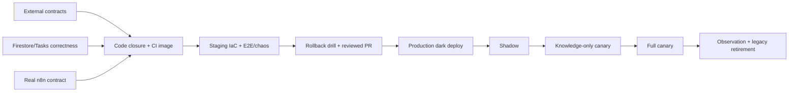

# Plan de implementación para completar handle-ticket en producción

> **Enmienda del owner — 2026-07-27 (prevalece sobre el texto histórico):**
> n8n debe conservar exactamente su autenticación actual
> OAuth2/IAM Credentials → `kb-rag-client` → `Authorization` + `X-API-Key`.
> No se solicitarán ni desplegarán cuentas, ARN, keys, roles o pools AWS WIF;
> tampoco se exige un segundo header workload, mapas client/tenant nuevos,
> export/migración del workflow ni un directorio participant-plan externo.
> ForUsBots 2.5 se integra según su documentación viva y código local; se
> permite exclusivamente su origen legacy revisado
> `http://35.224.156.104:10000` además de HTTPS canónico. La ausencia de
> idempotencia upstream se maneja sin retry ciego y no bloquea el merge.
> La entrega n8n/DevRev no cambia. Por tanto, toda instrucción posterior que
> contradiga esta enmienda queda anulada. La fuente de estado actual es
> `docs/verification/handle-ticket/01-external-contracts.md`.

> **Para Claude Opus 4.8:** SUBSKILL OBLIGATORIA: usa `.agents/skills/executing-plans` y ejecuta este plan tarea por tarea, con un punto de control de revisión después de cada tarea. Usa TDD para cada cambio de código. No actives producción hasta superar todos los puntos de control STOP de este plan.

**Objetivo:** finalizar de forma honesta el endurecimiento de handle-ticket: cerrar los defectos de código restantes, validar Firestore y Cloud Tasks contra infraestructura real, migrar a v2 el consumidor real de n8n, desplegar un worker privado y durable, demostrar el rollback y la observabilidad, y sólo entonces hacer el despliegue progresivo a producción sin exponer datos de participantes ni repetir efectos externos.

**Arquitectura:** mantener el servicio existente de Cloud Run `kb-rag-system` como productor/API y desplegar la misma imagen inmutable con roles excluyentes `APP_ROLE=producer|worker|reconciler`. El worker privado vive en `kb-rag-ticket-worker`; un reconciliador programado repara el outbox Firestore→Cloud Tasks. Cada rol tiene una SA distinta y sólo expone sus rutas. Staging usa servicios, cola, credenciales y una base Firestore nombrada `ticket-staging` con IAM aislado; producción usa `(default)`. Cloud Build construye y atesta un digest, pero Terraform es el único controlador de Cloud Run/configuración/tráfico. Producción permanece en la revisión segura desactivada hasta que exactamente el mismo digest haya superado staging.

`APP_ROLE=producer` significa la **API completa existente**, no un microservicio sólo de tickets. Debe preservar todas las rutas, buckets, Pinecone/Vertex/LLM, secretos e IAM no-ticket verificados; el modo `disabled` sólo vuelve opcionales las dependencias específicas de handle-ticket.

**Stack tecnológico:** Python 3.12, FastAPI/Pydantic V2, Firestore Native, Cloud Tasks, Cloud Run, Terraform/OpenTofu, Cloud Build, n8n, ForusBots sobre origen revisado, Pinecone con namespace explícito, pytest.

---

## Cómo debe usar Opus este plan

Este es un **plan nuevo de finalización**. Sus Tareas 0–18 no equivalen a las Tasks 0–12 del plan anterior: todas deben evaluarse y ejecutarse. El resumen de Fable es evidencia de avance, no autorización para saltar gates ni prueba de que el Definition of Done esté cerrado.

La sesión gcloud actual autoriza inspección read-only. **No constituye aprobación** para aplicar Terraform, modificar n8n/Cloud Build, cambiar tráfico, crear proyectos/bases/recursos, rotar secretos, mergear, activar cohorts ni retirar legacy.

Reglas de ejecución:

- Cada bloque comienza en `$WORKTREE_ROOT=/Users/ivanalvis/Desktop/ForUsGuide-handle-ticket-finalization`, salvo Tarea 0 Pasos 1–3 (usan rutas absolutas) o subshell explícito. Los bloques no heredan `cwd`.
- Antes de las Tareas 3 y 8, Opus debe releer `.agents/PINECONE.md` y la guía Python indicada allí. Este plan no crea ni modifica índices Pinecone.
- Un **skip crítico** es cualquier skip de seguridad, Firestore/Cloud Tasks, contrato n8n, dependencia live o E2E. Ninguno se permite en un gate. El skip de un artículo sin `must_have` puede clasificarse no crítico sólo si `pytest -rs` lo identifica y el owner lo acepta por escrito.
- Si el commit, revisión activa, modo, IAM, trigger o APIs difieren del snapshot, Opus detiene las mutaciones, captura un diff sanitizado, actualiza `00-preflight.md` y vuelve a auditar el impacto. Si producción ya no está `disabled`, reporta el incidente y pide aprobación para contención; no improvisa un cambio.
- Cuando una herramienta local falta, Opus no instala software del host sin aprobación. Puede usar Cloud Build/Cloud Shell con versiones fijadas. `gh` no es obligatorio: el PR puede abrirse en la web.

### Matriz de dependencia

| Trabajo | Sin contratos externos | Con contratos de Tarea 1 | Requiere gate de mutación |
|---|---:|---:|---:|
| Worktree, RED tests, packaging, modelos/interfaces, mocks | Sí | No | No |
| Firestore/Tasks código + Terraform `fmt/validate/plan` | Sí | No | No |
| Aplicar platform/staging disabled o crear base/colas/SAs | Sí | No | G1A/G1B/G1C/G2 |
| Validator concreto, ForusBots live, n8n inactivo | No | Sí | G3 para n8n/GCP sandbox |
| Staging activo/E2E con efectos | No | Sí | G4 |
| Merge y build canónico de `main` | No | Sí | G5 |
| Producción, token, tráfico, cohorts, legacy | No | Sí | G6A/G6B–G10 |

### Gates de aprobación

Toda aprobación se registra en `docs/verification/handle-ticket/approvals.md` con usuario, rol, fecha, alcance, evidencia y el texto exacto `APROBADO <GATE> <ALCANCE>`. Una aprobación de un gate no autoriza el siguiente.

| Gate | Antes de | Evidencia mínima | Aprobador requerido |
|---|---|---|---|
| G1A | Crear/proteger backend de estado remoto | comando exacto, IAM, costo, nombre global libre | requester/GCP owner |
| G1B | Bootstrap/apply IaC `live/platform` y neutralizar trigger | commit remoto, plan binario+hash sin destroy, diff IAM, rollback | requester/GCP owner + release owner |
| G1C | Restringir Firestore prod SA a `(default)` | binding scoped preparado, plan que quita grant project-wide, smoke/rollback | requester/GCP owner + API owner + operations |
| G2 | Aplicar IaC staging | plan de estado staging aislado, digest, costo | requester/GCP owner |
| G3 | Copia n8n inactiva + identidades/versiones sandbox | backup hash, WIF ARN, manifest de version IDs, diff | requester/GCP + owners n8n/dependencias |
| G4 | Activar staging con efectos/live dependencies | cuatro contratos Tarea 1, tests mock, datos sintéticos | requester + owners n8n/participant-plan/ForusBots/delivery |
| G5 | Mergear PR | CI, review adversarial, trigger seguro, sin skips críticos | repo maintainer + requester |
| G5V | Excepcionar un hallazgo HIGH del scan | digest y CVE exactos, exploitability, compensación, owner y expiración ≤30 días | security owner + release owner + requester |
| G6A | Fijar manifest completo de secret versions production | TLS, IDs numéricos, rotaciones duales, rollback | requester/GCP + owners n8n/participant-plan/ForusBots/secrets |
| G6B | Aplicar/promover producción oscura | attestation staging, secret version ID, plan exacto, rollback | requester/GCP owner + release + ForusBots owner |
| G7 | Activar workflow shadow/cambiar muestra | reporte anterior + alertas/on-call | n8n owner + product + operations |
| G8 | Cada escalón knowledge-only | reporte anterior + delivery dedupe | n8n/delivery owners + product + operations |
| G9 | Cada escalón full | reporte, capacity, differential, cuatro contratos | requester + product/operations + owners n8n/participant-plan/ForusBots/delivery |
| G10 | Archivar legacy | 7 días/1.000 jobs, rollback/evidencia final | n8n owner + product + operations |

### Glosario operativo

- **KQ:** `knowledge_question`, respuesta basada en KB sin scrape financiero.
- **GR:** `generate_response`, ruta que puede requerir ForusBots/datos del participante.
- **NMI:** `needs_more_info`; nunca debe ocultar un fallo técnico.
- **Shadow:** ejecuta/compara, pero n8n publica legacy.
- **Canary/cohort:** subconjunto determinístico de tickets, elegido por ID inmutable.
- **Dark deploy:** revisión endurecida desplegada con handler desactivado y sin publicación nueva.
- **Rollback anchor:** revisión durable, probada y desactivada a la que sí se puede volver.
- **Publicable:** cumple simultáneamente estado, `next_action`, safety y ledger de entrega.
- **Canónico:** deriva de una fuente autenticada y autorizada, no del ticket/LLM/caller.

## Estado inicial confirmado (2026-07-13)

- La rama de Git `handle-ticket-hardening` está en `3d48415`, 14 commits por delante de `main`, sin rama upstream.
- La suite local da `463 passed, 2 skipped, 4 warnings`, pero se ejecutó en Python 3.14.5. No ejercitó la imagen objetivo de Python 3.12, Firestore, Cloud Tasks ni staging.
- El worktree que la contiene está sucio con cambios propiedad del usuario. `HANDLE_TICKET_AUDIT_AND_REMEDIATION_PLAN.md` no está bajo seguimiento. Nunca ejecutes `git add -A`, reset, checkout, clean o stash sobre esos cambios.
- El proyecto de GCP es `rag-kb-system` (`900340137010`), con región/ubicación `us-central1`.
- El servicio de producción `kb-rag-system` sirve al 100% la revisión `kb-rag-system-00048-bkc`, imagen `:66f8350`, con `TICKET_HANDLER_MODE=disabled`.
- La revisión `kb-rag-system-00047-vkd` tiene la misma imagen vulnerable, pero con `TICKET_HANDLER_MODE=full`. **No es un destino de rollback válido.**
- `cloudtasks.googleapis.com` y las API de análisis de contenedores están desactivadas. No existe ninguna cola, SA invocadora de tasks, política TTL, índice compuesto de Firestore, métrica de logs de tickets ni alerta de tickets.
- Firestore `(default)` es Native en `us-central1`. La SA de runtime `kb-rag-runner@rag-kb-system.iam.gserviceaccount.com` ya tiene `roles/datastore.user`, pero carece de permisos para encolar en Cloud Tasks y para actuar como otra SA.
- Ese `roles/datastore.user` está a nivel proyecto y por tanto alcanzaría cualquier database nombrada; el aislamiento `ticket-staging` es imposible hasta reemplazarlo por acceso resource-scoped a `(default)` o mover staging a otro proyecto.
- El trigger existente de Cloud Build `deploy-kb-rag-system` observa `^main$`, no requiere aprobación y despliega directamente a producción. Los nuevos controles del YAML nunca se han ejecutado en GCP. El bucket de artefactos que declara no existe.
- La URL actual de ForusBots usa HTTP sin cifrar y está fuera de los recursos visibles en este proyecto de GCP. No asumas que el hostname HTTPS antiguo de Render es válido.
- La documentación del repo sitúa n8n en AWS y menciona OAuth de cuenta/IAM Credentials; no se verificó el runtime live. El rollout debe sustituir cualquier refresh token humano por identidad workload antes de invocar Cloud Run privado.

### Bloqueos restantes descubiertos después de los 14 commits

No se trata de limpieza opcional; cada punto invalida cualquier afirmación de que el plan original está completo:

1. La autorización participante-plan falla de forma abierta porque `participant_plan_validator` siempre es `None`.
2. Los campos TTL de jobs e idempotencia se serializan como strings, por lo que el TTL de Firestore no eliminará la PII.
3. Un reintento del worker vuelve a extraer y procesar inquiries ya completadas, repitiendo efectos de LLM/ForusBots.
4. Los fallos del extractor o de la síntesis KQ pueden convertirse en `succeeded + send_participant_reply`.
5. v2 no exige `Idempotency-Key`; el replay puede quedar bloqueado por verificaciones de cuota que ocurren antes.
6. Cloud Tasks no tiene un deadline de despacho explícito; el lease y la configuración de reintentos propuesta son inconsistentes.
7. Después de `AlreadyExists`, una tombstone del nombre de una task se confunde con una task activa.
8. El limitador de tasa en memoria del productor y el conteo no atómico de jobs pendientes no son globales.
9. `.dockerignore` excluye los prompts Markdown cargados en runtime; la imagen endurecida fallaría con su primer ticket.
10. Los fixtures de n8n son reconstruidos, sólo cubren v1 y omiten el comportamiento real del consumidor de `next_action`.
11. El arnés “diferencial” no llama al sistema legacy ni calcula una diferencia.
12. OpenAPI, la observabilidad, IaC, CI/CD, la verificación en vivo de dependencias y la matriz de staging están incompletos.

## Reglas de ejecución no negociables

- Mantén producción con `TICKET_HANDLER_MODE=disabled` hasta la Tarea 16.
- Usa `--project=rag-kb-system` y `--region=us-central1` o `--location=us-central1` explícitos en cada comando de gcloud.
- Nunca imprimas, muestres con echo, exportes al historial del shell, incluyas en un commit ni coloques en sustituciones del build el valor de una API key o token.
- Usa únicamente digests inmutables de imagen para staging y producción. Nunca despliegues `latest`.
- Usa el paquete de Pinecone llamado `pinecone`, un `NAMESPACE` explícito y ninguna escritura, eliminación o creación de índice en Pinecone dentro de este plan.
- Un fallo técnico nunca es una respuesta para el participante. Publica únicamente cuando se cumplan las tres condiciones: `state=succeeded`, `next_action=send_participant_reply` y cada inquiry seleccionada tenga `participant_reply_safe=true`.
- No uses división de tráfico de Cloud Run entre revisiones anteriores a la remediación y revisiones durables. Primero establece una baseline del productor 100% endurecida pero desactivada.
- Las mutaciones de n8n, las credenciales de ForusBots, la IaC de producción, el tráfico de producción o el retiro del sistema legacy son puntos de aprobación explícitos.



## Tarea 0: Crear un worktree limpio, fijar el toolchain y preservar la contención

**Archivos:**

- Copiar al worktree nuevo: `HANDLE_TICKET_AUDIT_AND_REMEDIATION_PLAN.md`
- Copiar al worktree nuevo: `docs/plans/2026-07-13-handle-ticket-production-completion.md`
- Modificar: `kb-rag-system/.gitignore`
- Crear: `docs/verification/handle-ticket/00-preflight.md`
- Crear: `docs/verification/handle-ticket/approvals.md`

**Paso 1: Capturar, sin modificarlo, el árbol sucio actual**

Ejecuta desde `/Users/ivanalvis/Desktop/ForUsGuide`:

```bash
git status --short --branch
git diff --check main...handle-ticket-hardening
git rev-list --left-right --count main...handle-ticket-hardening
```

Resultado esperado: la rama está 14 commits por delante, `git diff --check` no produce salida y los cambios propiedad del usuario siguen visibles.

**Paso 2: Crear el worktree dedicado**

```bash
git -C /Users/ivanalvis/Desktop/ForUsGuide worktree add \
  /Users/ivanalvis/Desktop/ForUsGuide-handle-ticket-finalization \
  -b handle-ticket-production-finalization handle-ticket-hardening
test -z "$(git -C /Users/ivanalvis/Desktop/ForUsGuide-handle-ticket-finalization status --porcelain)"
```

Resultado esperado: un worktree nuevo y limpio en `3d48415`; el worktree original queda intacto.

**Paso 3: Copiar únicamente los dos documentos del plan**

```bash
mkdir -p /Users/ivanalvis/Desktop/ForUsGuide-handle-ticket-finalization/docs/plans
cp /Users/ivanalvis/Desktop/ForUsGuide/HANDLE_TICKET_AUDIT_AND_REMEDIATION_PLAN.md \
  /Users/ivanalvis/Desktop/ForUsGuide-handle-ticket-finalization/
cp /Users/ivanalvis/Desktop/ForUsGuide/docs/plans/2026-07-13-handle-ticket-production-completion.md \
  /Users/ivanalvis/Desktop/ForUsGuide-handle-ticket-finalization/docs/plans/
```

No copies `response.json`, el JSON de PA modificado, `.gitignore` ni archivos de planes eliminados.

**Paso 4: Verificar en modo de sólo lectura el interruptor de emergencia de producción**

```bash
gcloud auth list --filter=status:ACTIVE --format='value(account)'
gcloud auth print-access-token >/dev/null
gcloud run services describe kb-rag-system \
  --project=rag-kb-system --region=us-central1 \
  --format='table(status.traffic[].revisionName,status.traffic[].percent,status.traffic[].tag)'
gcloud run services get-iam-policy kb-rag-system \
  --project=rag-kb-system --region=us-central1 --format=json
```

Si `print-access-token` pide reautenticación o falla, **STOP** y solicita al usuario renovar la sesión interactiva; no uses otra cuenta ni una key. Después, inspecciona sólo nombres de env/valores seguros. Esperado: `00048-bkc`, 100%, disabled. Registra si existe `allUsers` y lista/owner de consumidores no-ticket; no cambies invoker policy todavía.

**Paso 5: Auditar el entorno de ejecución sin instalar nada**

```bash
command -v git gcloud
git --version
gcloud version
for tool in python3.12 docker terraform tofu firebase gh syft; do
  command -v "$tool" || true
done
```

Registra qué comandos se ejecutarán localmente y cuáles en Cloud Build/Cloud Shell. El snapshot local ya mostró que Python 3.12, Docker, Terraform/OpenTofu, Firebase CLI y `gh` pueden no estar disponibles: su ausencia no autoriza una instalación global ni permite omitir la comprobación. Fija la versión y el digest de cada imagen-herramienta usada remotamente.

**Paso 5a: Crear el venv del worktree (no copiar el del árbol sucio)**

Añade `.venv/` a `kb-rag-system/.gitignore` con `apply_patch`. Después:

```bash
(cd kb-rag-system && python3 -m venv .venv)
(cd kb-rag-system && ./.venv/bin/python -m pip install \
  --disable-pip-version-check -r requirements.txt)
(cd kb-rag-system && ./.venv/bin/python --version)
(cd kb-rag-system && ./.venv/bin/pytest -q -rs)
```

Éste es un bootstrap local no autoritativo si usa Python 3.14; no copies `venv/` ni `.venv/` del worktree original. Tras Tarea 3, recrea `.venv` con Python 3.12 + dev lock si está disponible; si no, Cloud Build Python 3.12 es el gate autoritativo.

**Paso 6: Registrar la baseline segura**

En `00-preflight.md`, registra commit, revisión activa, **todas** las entradas de tráfico, digest/tag, modo, runtime SA y sus roles, nombres de env/secret refs, endpoints OpenAPI no-ticket, buckets/Vertex/Pinecone/core dependencies, versiones/toolchain, baseline `pytest -rs`, skips y “Nunca hagas rollback a `00047-vkd`.” No muestres valores secretos. En `approvals.md`, crea una tabla vacía con gate, texto exacto, usuario, rol, UTC, alcance y evidencia; una fila sólo se llena al recibir aprobación real.

**Paso 7: Hacer commit únicamente de la documentación**

```bash
git add HANDLE_TICKET_AUDIT_AND_REMEDIATION_PLAN.md \
  kb-rag-system/.gitignore \
  docs/plans/2026-07-13-handle-ticket-production-completion.md \
  docs/verification/handle-ticket/00-preflight.md \
  docs/verification/handle-ticket/approvals.md
git commit -m "docs: define handle-ticket production completion gates"
```

## Tarea 1: Obtener los cuatro contratos externos que bloquean la activación

**Archivos:**

- Crear: `docs/verification/handle-ticket/01-external-contracts.md`
- Crear después de sanitizar: `kb-rag-system/tests/fixtures/n8n/handle_ticket_workflow.sanitized.json`
- Crear después de recibirlo: `kb-rag-system/tests/fixtures/participant_plan/authorized_pair.json`
- Crear después de recibirlo: `kb-rag-system/tests/fixtures/participant_plan/rejected_pair.json`
- Crear después de recibirlo: `kb-rag-system/tests/fixtures/forusbots/live_contract.sanitized.json`
- Crear después de recibirlo: `kb-rag-system/tests/fixtures/participant_delivery/live_contract.sanitized.json`

**Paso 1: Solicitar la fuente canónica participante-plan**

Obtén del equipo propietario:

- el endpoint o la librería y su propietario;
- el método de autenticación y la audiencia;
- el schema exacto de request/response;
- los campos de tenant y record keeper devueltos por la fuente;
- el timeout/SLA y la semántica de los errores;
- un par sintético autorizado y un mismatch sintético.

Criterio de aceptación: la fuente puede responder “¿el participante P pertenece al plan L en el tenant T?” sin confiar en el texto del ticket ni en valores de empresa o record keeper proporcionados por n8n.

**Paso 2: Solicitar el contrato HTTPS de producción/sandbox de ForusBots**

Obtén:

- la URL base HTTPS verificada y el propietario del certificado/DNS;
- los contratos de `/health`, submit, status y result;
- la capacidad global de concurrencia/tasa;
- IDs sintéticos de participante/plan para pruebas;
- el procedimiento de rotación del token;
- una key de idempotencia aceptada por submit **o** una búsqueda por correlation ID estable para reconciliar un POST ambiguo;
- el comportamiento documentado de deduplicación, retención de keys (≥horizonte acordado de replay) y reconciliación ante timeout/reset después del POST.

No uses `https://forusbots-6jyh.onrender.com` sólo porque un documento antiguo lo mencione.

**Paso 3: Exportar el workflow real de n8n y cerrar su identidad AWS→GCP**

Antes de editar n8n, crea un export de respaldo. Sanitiza credenciales, emails, IDs, URLs de webhooks e IDs de credenciales de nodos, pero preserva nombres, expresiones, casing, null, timeouts, retries y ramas. Obtén cuenta AWS, ARN exacto del execution role de n8n, owner y mecanismo de metadata/credenciales temporales.

El contrato objetivo es AWS Workload Identity Federation: AWS role→pool/provider GCP con condition exacta→`n8n-ticket-invoker-{env}`→ID token con audiencia del producer e `includeEmail=true`. n8n siempre enviará exactamente `X-ForUs-Workload-Authorization: Bearer <WIF_ID_TOKEN>` para que v2 lo valide dentro de la aplicación; **no** uses `X-Serverless-Authorization` porque Cloud Run elimina la firma antes de entregarlo al contenedor. Si el servicio es privado, envía además el mismo token como `Authorization: Bearer` para que Cloud Run IAM lo valide. Prueba renovación y rechazos por cuenta/role/audiencia incorrectos. El `X-API-Key` de aplicación identifica cliente/tenant, pero no sustituye la identidad WIF ni autoriza por sí solo. Prohíbe OAuth/refresh token de una persona y claves JSON de SA. Si el runtime n8n no puede hacer WIF/impersonation, **STOP** y diseña/aprueba un broker service-to-service; no uses credenciales humanas como atajo.

**Paso 4: Obtener el contrato idempotente de entrega final al participante**

Identifica el sistema/nodo que publica el reply. Debe aceptar una key estable derivada del evento y devolver/reconciliar el mismo delivery ID. Registra horizonte máximo de redelivery de la fuente, retención de dedupe del receptor, estados y timeout ambiguo. Define `TICKET_IDEMPOTENCY_RETENTION_DAYS=max(90d, horizonte fuente, dedupe downstream, retención rollback)`. Un ledger local que sólo dice “intenté” no demuestra no-duplicación. Si la fuente puede redeliver sin límite y no se aprueba conservar un tombstone hash, no puede garantizarse cero duplicados indefinidamente.

**STOP de GR:** si ForusBots o el canal de entrega final no soportan idempotencia/reconciliación observable, `full` no puede activarse ni puede afirmarse “cero efectos duplicados”. Knowledge-only sólo puede avanzar si su propia entrega cumple este contrato.

**Paso 5: Obtener aprobación de producto/operaciones para los umbrales diferenciales**

Registra los mínimos aprobados. Los valores seguros por defecto, que se usarán hasta que se cambien explícitamente, son:

- IDs, hechos, módulos y límites de tokens determinísticos: coincidencia exacta del 100%;
- tasa de publicación insegura: 0%;
- tasa de inquiries faltantes: 0%;
- aceptabilidad semántica frente a casos legacy revisados: al menos 95%;
- tasa de respuestas duplicadas al participante: 0%;
- tasa de 404 de polling sin explicación: 0%.

**Paso 6: Escribir un inventario sanitizado de contratos**

Registra propietarios, schemas, IDs de fixtures de prueba y nombres/fechas de aprobación en `01-external-contracts.md`; no registres valores de secretos.

**Paso 7: Commitear el checkpoint de contratos disponible**

```bash
git add docs/verification/handle-ticket/01-external-contracts.md \
  docs/verification/handle-ticket/approvals.md
git add kb-rag-system/tests/fixtures
git commit -m "docs: record handle-ticket external contracts"
```

Si faltan contratos, el documento lista cada bloqueo/owner/fecha y el commit no crea fixtures falsos; se actualiza cuando lleguen.

**Punto de control STOP:** si no están disponibles la fuente participante-plan, ForusBots por HTTPS con reconciliación, el export real de n8n o el contrato idempotente de entrega, continúa con el trabajo local y de infraestructura desactivada, pero no inicies E2E activo en staging ni el despliegue progresivo a producción.

## Tarea 2: Añadir regresiones RED para cada bloqueo recién confirmado

**Archivos:**

- Modificar: `kb-rag-system/tests/test_handle_ticket_endpoint.py`
- Modificar: `kb-rag-system/tests/test_ticket_worker.py`
- Modificar: `kb-rag-system/tests/test_ticket_job_repository.py`
- Modificar: `kb-rag-system/tests/test_ticket_task_queue.py`
- Modificar: `kb-rag-system/tests/test_ticket_security.py`
- Modificar: `kb-rag-system/tests/test_handle_ticket_contract.py`
- Modificar: `kb-rag-system/tests/test_api.py`
- Modificar: `kb-rag-system/pytest.ini`
- Crear: `kb-rag-system/tests/test_container_contract.py`

**Paso 1: Añadir pruebas de contrato del endpoint y la autenticación**

Añade estas pruebas exactas:

```python
def test_v2_requires_idempotency_key_header(): ...
def test_v2_always_returns_202_and_replays_same_job(): ...
def test_v2_same_key_different_payload_is_409(): ...
def test_replay_pending_job_bypasses_quota_and_reensures_enqueue(): ...
def test_v1_inline_requires_send_participant_reply(): ...
def test_active_mode_without_participant_plan_validator_fails_closed(): ...
def test_wrong_participant_plan_or_tenant_is_403(): ...
def test_v2_rejects_missing_or_wrong_workload_identity_token_when_public(): ...
def test_v2_accepts_expected_wif_service_account_and_audience(): ...
def test_v2_rejects_x_serverless_authorization_or_unsigned_token(): ...
def test_non_ticket_routes_keep_existing_auth_contract(): ...
```

La validación WIF de v2 comprueba issuer, audience, principal/SA esperado, `exp` y firma contra metadata/JWKS confiable, no registra el token y falla cerrada si la verificación no está disponible. Parametriza las pruebas para el caso privado (`Authorization`) y el caso compatible con `allUsers` (`X-ForUs-Workload-Authorization`); no aceptes un header autoafirmado, sin firma, `X-Serverless-Authorization`, ni mezcles el token con `X-API-Key`. En staging añade un test live que atraviese el proxy de Cloud Run y demuestre que el header propio llega intacto al verificador.

**Paso 2: Añadir pruebas de worker, errores y reanudación**

```python
def test_extract_llm_failure_is_failed_not_participant_nmi(): ...
def test_invalid_extract_json_is_not_publishable(): ...
def test_kq_synthesis_failure_is_not_publishable(): ...
def test_retry_skips_completed_inquiry_checkpoint(): ...
def test_retry_reuses_persisted_execution_plan(): ...
def test_retry_preserves_prior_forusbots_job_ids(): ...
def test_crash_retry_completes_before_queue_attempts_exhaust(): ...
```

**Paso 3: Añadir pruebas del repositorio y de tasks**

```python
def test_firestore_documents_keep_native_timestamps(): ...
def test_idempotency_document_keeps_native_timestamps(): ...
def test_50_concurrent_reservations_consume_one_quota_slot(): ...
def test_task_has_oidc_audience_and_explicit_dispatch_deadline(): ...
def test_live_already_exists_is_benign(): ...
def test_tombstoned_task_name_uses_next_generation(): ...
def test_production_rejects_empty_worker_sa_or_oidc_disabled(): ...
def test_stale_lease_epoch_cannot_checkpoint_or_publish(): ...
def test_stale_task_generation_returns_204_without_claim_or_effect(): ...
def test_recovery_lock_requeues_without_owning_worker_lease(): ...
def test_absolute_job_deadline_terminalizes_late_deliveries(): ...
def test_reconciler_repairs_pending_outbox_and_stale_lease(): ...
def test_producer_role_preserves_non_ticket_routes_and_core_readiness(): ...
def test_queue_role_allows_create_task_get_and_queue_get_but_not_admin(): ...
```

**Paso 4: Añadir pruebas de empaquetado y OpenAPI**

Verifica que cada `data_pipeline/agent_prompts/*.md` exista y que los cinco builders de prompts puedan cargarse. Verifica que OpenAPI declare `Idempotency-Key` como obligatorio para v2, ambos esquemas de autenticación, estados/acciones como enums y las respuestas 401/403/409/410/413/429/503. Añade también pruebas RED para: `APP_ROLE` y rutas excluyentes; `FIRESTORE_DATABASE`; receipt de idempotencia que sobrevive al job y devuelve 410; contador activo sin TTL mientras sea positivo; y rechazo cruzado entre la base `ticket-staging` y `(default)`.

Registra en `pytest.ini` los markers `live_dependencies` y `staging_e2e` (además de los existentes) porque `--strict-markers` está activo. CI ejecuta explícitamente `-m "not live_dependencies and not staging_e2e"`; los gates G4/G2 ejecutan cada marker por separado. “Sin skips críticos” se evalúa dentro de la selección correspondiente, no exige secrets/live access en PR CI.

**Paso 5: Ejecutar cada prueba individualmente y preservar la evidencia RED**

```bash
(cd kb-rag-system && ./.venv/bin/pytest -q tests/test_ticket_worker.py -k 'extract_llm_failure or retry_skips')
(cd kb-rag-system && ./.venv/bin/pytest -q tests/test_handle_ticket_endpoint.py -k 'v2_requires or replay_pending')
(cd kb-rag-system && ./.venv/bin/pytest -q tests/test_ticket_job_repository.py -k 'native_timestamps or concurrent_reservations')
(cd kb-rag-system && ./.venv/bin/pytest -q tests/test_ticket_task_queue.py -k 'dispatch_deadline or tombstoned or stale_lease')
```

Resultado esperado: cada prueba nueva falla por la razón indicada, no por un fixture o import roto.

**Paso 6: Hacer commit únicamente de las pruebas**

```bash
git add kb-rag-system/tests kb-rag-system/pytest.ini
git commit -m "test: expose remaining handle-ticket production blockers"
```

## Tarea 3: Hacer que la imagen esté completa y que la resolución de dependencias sea reproducible

**Archivos:**

- Modificar: `kb-rag-system/.dockerignore`
- Modificar: `kb-rag-system/Dockerfile`
- Reemplazar/dividir: `kb-rag-system/requirements.txt`
- Crear: `kb-rag-system/requirements.in`
- Crear: `kb-rag-system/requirements-dev.in`
- Crear: `kb-rag-system/requirements.lock`
- Crear: `kb-rag-system/requirements-dev.lock`
- Crear: `kb-rag-system/pyproject.toml`
- Crear: `kb-rag-system/.secrets.baseline`
- Crear: `kb-rag-system/scripts/container_smoke.py`
- Crear: `kb-rag-system/ci/tool-images.env`

**Paso 1: Incluir los prompts de runtime**

Añade esto después de la regla que ignora Markdown:

```dockerignore
!data_pipeline/agent_prompts/
!data_pipeline/agent_prompts/*.md
```

**Paso 2: Separar las dependencias de runtime y desarrollo**

Relee primero `.agents/PINECONE.md` completa y la guía Python indicada por ella. Saca pytest y las herramientas de análisis del conjunto de dependencias de producción. Conserva `pinecone`, no `pinecone-client`. Antes de resolver, ejecuta:

```bash
docker run --rm python:3.12-slim python -m pip index versions pinecone
```

Usa el SDK actual de Pinecone y adapta el código; no fijes un paquete obsoleto. Fija `pip-tools`, `ruff`, `mypy`, `pip-audit` y `detect-secrets` en dev lock, y Syft por versión+digest. Un hallazgo CRITICAL bloquea sin excepción. Cada HIGH bloquea salvo un G5V separado que cite digest+CVE exactos, análisis de exploitability, compensación, owner y expiración ≤30 días; el gate no se hereda por tag, rebuild ni CVE.

Resuelve también `gcr.io/google.com/cloudsdktool/google-cloud-cli:emulators` a un RepoDigest `@sha256:` y revisa el componente con estos comandos:

```bash
docker pull gcr.io/google.com/cloudsdktool/google-cloud-cli:emulators
FIRESTORE_EMULATOR_IMAGE="$(docker image inspect \
  --format='{{index .RepoDigests 0}}' \
  gcr.io/google.com/cloudsdktool/google-cloud-cli:emulators)"
case "$FIRESTORE_EMULATOR_IMAGE" in *@sha256:*) ;; *) exit 2 ;; esac
docker run --rm "$FIRESTORE_EMULATOR_IMAGE" \
  gcloud components list --filter='id:cloud-firestore-emulator AND state.name:Installed'
```

Registra mediante `apply_patch` la referencia completa resultante como `FIRESTORE_EMULATOR_IMAGE=<RepoDigest>` en `ci/tool-images.env`. No dejes un tag mutable ni un placeholder. Si la imagen `:emulators` ya no existe, **STOP**: construye en CI una reemplazante revisada desde `google-cloud-cli:stable@sha256:<digest>` con la versión exacta del paquete `google-cloud-cli-firestore-emulator`, scanéala y registra su digest; no instales el componente globalmente en el host.

Define en `pyproject.toml` target Python 3.12 y scopes explícitos de módulos ticket/API para `ruff` y `mypy --strict`; sólo permite `ignore_missing_imports` a SDKs sin stubs, nunca `ignore_errors`. Genera `.secrets.baseline` con detect-secrets locked, revisa cada hallazgo y guarda el JSON sanitizado mediante `apply_patch`; un secreto real no se marca falso positivo.

**Paso 3: Compilar los locks de Linux/Python 3.12 con hashes**

Usa un contenedor Linux con Python 3.12 y genera archivos lock con `--generate-hashes`. `requirements-dev.in` incluye `-r requirements.in`, por lo que `requirements-dev.lock` resuelve runtime+test/tooling y puede arrancar la app E2E; `requirements.lock` contiene sólo runtime. Incluye ambos locks en un commit. La versión exacta del resolver utilizado debe quedar fijada en un comentario al principio de cada lock.

**Paso 4: Hacer que Docker instale el lock**

El Dockerfile debe copiar `requirements.lock` y ejecutar:

```dockerfile
RUN python -m pip install --no-cache-dir --require-hashes -r requirements.lock
```

No hagas `pip install --upgrade pip` sin versión: el pip incluido también queda fijado por el digest base y su versión se registra en el smoke/build. Resuelve y fija por digest la imagen base `python:3.12-slim`. El Dockerfile debe contener `FROM python:3.12-slim@sha256:...` antes del merge.

**Paso 5: Añadir un smoke test a nivel de imagen**

`scripts/container_smoke.py` debe importar la app, cargar los cinco prompts Markdown, instanciar los modelos request/response de Pydantic y terminar con un código distinto de cero si falta algún archivo.

**Paso 6: Construir y ejecutar la imagen localmente**

```bash
docker build --platform=linux/amd64 -t handle-ticket-final:local kb-rag-system
docker run --rm --entrypoint python handle-ticket-final:local scripts/container_smoke.py
```

Resultado esperado: código de salida 0 y una única línea sanitizada `container-smoke: ok`.

Si Docker no está disponible localmente, ejecuta estos mismos pasos en un build de Cloud Build sin permisos de deploy y guarda ID, builder digests y logs sanitizados; no los omitas.

**Paso 7: Ejecutar las pruebas en el runtime objetivo**

Si `python3.12` está local:

```bash
(cd kb-rag-system && python3.12 -m venv --clear .venv)
(cd kb-rag-system && ./.venv/bin/python -m pip install \
  --disable-pip-version-check --require-hashes -r requirements-dev.lock)
(cd kb-rag-system && ./.venv/bin/pytest -q -rs)
```

Si no, ejecuta lo mismo en el builder Python 3.12 fijado. Resultado: ninguna regresión/skip crítico; ForusBots live queda detrás de G4.

**Paso 8: Hacer commit**

```bash
git add kb-rag-system/.dockerignore kb-rag-system/Dockerfile \
  kb-rag-system/requirements* kb-rag-system/pyproject.toml \
  kb-rag-system/.secrets.baseline kb-rag-system/scripts/container_smoke.py \
  kb-rag-system/ci/tool-images.env
git commit -m "build: ship ticket prompts and lock Python 3.12 runtime"
```

## Tarea 4: Cerrar la autorización participante-plan-tenant y el contrato v2

**Archivos:**

- Crear: `kb-rag-system/api/participant_plan.py`
- Modificar: `kb-rag-system/api/auth.py`
- Modificar: `kb-rag-system/api/config.py`
- Modificar: `kb-rag-system/api/main.py`
- Modificar: `kb-rag-system/api/models.py`
- Modificar: `kb-rag-system/tests/test_ticket_security.py`
- Modificar: `kb-rag-system/tests/test_handle_ticket_endpoint.py`
- Modificar: `kb-rag-system/tests/test_api.py`

**Paso 1: Modelar un resultado de autorización confiable**

Usa esta estructura; el adaptador concreto proviene de la Tarea 1:

```python
class AuthorizedParticipantPlan(BaseModel):
    model_config = ConfigDict(extra="forbid")
    tenant_id: str
    participant_id: str
    plan_id: str
    record_keeper: str | None = None

class ParticipantPlanValidator(Protocol):
    async def authorize(
        self, *, tenant_id: str, participant_id: str, plan_id: str
    ) -> AuthorizedParticipantPlan | None: ...
```

La indisponibilidad o un timeout deben lanzar un error de disponibilidad tipado y producir un 503. Un mismatch produce un 403. Una configuración `None` en un modo activo es un error de inicio, nunca una autorización.

**Paso 1a: Separar roles de proceso y validación de configuración**

Añade `APP_ROLE=producer|worker|reconciler`. El productor expone v1/v2/status, pero no `/tasks/run`; el worker expone únicamente health y la ruta interna de task; el reconciliador no sirve endpoints públicos. Valida al arrancar:

- `producer + disabled`: conserva todas las dependencias/core readiness no-ticket; sólo puede omitir validador/cola/ForusBots específicos de tickets y rechaza tickets de forma controlada;
- `producer + shadow|knowledge_only|full`: exige validador, Firestore, cola y credenciales de cliente;
- `worker`: exige Firestore, `FIRESTORE_DATABASE`, OIDC, LLM/Pinecone y las dependencias requeridas por el modo del job, pero no el validador del productor;
- `reconciler`: exige Firestore y cola; no exige LLM, Pinecone ni ForusBots.

Un rol inválido o una variable activa faltante impide el arranque. Añade pruebas de que ninguna ruta de otro rol aparece ni puede invocarse.

**Paso 2: Derivar el principal y el tenant de las credenciales**

Reemplaza el mapping plano legacy de v2 por un mapping de clientes respaldado por un secreto, cuyo resultado autenticado contenga `principal_id` y `tenant_id`. Conserva la `API_KEY` legacy sólo para v1 durante la migración. Nunca aceptes el tenant del texto del ticket ni de un header de identidad sin firmar.

**Paso 2a: Verificar la identidad workload dentro de v2**

Toda llamada v2 activa exige dos credenciales independientes: `X-ForUs-Workload-Authorization: Bearer <token>` y `X-API-Key`. Verifica el token Google-signed con la librería oficial `google-auth`: firma/JWKS, issuer permitido, audiencia exacta del producer, `exp`/`iat`, `email_verified=true` y `email=n8n-ticket-invoker-{env}@rag-kb-system.iam.gserviceaccount.com`; cachea certs sólo según sus headers y falla cerrada/503 si no puede verificarlos. Nunca loguees headers/tokens. Rechaza `X-Serverless-Authorization`, un JWT sin firma, algoritmo `none`, audience múltiple no esperada o una SA del otro entorno.

n8n siempre manda el header propio. Si Cloud Run queda privado, manda además el mismo ID token en `Authorization` y mantiene `roles/run.invoker` sobre producer; si se preserva `allUsers`, el header propio continúa siendo el control obligatorio de v2. Documenta ambos headers en OpenAPI y prueba que las rutas no-ticket mantienen su autenticación existente.

**Paso 3: Hacer que el servidor sea propietario de los campos confiables**

Usa el resultado del validador para `tenant_id`, participante, plan y record keeper. Persístelo en el job. Ignora o rechaza conflictos con metadatos de record keeper o empresa proporcionados en el request.

**Paso 4: Introducir un modelo estricto de request v2**

`HandleTicketV2Request` no debe contener `idempotency_key` ni `ticket_handler_mode`. v2 sólo acepta el rollout desde la configuración del servidor y exige el header:

```python
IdempotencyKey = Annotated[
    str,
    Header(alias="Idempotency-Key", min_length=1, max_length=128),
]
```

v1 puede conservar la idempotencia en el body sólo durante la ventana de deprecación.

**Paso 5: Mover el replay antes del consumo de cuota de requests nuevos**

Autentica/autoriza y calcula el fingerprint; luego resuelve la idempotencia de forma transaccional. Un replay con la misma key y el mismo payload debe omitir los límites de tasa y jobs pendientes aplicables a jobs nuevos y reparar un enqueue pendiente. Sólo un job lógico recién creado consume cuotas.

**Paso 6: Corregir la publicación inline de v1**

Devuelve un 200 inline sólo cuando `state=succeeded`, `next_action=send_participant_reply`, todas las inquiries seleccionadas sean seguras y `metadata.fallback != true`. En cualquier otro caso, devuelve 202/poll o una acción legacy explícita; nunca ocultes `use_legacy` dentro de un 200 de v1.

**Paso 7: Completar OpenAPI**

Documenta el requisito de API key y bearer de Cloud Run, el header obligatorio de v2, Location/Retry-After, todos los estados/acciones cerrados y los errores 401/403/409/413/429/503. Usa enums en los modelos de respuesta en lugar de strings sin restricciones.

**Paso 8: Ejecutar y hacer commit**

```bash
(cd kb-rag-system && ./.venv/bin/pytest -q tests/test_ticket_security.py \
  tests/test_handle_ticket_endpoint.py tests/test_api.py)
git add kb-rag-system/api kb-rag-system/tests
git commit -m "security: fail closed participant-plan auth and v2 idempotency"
```

## Tarea 5: Hacer reales la persistencia, TTL, idempotencia y cuotas de Firestore

**Archivos:**

- Modificar: `kb-rag-system/data_pipeline/ticket_job_models.py`
- Modificar: `kb-rag-system/data_pipeline/ticket_job_repository.py`
- Crear: `kb-rag-system/tests/integration/test_firestore_ticket_repository.py`
- Crear: `kb-rag-system/firestore.indexes.json`
- Crear: `kb-rag-system/scripts/run_firestore_emulator_tests.sh`

**Paso 1: Preservar timestamps nativos**

Cambia la serialización de jobs para preservar `datetime`:

```python
def _record_to_doc(record: TicketJobRecord) -> dict:
    return record.model_dump(mode="python")
```

Escribe valores nativos de `utcnow()` y `candidate.expires_at` en el documento de idempotencia; nunca llames a `.isoformat()` para almacenar en Firestore.

**Paso 2: Añadir cuotas atómicas y durables por principal**

Separa control de payload; no reutilices un documento/TTL para ambos:

- `ticket_jobs/{job_id}`: control/tombstone **sin PII** (estado, hashes, timestamps, lease/outbox/cuota). No terminal no tiene TTL; terminal se retiene el mismo `TICKET_IDEMPOTENCY_RETENTION_DAYS` que su receipt, para que GET devuelva 410 durante todo el horizonte de replay;
- `ticket_job_payloads/{job_id}`: request, execution plan, checkpoints y resultado con PII mínima; desde aceptación tiene `expires_at` nativo a 24h como fail-safe de privacidad;
- `ticket_idempotency_receipts/{principal_hash:key_hash}`: fingerprint, job ID y estado terminal/expired, sin PII, con TTL `TICKET_IDEMPOTENCY_RETENTION_DAYS`, default 90d y nunca menor al máximo acordado en Tarea 1;
- `ticket_active_counters/{principal_hash}`: `active_jobs` sin TTL mientras sea positivo; elimínalo únicamente al volver atómicamente a cero;
- `ticket_rate_windows/{principal_hash:window}`: ventana separada, con TTL posterior al máximo horizonte de retry/replay.

En la misma transacción:

1. resuelve primero la idempotencia;
2. devuelve replay/conflict sin consumir un slot nuevo;
3. para un job nuevo, aplica los límites de tasa y de jobs activos;
4. incrementa contadores y crea control, payload y receipt;
5. decrementa `active_jobs` exactamente una vez cuando un job llegue a estado terminal, protegido por `active_slot_released` en el job.

El deadline/reconciliador libera antes de 24h. Si desaparece payload no terminal, lectura/reconciliación marca `expired_payload`, libera y no reejecuta. Receipt y control/tombstone expiran juntos: POST replay no crea otro job y GET devuelve 410 durante todo el horizonte. Prueba payload→control/receipt. La no-duplicación queda limitada al horizonte documentado; extenderlo sólo conserva hashes no-PII. Firestore es autoritativo.

**Paso 3: Seleccionar explícitamente la base Firestore y añadir índices**

Añade `FIRESTORE_DATABASE` y pásalo en cada construcción del cliente. Staging usa la base nombrada `ticket-staging`; producción usa `(default)`. Ambos usan los mismos collection IDs, porque la base —no un prefijo— es el límite de aislamiento. Declara `principal_id ASC + state ASC` y cualquier índice que requieran las consultas reales. No crees índices manualmente sin reflejarlos en IaC.

**Paso 4: Ejecutar contra un emulador de Firestore fijado**

Implementa `scripts/run_firestore_emulator_tests.sh` con `set -euo pipefail`. Debe cargar el `FIRESTORE_EMULATOR_IMAGE` inmutable de `ci/tool-images.env`, rechazar una referencia sin `@sha256:`, usar el nombre `handle-ticket-firestore-emulator`, publicar sólo `127.0.0.1:8085`, limpiar siempre mediante `trap`, esperar hasta 60s comprobando conexión y que el contenedor siga vivo, imprimir logs si no está ready y exportar las variables sólo al proceso pytest. La receta ejecutable es:

```bash
cd kb-rag-system
source ci/tool-images.env
case "$FIRESTORE_EMULATOR_IMAGE" in *@sha256:*) ;; *) exit 2 ;; esac
EMULATOR_NAME=handle-ticket-firestore-emulator
cleanup() { docker rm -f "$EMULATOR_NAME" >/dev/null 2>&1 || true; }
trap cleanup EXIT INT TERM
cleanup
docker run -d --name "$EMULATOR_NAME" -p 127.0.0.1:8085:8085 \
  "$FIRESTORE_EMULATOR_IMAGE" gcloud emulators firestore start \
  --host-port=0.0.0.0:8085 --database-mode=firestore-native
ready=0
for attempt in $(seq 1 60); do
  if curl --silent --show-error --output /dev/null --max-time 1 http://127.0.0.1:8085/; then
    ready=1
    break
  fi
  test "$(docker inspect --format='{{.State.Running}}' "$EMULATOR_NAME")" = true || break
  sleep 1
done
if test "$ready" != 1; then docker logs "$EMULATOR_NAME"; exit 1; fi
FIRESTORE_EMULATOR_HOST=127.0.0.1:8085 \
FIRESTORE_PROJECT_ID=handle-ticket-emulator \
GCLOUD_PROJECT=handle-ticket-emulator \
  ./.venv/bin/pytest -q tests/integration/test_firestore_ticket_repository.py
```

Ejecuta el script, no una instancia manual en otra terminal:

```bash
(cd kb-rag-system && bash scripts/run_firestore_emulator_tests.sh)
```

Casos obligatorios: tipos timestamp nativos; 50 requests concurrentes con la misma key crean un solo job/slot; conflicto por mismatch; dos clientes hacen polling; transiciones/checkpoints; atomicidad/liberación de cuota; control/receipt sobreviven al payload y devuelven 410; payload ausente terminaliza sin efectos; contador activo no expira; y database ID obligatorio. El emulador prueba semántica, pero **no** demuestra IAM, TTL ni disponibilidad de índices; eso se valida contra staging real.

**Paso 5: Ejecutar las pruebas unitarias del repositorio y hacer commit**

```bash
(cd kb-rag-system && ./.venv/bin/pytest -q tests/test_ticket_job_repository.py \
  tests/integration/test_firestore_ticket_repository.py)
git add kb-rag-system/data_pipeline/ticket_job_models.py \
  kb-rag-system/data_pipeline/ticket_job_repository.py \
  kb-rag-system/tests/integration kb-rag-system/firestore.indexes.json \
  kb-rag-system/scripts/run_firestore_emulator_tests.sh
git commit -m "fix: persist native Firestore timestamps and atomic quotas"
```

## Tarea 6: Hacer que los reintentos del worker reanuden en lugar de repetir efectos

**Archivos:**

- Modificar: `kb-rag-system/data_pipeline/ticket_job_models.py`
- Modificar: `kb-rag-system/data_pipeline/ticket_orchestrator.py`
- Modificar: `kb-rag-system/api/ticket_worker.py`
- Modificar: `kb-rag-system/tests/test_ticket_worker.py`
- Modificar: `kb-rag-system/tests/test_ticket_orchestrator.py`

**Paso 1: Distinguir los resultados de la extracción**

Introduce excepciones/códigos tipados para timeout del proveedor, fallo del proveedor, JSON inválido y rechazo del schema. No devuelvas `[]` ante un fallo técnico. Una extracción vacía válida puede elegir legacy/humano, pero no debe sintetizar un saludo publicable.

**Paso 2: Hacer que los fallos de síntesis KQ sean degradados**

Los fallos de proveedor, parseo o schema en KQ deben producir `participant_reply_safe=false`, un error legible por máquinas y `next_action=use_legacy_or_human`; nunca un simple `needs_more_info`.

**Paso 3: Persistir un plan de ejecución antes de los efectos externos**

Añade a `TicketJobRecord` un `execution_plan` versionado que contenga las inquiries extraídas y normalizadas, clasificaciones, decisiones de gating y conteos totales/no procesados. Persístelo una sola vez. En un reintento, reutilízalo; no vuelvas a llamar a extracción/clasificación.

**Paso 4: Omitir checkpoints completados**

Antes de procesar el índice `i`, inspecciona `per_inquiry_status`. Omite cualquier checkpoint terminal. Procesa únicamente entradas faltantes o pendientes. Agrega el estado final y los IDs de jobs de ForusBots a partir de todas las entradas persistidas, no sólo de los resultados creados durante el intento actual.

**Paso 4a: Añadir heartbeat y fencing de lease**

Cada claim incrementa transaccionalmente `lease_epoch` y fija `lease_owner`/`lease_expires_at`. Mientras procesa, el worker renueva cada 30s un lease de 90s. Antes **y después** de cada efecto externo y antes de cada checkpoint/finalización, verifica que owner+epoch sigan vigentes. Toda escritura condicional incluye el epoch; un intento viejo que despierta después de perder el lease no puede enviar, guardar ni publicar. Los clientes externos usan timeouts cooperativos menores al lease y la key/correlation ID estable del checkpoint.

**Paso 5: Probar los límites de crash**

Simula un crash:

- después de persistir el plan de ejecución;
- después del checkpoint de la inquiry 0;
- después de persistir el submit/resultado de ForusBots;
- antes de la actualización agregada final.

Incluye un worker A que pierde lease mientras B reclama otro epoch; A queda fenced. Los checkpoints persistidos no se repiten. Una inferencia LLM cuyo response se perdió antes del checkpoint es at-least-once interno: puede repetirse con el mismo correlation/input hash, presupuesto/costo acotado y métrica, pero nunca altera hechos determinísticos ni publica dos veces. ForusBots/delivery participant-facing sí exigen key/reconciliación; sin ella quedan `manual_reconciliation_required` y no se reenvían a ciegas.

**Paso 6: Ejecutar y hacer commit**

```bash
(cd kb-rag-system && ./.venv/bin/pytest -q tests/test_ticket_worker.py tests/test_ticket_orchestrator.py)
git add kb-rag-system/api/ticket_worker.py kb-rag-system/data_pipeline \
  kb-rag-system/tests/test_ticket_worker.py kb-rag-system/tests/test_ticket_orchestrator.py
git commit -m "fix: resume durable ticket jobs without repeating effects"
```

## Tarea 7: Hacer confiables el enqueue, OIDC, los deadlines y la reconciliación de Cloud Tasks

**Archivos:**

- Modificar: `kb-rag-system/api/config.py`
- Modificar: `kb-rag-system/api/main.py`
- Modificar: `kb-rag-system/api/ticket_worker.py`
- Modificar: `kb-rag-system/data_pipeline/ticket_job_models.py`
- Modificar: `kb-rag-system/data_pipeline/ticket_job_repository.py`
- Modificar: `kb-rag-system/data_pipeline/ticket_task_queue.py`
- Crear: `kb-rag-system/data_pipeline/ticket_reconciler.py`
- Crear: `kb-rag-system/data_pipeline/staging_fault_injection.py`
- Crear: `kb-rag-system/scripts/requeue_ticket_job.py`
- Crear: `kb-rag-system/tests/test_ticket_reconciler.py`
- Crear: `kb-rag-system/tests/test_staging_fault_injection.py`
- Modificar: `kb-rag-system/tests/test_ticket_task_queue.py`
- Modificar: `kb-rag-system/tests/test_ticket_worker.py`
- Modificar: `kb-rag-system/tests/test_api.py`

**Paso 1: Añadir configuraciones temporales explícitas**

Usa estos valores iniciales:

```text
TICKET_ATTEMPT_BUDGET_S=480
TICKET_JOB_DEADLINE_S=2400
TICKET_WORKER_LEASE_S=90
TICKET_WORKER_HEARTBEAT_S=30
TICKET_TASK_DISPATCH_DEADLINE_S=540
Cloud Run worker timeout=520s
admission queue-delay ceiling=300s
Cloud Tasks max retry duration=1800s
n8n end-to-end watch deadline=2700s
```

Al aceptar, persiste `job_deadline_at=accepted_at+2400s`. Cada intento limita su presupuesto a `min(480s, job_deadline_at-now)` y no inicia un efecto que no cabe. El productor rechaza/fallback si estima >300s de espera. Worker y reconciliador terminalizan el deadline; además cada GET status hace lazy-terminalize por CAS si ya venció, liberando cuota una sola vez. n8n limita `Retry-After`/intervalo de poll a 30s, por lo que observa terminal a más tardar ~2430s y conserva ~270s antes de 2700s aun si Scheduler se retrasa. Codifica relaciones/pruebas; el retry config de Cloud Tasks no es el reloj autoritativo.

**Paso 2: Configurar explícitamente el deadline de despacho de la task**

Construye la task con una duración protobuf:

```python
dispatch_deadline=duration_pb2.Duration(
    seconds=settings.TICKET_TASK_DISPATCH_DEADLINE_S
)
```

**Paso 3: Introducir una generación de enqueue**

Añade `enqueue_generation: int = 0`. Los nombres de las tasks son `ticket-{job_id}-g{generation}`. Ante `AlreadyExists`, llama a `get_task`:

- encontrada: replay activo, éxito;
- no encontrada o tombstoned: incrementa transaccionalmente la generación y crea el nombre nuevo;
- otro error: deja `enqueue_state=pending` y devuelve 503, nunca un 202 falso.

El body autenticado por OIDC incluye `{job_id, enqueue_generation}`. Una transacción compara antes del lease: generación menor/stale, mayor/imposible, job desconocido/terminal o schema permanente se registran/alertan y devuelven 204 sin efecto, porque Cloud Tasks reintenta cualquier non-2xx incluso 4xx. Sólo la generación actual pasa a running; sólo fallos realmente transitorios devuelven non-2xx. No confíes únicamente en nombre/header.

**Paso 4: Añadir una CLI administrativa auditada para requeue**

`requeue_ticket_job.py` debe rechazar jobs terminales y leases activos, incrementar la generación transaccionalmente, encolar y registrar únicamente el hash del job, la generación y la identidad del operador. Reemplaza la recomendación incorrecta del runbook de recrear el mismo nombre de task.

**Paso 5: Añadir reconciliación automática, no sólo una CLI**

`ticket_reconciler.py`, ejecutado con `APP_ROLE=reconciler` cada minuto por Cloud Scheduler→Cloud Run Job, debe:

1. reclamar con un `recovery_lock_owner/recovery_lock_expires_at` separado un lote acotado de outbox `pending` y reenqueuarlo por generación;
2. para un lease vencido, incrementar `lease_epoch` para fencear al worker viejo, limpiar owner/expiry, transicionar `running→queued` y crear una generación nueva; el reconciliador **no** conserva el lease de ejecución que debe reclamar el worker;
3. terminalizar jobs sin recuperación posible y liberar su slot exactamente una vez;
4. terminalizar `job_deadline_at` vencido o payload ausente, devolver 2xx a cualquier task tardía y detectar receipts/jobs huérfanos sin recrear efectos;
5. emitir métricas sanitizadas y tolerar dos reconciliadores concurrentes.

Expone un entrypoint batch `python -m data_pipeline.ticket_reconciler --once --batch-size=25` que termina 0 sólo si completó el lote o no había trabajo; no inicia Uvicorn. El valor 25 es configuración declarada y probada para ambos entornos; cambiarlo exige plan/revisión de capacidad. La CLI queda reservada para incidentes. Añade pruebas de crash entre commit de Firestore y `create_task`, concurrencia de dos reconciliadores y reejecución idempotente.

**Paso 6: Hacer que la configuración falle de forma cerrada por rol**

En producción, `producer` activo exige proyecto/ubicación/cola, URL HTTPS del worker, SA firmante, backend/base Firestore y validador. `worker` exige email/audiencia OIDC, backend/base Firestore y dependencias de ejecución, pero no validador. `reconciler` exige backend/base Firestore y cola, pero no dependencias LLM/ForusBots. Cualquier rol con Cloud Tasks exige `TICKET_WORKER_REQUIRE_OIDC=true`; no existe una opción production para desactivarlo.

**Paso 7: Verificar el horizonte de reintentos y el deadline absoluto**

Configura `max_attempts=5`, `max_retry_duration=1800s`, backoff 30–120s y 2 duplicaciones, pero documenta la semántica real: con ambos límites Cloud Tasks puede seguir hasta que **ambos** se alcancen; 5 no es cap duro. `job_deadline_at` da la garantía: worker/reconciliador/GET terminalizan sin efectos y deliveries tardíos reciben 2xx. Con reloj falso prueba crashes, recovery-lock/lease, generation stale, ejecución tras 5 intentos antes de 1800s, deadline 2400, poll ≤30s y terminal antes de 2700s. Si staging requiere otros valores, cambia config, prueba y contrato n8n juntos.

**Paso 7a: Implementar fault injection runtime sólo para staging**

Añade fallos determinísticos post-checkpoint, timeout/reset, dependencia caída y lease perdido. La SA E2E llama al **producer** con un header/test contract autenticado; sólo `APP_ENV=staging` persiste un `fault_plan` server-signed en el job sintético. Cloud Tasks invoca worker internal y éste valida firma/env/config antes de inyectar. No hay fault endpoint en worker. Production rechaza config/header. Prueba principal incorrecto, firma alterada y cada punto.

**Paso 8: Ejecutar y hacer commit**

```bash
(cd kb-rag-system && ./.venv/bin/pytest -q tests/test_ticket_task_queue.py \
  tests/test_ticket_worker.py tests/test_ticket_reconciler.py \
  tests/test_staging_fault_injection.py tests/test_api.py)
git add kb-rag-system/api kb-rag-system/data_pipeline \
  kb-rag-system/scripts/requeue_ticket_job.py kb-rag-system/tests
git commit -m "fix: make Cloud Tasks delivery and requeue recoverable"
```

## Tarea 8: Completar el endurecimiento de dependencias externas y las probes seguras en vivo

**Archivos:**

- Modificar: `kb-rag-system/data_pipeline/pinecone_uploader.py`
- Modificar: `kb-rag-system/data_pipeline/rag_engine.py`
- Modificar: `kb-rag-system/data_pipeline/forusbots_client.py`
- Modificar: `kb-rag-system/tests/test_pinecone_uploader.py`
- Modificar: `kb-rag-system/tests/test_forusbots_client.py`
- Crear: `kb-rag-system/tests/integration/test_live_dependencies.py`

**Paso 1: Añadir manejo acotado de fallos transitorios de Pinecone**

Relee `.agents/PINECONE.md` completa y `.agents/PINECONE-python.md` antes de tocar esta ruta. Reintenta únicamente 429 y 5xx con backoff exponencial, jitter, un presupuesto máximo de intentos/tiempo y un circuit breaker pequeño. Nunca reintentes otros 4xx. Preserva el namespace explícito `kb_articles` y verifica que ningún valor financiero o de participante entre al texto de la consulta.

**Paso 2: Mantener la verificación de Pinecone en modo de sólo lectura**

Contra `kb-articles-production`/`kb_articles`, llama a `describe_index_stats()` y realiza una consulta sanitizada de sólo lectura. No crees un índice ni hagas upsert, update o delete de registros. Un fallo en la llamada de estadísticas hace que readiness reporte un estado no saludable.

**Paso 3: Verificar el comportamiento de transporte y redirecciones de ForusBots**

La prueba en vivo debe verificar HTTPS, un certificado/hostname válido, que no haya downgrade ni redirección autenticada entre hosts, además de health, submit y poll usando identidades sintéticas. Reenvía siempre la misma key/correlation ID. Un POST ambiguo debe consultar/reconciliar antes de cualquier reenvío; si el upstream no lo permite, marca `manual_reconciliation_required` y conserva `full` bloqueado.

**Paso 4: Ejecutar mocks y gatear toda prueba effectful**

```bash
(cd kb-rag-system && ./.venv/bin/pytest -q tests/test_pinecone_uploader.py tests/test_forusbots_client.py)
(cd kb-rag-system && ./.venv/bin/pytest -q -m live_dependencies tests/integration/test_live_dependencies.py)
```

La primera línea no requiere mutación. TLS/health/Pinecone read-only pueden ejecutarse con credenciales aprobadas; **submit/poll de ForusBots o cualquier efecto sólo después de G4** y con identidades sintéticas. Separa markers para demostrarlo. El resultado no contiene participantes, tokens, bodies upstream ni texto LLM.

**Paso 5: Hacer commit**

```bash
git add kb-rag-system/data_pipeline kb-rag-system/tests
git commit -m "fix: complete ticket dependency resilience and live probes"
```

## Tarea 9: Reemplazar los fixtures reconstruidos de n8n y construir un arnés diferencial real

**Archivos:**

- Reemplazar: `kb-rag-system/tests/fixtures/n8n_handle_ticket_request.json`
- Reemplazar: `kb-rag-system/tests/fixtures/n8n_handle_ticket_polling.json`
- Añadir: `kb-rag-system/tests/fixtures/n8n/handle_ticket_workflow.sanitized.json`
- Modificar: `kb-rag-system/tests/test_handle_ticket_contract.py`
- Crear: `kb-rag-system/rag-testing/ticket_differential.py`
- Crear: `kb-rag-system/rag-testing/ticket_differential_thresholds.json`
- Crear: `kb-rag-system/tests/test_ticket_differential.py`
- Crear: `kb-rag-system/tests/test_participant_delivery_contract.py`

**Paso 0: Trabajar únicamente sobre una copia inactiva**

Con G3 aprobado, importa/clona el export real como workflow **inactivo** con credenciales sandbox y un nombre inequívoco. Conserva el workflow activo y su backup sin cambios. Ejecuta toda edición y replay contra esa copia; no la actives, no reasignes su webhook de producción y no cambies credenciales reales en esta tarea.

**Paso 1: Modelar el consumidor v2 real**

Actualiza el workflow real de n8n para que:

1. genere una key de idempotencia estable por cada evento lógico de ticket y la reutilice en cada reintento;
2. llame a v2 y acepte 202 para cada ruta;
3. almacene `ticket_job_id`, `status_url` y si legacy ya confirmó una respuesta;
4. respete `Retry-After` con intervalo máximo de 30s y observe/pollee hasta 2700s mediante Wait/resume durable, no conexión abierta; el timeout n8n aprobado debe ser ≥3000s o debe persistir/reanudar en una ejecución sucesora correlacionada;
5. contemple cada estado y cada `next_action`, incluido `cancelled`;
6. publique únicamente el resultado seguro que cumple las tres condiciones;
7. envíe los 409 a investigación del operador, respete los 429 y envíe 403/404/410/JSON inválido/estados terminales técnicos a legacy o a un humano;
8. reclame transaccionalmente en un ledger el delivery del evento lógico, envíe al canal final la misma key de idempotencia y persista/reconcilie su delivery ID;
9. nunca publique un resultado nuevo tardío después de que legacy ya haya respondido ni repita un delivery confirmado;
10. mantenga disponible la rama legacy durante el rollout.

Si el canal final no soporta key o consulta por correlation ID, prueba que el workflow deriva a humano ante ambigüedad y mantén bloqueada la publicación automática. El ledger no puede convertir un timeout ambiguo del receptor en una garantía de exactly-once.

**Paso 2: Reemplazar la procedencia de los fixtures**

Los fixtures deben identificar el hash y la fecha del export sanitizado del workflow y ya no deben decir `RECONSTRUIDO`.

**Paso 3: Hacer que el arnés sea realmente diferencial**

Para los mismos casos sanitizados, ejecuta legacy y v2; normaliza los resultados; compara IDs, cobertura de inquiries, módulos, hechos determinísticos, siguiente acción, publicabilidad y calidad semántica de la respuesta. Emite JSON sanitizado junto con un resumen legible para humanos. Termina con un código distinto de cero cuando no se alcance cualquier umbral aprobado.

**Paso 4: Añadir pruebas**

Las pruebas deben fallar si el workflow omite una rama terminal, cambia la expresión de idempotencia, acorta el deadline, publica resultados shadow/fallback, repite una entrega confirmada, reenvía después de un timeout ambiguo sin reconciliar o si el runner diferencial nunca llama a ambos sistemas.

**Paso 5: Ejecutar y hacer commit**

```bash
(cd kb-rag-system && ./.venv/bin/pytest -q tests/test_handle_ticket_contract.py \
  tests/test_ticket_differential.py tests/test_participant_delivery_contract.py)
git add kb-rag-system/tests/fixtures kb-rag-system/tests \
  kb-rag-system/rag-testing/ticket_differential.py \
  kb-rag-system/rag-testing/ticket_differential_thresholds.json
git commit -m "test: freeze real n8n v2 contract and differential gates"
```

## Tarea 10: Declarar la infraestructura de GCP con Terraform/OpenTofu

Si en la Tarea 1 el equipo identifica un repositorio de IaC autoritativo existente, implementa allí y enlaza su commit. De lo contrario, crea aquí lo siguiente.

**Archivos:**

- Crear: `infra/terraform/modules/ticket_environment/{main,variables,outputs,iam,firestore,cloud_tasks,cloud_run,monitoring}.tf`
- Crear: `infra/terraform/live/platform/{versions,backend,providers,main,variables,outputs,workload_identity}.tf`
- Crear: `infra/terraform/live/staging/{versions,backend,providers,main,variables,outputs}.tf`
- Crear: `infra/terraform/live/production/{versions,backend,providers,main,variables,outputs,imports}.tf`
- Crear y versionar: `infra/terraform/live/{platform,staging,production}/.terraform.lock.hcl`
- Crear: `infra/terraform/README.md`

**Paso 1: Separar ownership y estado antes de crear recursos**

Terraform/OpenTofu será el **único** controlador de Cloud Run: imagen por digest, variables, SAs, escalado y tráfico. Cloud Build construye/atesta el digest y un pipeline aprobado ejecuta el plan/apply; ningún YAML usa `gcloud run deploy`, `update` ni `services update-traffic`.

Usa tres roots/state independientes, nunca el mismo root con distintos tfvars:

| Root | Backend bucket/prefix | Ownership |
|---|---|---|
| `live/platform` | `rag-kb-system-tfstate-platform-900340137010/state` | APIs, Artifact Registry, buckets, SAs/build triggers compartidos |
| `live/staging` | `rag-kb-system-tfstate-staging-900340137010/state` | base nombrada, cola, productor/worker/reconciler, IAM/monitoring staging |
| `live/production` | `rag-kb-system-tfstate-production-900340137010/state` | recursos equivalentes de producción e imports existentes |

**Paso 2: Bootstrap del estado remoto con G1A**

Prepara estos comandos, pero ejecútalos sólo en el Paso 10, después de commitear y recibir G1A:

```bash
set -euo pipefail
for env in platform staging production; do
  bucket="gs://rag-kb-system-tfstate-${env}-900340137010"
  if gcloud storage buckets describe "$bucket" \
    --project=rag-kb-system >/dev/null 2>&1; then
    echo "STOP: bucket name already exists: $bucket" >&2
    exit 1
  fi
done
for env in platform staging production; do
  gcloud storage buckets create \
    "gs://rag-kb-system-tfstate-${env}-900340137010" \
    --project=rag-kb-system --location=us-central1 \
    --uniform-bucket-level-access
  gcloud storage buckets update \
    "gs://rag-kb-system-tfstate-${env}-900340137010" \
    --versioning --public-access-prevention=enforced
done
```

El preflight valida los tres nombres **antes** de mutar; `set -e` detiene al primer fallo. Si aun así hay carrera/fallo parcial, no rerun ni actualices el bucket ajeno: inventaría lo creado y pide decisión G1A de import/cleanup. Tras G1B, entrega IAM a cada SA plan/apply de su entorno y reduce el bootstrap principal al grupo break-glass/auditoría; verifica matriz negativa. CI normal no lee state. State referencia nombres/versiones, nunca payloads.

**Paso 3: Declarar platform y neutralizar ownership duplicado**

Incluye Cloud Tasks, Container Analysis/Scanning/On-Demand Scanning, Run, Firestore, Artifact Registry, Build, Logging, Monitoring, Secret Manager, IAM Credentials, Security Token Service y Scheduler. Usa `disable_on_destroy=false` para APIs compartidas. Declara repositorio, bucket de evidencia, SAs CI/deploy, triggers y pool/provider AWS WIF. El apply platform/neutralización ocurre sólo con G1B y antes del merge.

**Paso 4: Declarar dos entornos realmente aislados**

Usa estos nombres:

| Recurso | Staging | Producción |
|---|---|---|
| Productor | `kb-rag-system-staging` | `kb-rag-system` existente |
| Worker | `kb-rag-ticket-worker-staging` | `kb-rag-ticket-worker` |
| Cola | `ticket-jobs-staging` | `ticket-jobs-prod` |
| Base Firestore | `ticket-staging` | `(default)` |
| SA runtime productor | `ticket-producer-stg` | `kb-rag-runner` existente, preservada inicialmente |
| SA runtime worker | `ticket-worker-stg` | `ticket-worker-prod` |
| SA runtime reconciliador | `ticket-reconciler-stg` | `ticket-reconciler-prod` |
| SA firmante de tasks | `ticket-task-signer-stg` | `ticket-task-signer-prod` |
| SA Scheduler | `ticket-scheduler-stg` | `ticket-scheduler-prod` |
| SA invocadora n8n | `n8n-ticket-invoker-stg` | `n8n-ticket-invoker-prod` |
| SA E2E | `ticket-e2e-stg` | ninguna |
| Reconciliador | Run Job + Scheduler cada 1m | Run Job + Scheduler cada 1m |
| E2E runner | Run Job `ticket-e2e-staging` | ninguno |

La misma imagen usa `APP_ROLE` distinto. El Run Job ejecuta `python -m data_pipeline.ticket_reconciler --once --batch-size=25`; no sirve HTTP. Worker privado: concurrencia 1, timeout 520s, 1 CPU/1 GiB, max instances 1 staging/2 prod. Cola: concurrencia 1/2, 1/s, `max_attempts=5` (no cap duro junto con duración), retry 1800s, backoff 30–120s, 2 doublings y task deadline 540s; manda el deadline durable. Producer disabled omite sólo dependencias **ticket-specific**; conserva core API. Cada rol valida las suyas.

Ingress: producer `all` para AWS n8n/E2E; preserva su invoker policy actual hasta inventariar consumidores. v2 siempre valida dentro de la app `X-ForUs-Workload-Authorization: Bearer <WIF_ID_TOKEN>` (firma/issuer/audience/SA/email/exp) + X-API-Key tenant y rechaza `X-Serverless-Authorization`. Si hoy requiere `allUsers`, **no lo retires en este rollout** y conserva el contrato de rutas core; si ya es privado, n8n duplica el token en `Authorization` y Cloud Run IAM añade defensa. Worker `internal`+IAM sólo Tasks; Jobs sin endpoint. E2E llama producer, nunca worker.

Modela `release_phase` cerrado: `infra_only` (sólo staging, sin servicios), `dark_no_traffic`, `dark_100`, `shadow`, `knowledge_only`, `full`. Rechaza combinaciones. **n8n es el único sampler de cohorts**: cuando `release_phase=shadow`, el producer ejecuta el 100% de los tickets que n8n ya seleccionó (`shadow_sample_rate=100` sólo como invariant); fuera de shadow el valor es 0. No hay random/hash sampling adicional en el producer. Todo servicio exige IDs numéricos/inmutables de Secret Manager, nunca `latest`. Tras dark_100, producer durable queda 100% y cohort se controla en n8n, no por split.

La base nombrada de staging es un límite IAM, no sólo una convención. Añade condiciones/recurso de database ID y pruebas negativas: ninguna SA staging puede leer/escribir `(default)` y ninguna SA prod puede leer/escribir `ticket-staging`. Si Firestore/IAM no permite expresar el aislamiento necesario en este proyecto, detén G2 y presenta un diseño/costo revisado para un proyecto staging separado; no lo crees sin nueva aprobación y no vuelvas a prefijos de colecciones.

**Paso 5: Declarar IAM con privilegio mínimo y rutas excluyentes**

Antes de crear `ticket-staging`, modela la migración obligatoria de `kb-rag-runner`: (a) añade binding database-scoped `roles/datastore.user` sobre `(default)`; (b) en un plan separado elimina el binding project-wide sólo después de verificar el scoped; (c) smokea todas las rutas core y conserva rollback break-glass. Si provider/IAM Deny no permite demostrar la negativa o cualquier otro binding heredado vuelve a dar acceso amplio, **STOP G2** y presenta un proyecto staging separado. No aceptes una prueba negativa imposible.

- Runtime del productor: conserva permisos core demostrados, añade database propia y un custom role queue-scoped con sólo `cloudtasks.tasks.create`, `cloudtasks.tasks.get`, `cloudtasks.queues.get`; recibe `actAs` sólo sobre task signer.
- Task signer: sin permisos de datos; `roles/run.invoker` únicamente sobre el worker de su entorno.
- Runtime del worker: database propia, telemetría y sólo los provider permissions/secret refs que ejecuta (`roles/aiplatform.user` si `USE_VERTEX_AI=true`, Pinecone/ForusBots/LLM secrets y Storage sólo si un test demuestra necesidad); no encola ni invoca producer.
- Runtime del reconciliador: database propia + el mismo custom queue role + `actAs` sólo sobre task signer; sin LLM/Pinecone/ForusBots.
- Service agent de Cloud Tasks `service-900340137010@gcp-sa-cloudtasks.iam.gserviceaccount.com`: únicamente los permisos oficiales para emitir el ID token de la task signer.
- Scheduler SA: permiso de ejecutar únicamente su Run Job reconciliador; no acceso a Firestore/Tasks/secrets.
- Caller n8n: WIF/ID token con audiencia exacta; `roles/run.invoker` sólo producer cuando IAM lo exige y, en todo caso, validación fail-closed del token en v2. Nunca worker/reconciliador.
- E2E SA: sólo invoca producer staging/test contract; no invoca worker ni tiene acceso production. Cualquier sentinel Firestore se crea vía producer/reconciler test path server-side.
- Salvo el reemplazo project-wide→database-scoped de Firestore exigido por G1C, no retires roles core existentes de `kb-rag-runner`/`kb-rag-client` sin tracing/pruebas. Esta excepción **no** cubre la credencial OAuth humana, grants de impersonation/TokenCreator ni invoker bindings usados por el flujo de tickets legacy: se cierran con la migración WIF descrita abajo. Cualquier cleanup realmente no-ticket queda en un PR separado.

Prueba además que `/tasks/run` no existe en producer, v1/v2 no existen en worker y ninguna ruta de reconciliador es pública.

Prueba IAM positiva create/get-task/get-queue y negativa list/delete/run/pause/purge/update. No concedas `roles/cloudtasks.viewer` a nivel proyecto como atajo.

El provider WIF restringe cuenta AWS + ARN del execution role recibido en Tarea 1 mediante attribute condition; sólo ese principal obtiene `roles/iam.workloadIdentityUser` sobre la SA n8n de su entorno. No admite usuario AWS genérico, wildcard de cuenta, refresh token humano ni key JSON. Añade pruebas live de token válido, role/account falsos, audience falsa y expiración/renovación.

Con G3 y antes de G4, ejecuta este cierre de identidad: (1) inventaría el ID/hash sanitizado de la credencial n8n legacy, la cuenta humana y cada binding `serviceAccountTokenCreator`/impersonation/invoker que habilita; (2) cambia la copia inactiva al role AWS→WIF; (3) prueba desde n8n renovación, audiencia, que `X-ForUs-Workload-Authorization` llega intacto a través de Cloud Run cuando aplica, y los rechazos de token viejo, `X-Serverless-Authorization`, role/account/audience falsos; (4) elimina del workflow de tickets toda referencia a la credencial humana y revoca/deshabilita esa credencial/refresh grant; (5) elimina los grants exclusivos del ticket path. Si un binding es compartido con rutas no-ticket, no lo borres a ciegas: registra owner/consumidores/expiración ≤30 días y demuestra que v2 no lo acepta; G7 queda bloqueado hasta cerrar esa excepción. La prueba negativa del path viejo y el smoke de rutas core quedan en `03-n8n-identity-cutover.md` sin tokens.

`enable_n8n_wif=false` por defecto. El bootstrap G1B puede crear pipelines sin el binding si aún falta el ARN, pero no inventa/wildcardea valores. Cuando llegue el contrato, un nuevo platform plan→G1B+G3→apply exacto habilita pool/provider/bindings antes de staging activo.

**Paso 6: Declarar TTL e índices de Firestore**

Configura TTL sobre payloads (24h), controles terminales + receipts (mismo `TICKET_IDEMPOTENCY_RETENTION_DAYS`, default 90d) y rate windows; **no** sobre controles no terminales/contadores. Valida retention ≥ máximo Tarea 1/legacy y que control/receipt coinciden. Declara índices por database; controles/receipts no llevan PII.

**Paso 7: Declarar imports, sin ejecutarlos todavía**

Escribe bloques `import`: trigger/build SAs/APIs y **todo binding `roles/datastore.user` project-wide/scoped de `kb-rag-runner` sólo en `live/platform`**; producer y demás runtime IAM (excluyendo esos bindings), secret refs/alertas en `live/production`. Ningún member/resource vive en dos states. Imports platform ocurren G1B/G1C; production G6B. Primer plan production importa in-place y preserva disabled.

**Paso 8: Validar roots sin backend ni mutaciones**

```bash
terraform fmt -check -recursive infra/terraform
for root in platform staging production; do
  terraform -chdir="infra/terraform/live/$root" init -backend=false -input=false
  terraform -chdir="infra/terraform/live/$root" validate
done
```

Resultado esperado: módulos/roots válidos sin tocar GCP/state. Los planes reales se generan desde commits remotos por el flujo plan→gate→apply de Tarea 12. `.tfplan`/`.terraform/` no se versionan. Si se usa OpenTofu, sustituye consistentemente todos los comandos y registra versión; no mezcles motores en un state.

**Paso 9: Hacer commit antes de cualquier apply**

Commitea primero el módulo/roots/locks. No apliques `live/platform` todavía, porque Tareas 11–12 completan monitoring y triggers. El bootstrap/apply final de platform ocurre en Tarea 12 con G1B; staging en Tarea 13 con G2; producción en Tarea 16 con G6B.

```bash
git add infra/terraform kb-rag-system/firestore.indexes.json .gitignore
git commit -m "infra: declare durable ticket staging and production topology"
```

**Paso 10: Crear el backend sólo con G1A**

Después del commit y G1A, ejecuta Paso 2, aplica sólo IAM bootstrap mínimo y hace `init` con backend. Las SAs finales aún no existen; su handoff ocurre inmediatamente tras G1B. No apliques platform todavía. Registra buckets/IAM/costo sin contenido state.

## Tarea 11: Hacer ejecutables la observabilidad y la respuesta a incidentes

**Archivos:**

- Modificar: `kb-rag-system/api/metrics.py`
- Modificar: `kb-rag-system/api/main.py`
- Modificar: `kb-rag-system/api/ticket_worker.py`
- Modificar: `kb-rag-system/Development Docs/HANDLE_TICKET_RUNBOOK.md`
- Modificar: `infra/terraform/modules/ticket_environment/monitoring.tf`
- Crear: `docs/verification/handle-ticket/11-incident-drill-template.md`

**Paso 1: Emitir eventos de métricas estructurados**

Emite campos JSON estables: `metric`, labels aprobados, `job_hash`, `trace_id` y un valor numérico. Nunca emitas texto del ticket, IDs de participante/plan, errores sin procesar, resultados del LLM ni bodies del upstream.

**Paso 2: Cubrir las señales faltantes**

Añade demora de cola, jobs activos, job más antiguo, latencia/código de error por paso, partial/truncated/unprocessed, submit/poll/ambiguous de ForusBots, retry/circuit de Pinecone, parse/fallback/token/cost del LLM y estado del poll de n8n.

**Paso 3: Declarar dashboards y alertas**

Como mínimo:

- `ticket_poll_not_found > 0` sin explicación durante 5m;
- proporción de terminales incorrectos >10% durante 15m;
- antigüedad máxima en cola >120s o profundidad >50 durante 10m;
- 5xx del worker >1% durante 5m;
- aumento súbito de fallos de autenticación;
- job obsoleto en ejecución después del lease;
- task próxima a agotar sus reintentos;
- circuit de Pinecone/ForusBots abierto;
- alertas de costo/presupuesto.

Corrige la política existente “High Error Rate >5%” para que sea una proporción o renómbrala de acuerdo con su significado real de tasa absoluta.

Declara políticas separadas por entorno y prueba entrega real a dos canales/on-call aprobados. Registra en `approvals.md` owner, canal lógico y hora del ack, no direcciones privadas ni tokens. Una policy creada sin notificación comprobada no supera el gate.

**Paso 4: Hacer que readiness tenga significado**

`/readyz` debe ser role-aware: siempre preserva checks core del producer existente; cuando tickets están activos añade validador/repositorio/cola/ForusBots; worker valida store/dependencias de ejecución; reconciliador store/cola. Un producer `disabled` no depende de validador/ForusBots/cola **de tickets**, pero Pinecone/Vertex/buckets pueden seguir siendo core de otras rutas. Prueba `/livez` por separado y sin I/O externo.

**Paso 5: Actualizar el runbook**

Reemplaza las mutaciones directas desde la consola por la CLI auditada. Documenta el rollback del productor frente al del worker, pause/resume de la cola, requeue basado en generación, reglas de baseline segura y qué evidencia capturar.

**Paso 6: Ejecutar y hacer commit**

```bash
(cd kb-rag-system && ./.venv/bin/pytest -q tests/test_api.py tests/test_ticket_worker.py tests/test_ticket_reconciler.py)
terraform -chdir=infra/terraform/live/staging validate
terraform -chdir=infra/terraform/live/production validate
git add kb-rag-system/api kb-rag-system/Development\ Docs/HANDLE_TICKET_RUNBOOK.md \
  infra/terraform/modules/ticket_environment/monitoring.tf \
  docs/verification/handle-ticket/11-incident-drill-template.md
git commit -m "ops: add deployable ticket metrics alerts and recovery runbook"
```

## Tarea 12: Reemplazar el Cloud Build directo a producción por CI/CD con controles

**Archivos:**

- Modificar: `kb-rag-system/cloudbuild.yaml` (sólo CI)
- Crear: `kb-rag-system/cloudbuild.terraform-plan.yaml`
- Crear: `kb-rag-system/cloudbuild.terraform-apply.yaml`
- Crear: `kb-rag-system/cloudbuild.staging-attest.yaml`
- Crear: `kb-rag-system/cloudbuild.evidence-manifest.yaml`
- Crear: `kb-rag-system/cloudbuild.test-only.yaml`
- Crear: `kb-rag-system/cloudbuild.e2e-image.yaml`
- Crear: `kb-rag-system/Dockerfile.e2e`
- Crear: `kb-rag-system/Dockerfile.e2e.dockerignore`
- Crear: `kb-rag-system/scripts/smoke_deployed_ticket.py`
- Crear: `kb-rag-system/scripts/create_plan_manifest.py`
- Crear: `kb-rag-system/scripts/verify_plan_manifest.py`
- Crear: `kb-rag-system/scripts/create_promotion_manifest.py`
- Crear: `kb-rag-system/scripts/verify_promotion_manifest.py`
- Crear: `kb-rag-system/tests/test_release_manifests.py`
- Crear: `infra/terraform/live/platform/cloud_build.tf`
- Crear: `docs/verification/handle-ticket/12-cicd-bootstrap.md`

**Paso 1: Eliminar el despliegue a producción del build de CI de la rama**

El orden del build de CI debe ser:

1. instalar desde el lock de desarrollo de Python 3.12 con hashes;
2. ejecutar `pytest -q -rs -m "not live_dependencies and not staging_e2e"`, contratos incluidos, y `pytest --collect-only` para detectar markers/imports rotos; los markers live corren sólo en sus gates;
3. ejecutar `ruff` y `mypy --strict` sobre los módulos de tickets declarados en el build;
4. ejecutar `pip check` y `pip-audit` contra el lock;
5. ejecutar `detect-secrets` con baseline revisada;
6. construir una imagen inmutable;
7. ejecutar el smoke de prompts/app a nivel de imagen;
8. hacer push por SHA y declarar la imagen bajo `images:` para que Cloud Build registre el artefacto;
9. resolver el digest, generar SBOM Syft fijado por digest y subirlo al bucket de evidencia;
10. analizar **ese digest** con Artifact Analysis/On-Demand Scanning; CRITICAL bloquea sin excepción y cada HIGH requiere un G5V por digest+CVE aún vigente;
11. registrar provenance/attestation y digest.

Configura `options.requestedVerifyOption: VERIFIED`. Elimina la referencia inexistente a `gs://rag-kb-system-build-artifacts` o crea en `live/platform` el nuevo bucket versionado de evidencia. El lock está incluido en el repositorio y no se genera como artefacto efímero del build. Una scan anterior al push no cuenta como evidencia del digest promovido.

**Paso 2: Implementar plan→gate→apply del artefacto exacto**

Los triggers privilegiados (`*-plan`, `*-apply`, `staging-attest`, `evidence-manifest`) usan **build config inline gestionada por `live/platform`** o una release-controller image revisada/fijada por digest; nunca `filename`/YAML/scripts tomados del candidate SHA. El SHA candidato es sólo input/source. CI/E2E sin state/deploy sí puede ejecutar config del repo con SA no privilegiada.

Los YAML/scripts privilegiados del repo son fuente auditable para construir el controller durante G1B; un cambio posterior no altera triggers automáticamente. Actualizar controller/inline config exige nuevo platform plan+gate y nuevo digest. El trigger apply usa su config protegida, no la copia del branch.

- Trigger de PR/rama: sólo CI con SA sin Run Admin, IAM Admin ni acceso a state production.
- Trigger de `main`: construye **una sola vez** el artefacto canónico y publica su digest; no despliega. En el recurso Terraform del trigger configura exactamente `ignored_files = ["docs/verification/**", "kb-rag-system/Development Docs/**", "**/README.md"]`. No añadas ahí código, locks, prompts, Dockerfiles, build config ni IaC. Añade una prueba del filtro con un diff que sólo toque esos globs y otra con código/lock/IaC; la primera no construye y la segunda sí.
- Triggers `*-plan` separados por environment: leen el state de su entorno, generan un `.tfplan` binario desde un commit/digest/fase exactos y suben plan+manifest a un bucket de evidencia write-once. No pueden aplicar.
- Triggers `*-apply`: reciben URI con generation + SHA-256 del plan aprobado, verifican manifest/commit/digest/root/lockfile y ejecutan **sólo** `terraform apply saved.tfplan`. No regeneran plan. Requieren aprobación manual de Cloud Build después de que el humano haya registrado el gate correspondiente.
- Trigger `handle-ticket-staging-attest`: no muta runtime/state; verifica hashes del staging canónico y escribe una promotion attestation nueva con SA dedicada sin permisos de deploy.
- Trigger `handle-ticket-evidence-manifest`: controller confiable; acepta un evidence-branch SHA docs-only, verifica que el diff contra main sólo sea evidencia sanitizada, valida G2/G4/G5 y generations de E2E/differential/rollback, y crea un manifest write-once. Sin state/deploy.
- Trigger `handle-ticket-test-only`: checkout de SHA canónico, ejecuta gates Python 3.12 y revalida un digest existente; no construye/pushea imagen ni accede a deploy/state.
- Trigger `handle-ticket-e2e-image`: construye por SHA una imagen runner con tests/fixtures, scan/SBOM y command pytest; sólo se despliega como Run Job staging y nunca se acepta como digest de production.

`Dockerfile.e2e` usa el **mismo base digest Python 3.12** que runtime, instala `requirements-dev.lock` con `--require-hashes`, copia `api/`, `data_pipeline/`, `scripts/`, `tests/` completos (incluidos fixtures JSON) y prompts Markdown, cambia al mismo usuario no-root y define `ENTRYPOINT ["python", "-m", "pytest"]` con `CMD ["-q", "-m", "staging_e2e", "tests/e2e/test_ticket_staging.py"]`. `Dockerfile.e2e.dockerignore` es específico de ese Dockerfile y allowlistea exactamente Dockerfiles/locks/config, esos cuatro árboles y fixtures/prompts; no incluye `.git`, env files, docs de evidencia ni secretos. El Dockerfile runtime sigue sin copiar tests/fixtures.

El trigger E2E ejecuta el equivalente a `docker buildx build --platform=linux/amd64 --file kb-rag-system/Dockerfile.e2e --tag REGISTRY/E2E:REMOTE_COMMIT_SHA --push kb-rag-system`, resuelve inmediatamente `REGISTRY/E2E@sha256:E2E_DIGEST`, ejecuta smoke/scan/SBOM sobre ese digest y publica un manifest write-once con SHA+digest. Falla si faltan `tests/e2e`, fixtures JSON o prompts, si el tag resolvió más de un digest o si el contexto contiene un archivo fuera del allowlist.

El manifest incluye root/backend bucket, state lineage/serial, commit, image digest, release phase, provider-lock hash, plan hash, hash del `terraform show` sanitizado, builder digest y GCS generation. En el **bucket de evidencia**, la SA plan sólo crea objetos nuevos y no sobrescribe/borra. En el **bucket state de su entorno**, plan tiene read más create/delete condicionado únicamente al objeto de lock `.tflock`; apply tiene RW de state+lock. Ninguna SA cruza buckets. Apply sólo lee el plan aprobado del evidence bucket. Un state drift invalida el binary plan y obliga nuevo gate.

Antes de dar state a Terraform candidato, el release-controller bloquea providers/módulos no allowlisted, `external`, `null_resource`/`terraform_data` con provisioners, `local-exec`/`remote-exec` y source remotos no fijados; ejecuta policy-as-code y limita egress del private pool. Empaqueta source+lock con hash. Apply descarga ese bundle/plan, verifica hashes y usa el controller confiable; la rama no controla steps ni SA.

Production plan/apply añaden un control obligatorio: verifican una promotion attestation write-once que vincula `main_sha + image_digest` con provenance/SBOM/scan y hashes de staging canónico, E2E, diferencial y rollback. Sin attestation válida o con cualquier hash distinto, el build termina antes de `terraform`. Cubre positive/tampering/wrong-digest/wrong-SHA en `test_release_manifests.py`.

Usa SAs distintas para CI, plan/apply platform, plan/apply staging y plan/apply production, nunca la Compute default. Production apply sólo puede usarse por su trigger/release group y no tiene acceso a state staging. Elimina permisos Run/IAM/deploy de la Compute SA sólo después de auditar otros builds.

**Paso 2a: Commitear y publicar un SHA inmutable antes del bootstrap**

```bash
git add kb-rag-system/cloudbuild*.yaml kb-rag-system/scripts \
  infra/terraform docs/verification/handle-ticket/approvals.md
git commit -m "build: gate images and add reviewed terraform promotion"
git push -u origin handle-ticket-production-finalization
```

Abre un PR draft. Todo plan/apply/build posterior usa este SHA remoto o un descendiente commiteado/pusheado; `git status --porcelain` debe estar vacío para código/IaC. No apliques desde archivos locales sin commit.

**Paso 3: Bootstrap único de platform y neutralizar el trigger con G1B**

Como los triggers seguros aún no existen, ésta es la única excepción al pipeline. En Cloud Shell/runner auditado, checkout del SHA remoto exacto, init del bucket platform, imports, plan binario y hash. Publica `terraform show` sanitizado y detente. Con `APROBADO G1B ...` que cite SHA+plan hash, aplica **ese archivo binario**; si el state cambió, no replanifiques/apliques sin renovar G1B.

```bash
test -z "$(git status --porcelain)"
git rev-parse HEAD
terraform -chdir=infra/terraform/live/platform init -input=false
terraform -chdir=infra/terraform/live/platform plan -out=platform-bootstrap.tfplan
sha256sum infra/terraform/live/platform/platform-bootstrap.tfplan
terraform -chdir=infra/terraform/live/platform show platform-bootstrap.tfplan
```

**STOP:** registra plan/hash y obtiene G1B. Sólo después ejecuta:

```bash
terraform -chdir=infra/terraform/live/platform apply platform-bootstrap.tfplan
gcloud builds triggers describe deploy-kb-rag-system \
  --project=rag-kb-system --region=global --format=yaml
```

El plan no incluye destroy no aprobado. El apply crea pipelines y cambia main a CI sin deploy. Completa ahora el handoff de cada state bucket a sus SAs plan/apply con la matriz lock/RW definida, verifica acceso cruzado negado y reduce bootstrap a break-glass. Desde aquí no hay `terraform apply` local: sólo triggers.

**Paso 3a: Migrar el grant Firestore amplio con G1C**

Usa `handle-ticket-platform-plan/apply` en dos planes exactos. `prepare` añade `roles/datastore.user` a `kb-rag-runner` sólo sobre `(default)` sin quitar el grant project-wide; smokea toda la API. Luego `enforce` elimina el grant project-wide. Revisa G1C después de cada plan y antes de cada apply. El gate incluye un comando break-glass para restaurar temporalmente el grant amplio si los endpoints core fallan; después se reconcilia Terraform.

```bash
gcloud builds triggers run handle-ticket-platform-plan \
  --project=rag-kb-system --region=global \
  --substitutions=_FIRESTORE_SCOPE_PHASE=prepare
```

**STOP:** revisa/autoriza G1C; ejecuta `handle-ticket-platform-apply` con URI/hash. Smokea core. Después:

```bash
gcloud builds triggers run handle-ticket-platform-plan \
  --project=rag-kb-system --region=global \
  --substitutions=_FIRESTORE_SCOPE_PHASE=enforce
```

**STOP:** nuevo hash/revalidación G1C; ejecuta platform-apply exacto y smoke inmediato.

Para ambos applies usa el URI/hash de su propio plan:

```bash
gcloud builds triggers run handle-ticket-platform-apply \
  --project=rag-kb-system --region=global \
  --substitutions="_PLAN_URI=GCS_GENERATION_URI,_PLAN_SHA256=APPROVED_SHA256"
```

No crees `ticket-staging` hasta que `kb-rag-runner` ya no tenga ningún allow project-wide/heredado. Si no puede cumplirse, cambia a proyecto staging separado con aprobación revisada.

**Paso 4: Ejecutar el nuevo build de CI desde la rama**

```bash
gcloud builds triggers run handle-ticket-ci \
  --project=rag-kb-system --region=global \
  --branch=handle-ticket-production-finalization
```

Registra ID, commit, builder digests, conteos/`pytest -rs`, digest de imagen, URI/hash del SBOM, provenance y resultado de scan. Esta imagen de rama permite staging preliminar, pero **no** es el artefacto de producción: después del merge, `main` se construye una vez y ese digest debe repetir staging autoritativo antes de producción.

**Paso 5: Registrar y publicar la evidencia de bootstrap**

```bash
git add docs/verification/handle-ticket/12-cicd-bootstrap.md \
  docs/verification/handle-ticket/approvals.md
git commit -m "docs: record handle-ticket cicd bootstrap evidence"
git push
```

## Tarea 13: Aplicar infraestructura aislada de staging y desplegar el digest probado

**Archivos:**

- Crear: `docs/verification/handle-ticket/13-staging-deploy.md`

**Paso 1: Plan/apply `infra_only` con G2**

Verifica primero que `live/platform` ya posee APIs/service identities/pool-provider WIF. Si el ARN llegó después de G1B, ejecuta explícitamente platform plan→G1B+G3→apply antes de continuar. Luego planifica staging `infra_only`: base, cola, SAs/bindings staging, secret containers y monitoring, sin APIs/WIF compartidos ni servicios Run. Revisa manifest/backend/costo/IAM y obtiene G2.

```bash
gcloud builds triggers run handle-ticket-staging-plan \
  --project=rag-kb-system --region=global --sha=REMOTE_COMMIT_SHA \
  --substitutions=_RELEASE_PHASE=infra_only
```

Después de G2, aplica exactamente ese plan:

```bash
gcloud builds triggers run handle-ticket-staging-apply \
  --project=rag-kb-system --region=global \
  --substitutions=_PLAN_URI=GCS_GENERATION_URI,_PLAN_SHA256=APPROVED_SHA256
```

Verifica API/service agent, cola/base, IAM/ingress planificado, TTL/índices y secret containers; aún no hay servicios.

**Paso 2: Crear versiones sandbox inmutables con G3**

Con owners/G3, crea credenciales sandbox distintas para app client mapping, participant-plan auth, LLM/Vertex, Pinecone, ForusBots y firma staging-only de fault plans. Inserta payloads por canal seguro fuera de Terraform. Produce manifest write-once con **resource + version ID numérico**, nunca valores/`latest`. Si falta un contrato, no inventes la versión ni avances activo.

**Paso 3: Plan/apply servicios disabled con version IDs existentes**

Ejecuta staging-plan `dark_100` con digest probado y URI del manifest de versiones. El plan valida que cada versión existe sin leer valor. Revisa/revalida G2 y aplica el binary plan exacto.

```bash
gcloud builds triggers run handle-ticket-staging-plan \
  --project=rag-kb-system --region=global --sha=REMOTE_COMMIT_SHA \
  --substitutions="_IMAGE_DIGEST=REGISTRY/IMAGE@sha256:TESTED_DIGEST,_RELEASE_PHASE=dark_100,_SECRET_VERSION_MANIFEST_URI=GCS_SECRET_MANIFEST_GENERATION_URI"
```

**STOP:** registra nuevo plan/hash y revalidación G2. Después ejecuta staging-apply con ese URI/hash.

```bash
gcloud builds triggers run handle-ticket-staging-apply \
  --project=rag-kb-system --region=global \
  --substitutions="_PLAN_URI=GCS_GENERATION_URI,_PLAN_SHA256=APPROVED_SHA256"
```

**Paso 4: Verificar orden, roles e ingress**

El apply crea worker internal, reconciler Job/Scheduler y producer IAM-auth ingress all/disabled. Worker URL es audiencia; sólo task signer invoca `/tasks/run`; E2E SA sólo producer test contract. No uses deploy directo.

**Paso 5: Ejecutar smoke disabled**

Prueba `/livez`, `/readyz`, el snapshot completo de rutas/respuestas no-ticket, acceso core a buckets/Vertex/Pinecone, OpenAPI, rechazo de autenticación, disabled v2, rechazo OIDC worker, timestamps y sentinels sin PII en `ticket-staging`. Ejecuta IAM negativa contra `(default)`. Sin G4 no encoles una task que llame LLM, Pinecone, ForusBots o entrega final.

**Paso 6: Habilitar staging activo sólo con G4**

Genera un staging-plan `shadow`/sample 100 con el mismo digest/version manifest. Revisa plan, obtiene G4 citando hash y aplica por staging-apply. Usa sólo datos sintéticos. Registra revisiones/Jobs, digest, database ID, cola/IAM en `13-staging-deploy.md`.

Esta ejecución con digest de rama es **preliminar**. Después de G5, Tarea 15 debe construir `main` una sola vez, volver a aplicar exactamente ese digest a staging y repetir Tareas 13–15 como staging canónico. Sólo ese digest puede promoverse a producción.

**Paso 7: Commitear y publicar evidencia staging**

```bash
git add docs/verification/handle-ticket/13-staging-deploy.md \
  docs/verification/handle-ticket/approvals.md
git commit -m "docs: record preliminary handle-ticket staging deploy"
git push
```

## Tarea 14: Ejecutar la matriz completa de E2E, dependencias en vivo y caos en staging

**Archivos:**

- Crear: `kb-rag-system/tests/e2e/test_ticket_staging.py`
- Crear: `docs/verification/handle-ticket/14-staging-e2e.json`
- Crear: `docs/verification/handle-ticket/14-staging-e2e.md`

**Paso 0: Verificar los hooks runtime incluidos antes del build**

Confirma que el digest contiene el fault-plan firmado de Tarea 7. Actívalo sólo staging con plan→G2/G4→apply; E2E llama producer y la task llega al worker por Cloud Tasks/internal ingress. Production rechaza el header y no hay ruta worker. Si cambia runtime, vuelve a commit→CI→deploy y reinicia evidencia.

**Paso 1: Implementar la suite E2E ejecutable**

Cubre todos estos casos con datos sintéticos:

1. POST v2 → queued → running → succeeded.
2. Poll desde otra instancia/revisión del productor.
3. Reinicio/finalización del worker después de un checkpoint; el reintento continúa sin repetir efectos completados.
4. 50 POST concurrentes con la misma key producen un solo job lógico, task y slot de cuota.
5. Misma key con payload distinto devuelve 409.
6. Principal, tenant o par participante-plan incorrectos devuelven 403.
7. Una mezcla KQ/GR con un fallo preserva el otro resultado y no es publicable.
8. Las inquiries por encima del límite quedan explícitamente como partial/unprocessed.
9. Los casos de ForusBots sólo participante, sólo plan y ambos preservan todos los IDs del upstream.
10. La inyección de prompts no puede cambiar IDs, hechos, módulos, rutas ni presupuesto de tokens.
11. Los límites de body/mensaje/tasa/jobs pendientes devuelven 413/429 con los headers correctos.
12. El sentinel secreto no aparece en la respuesta, los campos públicos de Firestore ni los logs.
13. n8n real procesa de forma segura 202/409/429/partial/failed/timeout/cancelled/403/404/410 y finalizaciones tardías.
14. La generación de tombstone/requeue de una task se recupera sin duplicar efectos.
15. Los campos TTL son timestamps nativos y un sentinel vencido sin PII se elimina eventualmente.
16. La probe en vivo de Pinecone usa el namespace explícito y no realiza escrituras.
17. Dos intentos con epochs distintos no producen writes/delivery del intento fenced.
18. El reconciliador repara outbox pending y lease vencido sin intervención CLI.
19. Las SAs staging no acceden `(default)` y una identidad no autorizada tampoco accede `ticket-staging`; repite la negativa de SA prod después de crearla en Tarea 16.
20. Un timeout ambiguo de ForusBots y de entrega final se reconcilia por key/correlation ID o deriva a humano sin reenviar.

**Paso 1a: Commitear el cliente E2E antes de usarlo como gate**

```bash
git add kb-rag-system/tests/e2e/test_ticket_staging.py
git commit -m "test: add executable handle-ticket staging matrix"
git push
```

Espera CI del nuevo SHA. Si produce un digest distinto —lo normal— repite staging plan→G2→apply con ese digest antes de ejecutar evidencia; no certifiques una imagen anterior con tests de un commit posterior.

Construye además el runner E2E del mismo SHA, luego genera un staging-plan que mantenga el runtime digest, añada `e2e_image_digest`, active hooks sólo staging y cree/actualice el Run Job. Revalida G2+G4 y aplica exacto:

```bash
gcloud builds triggers run handle-ticket-e2e-image \
  --project=rag-kb-system --region=global --sha=REMOTE_COMMIT_SHA
gcloud builds triggers run handle-ticket-staging-plan \
  --project=rag-kb-system --region=global --sha=REMOTE_COMMIT_SHA \
  --substitutions="_IMAGE_DIGEST=REGISTRY/RUNTIME@sha256:RUNTIME_DIGEST,_E2E_IMAGE_DIGEST=REGISTRY/E2E@sha256:E2E_DIGEST,_RELEASE_PHASE=shadow,_ENABLE_FAULTS=true,_SECRET_VERSION_MANIFEST_URI=GCS_SECRET_MANIFEST_GENERATION_URI"
```

**STOP:** revisa plan/hash y revalida G2/G4; luego usa staging-apply exacto. E2E runner no tiene recursos production ni se promociona.

**Paso 2: Ejecutar la suite**

Ejecuta desde el Run Job interno; su SA E2E usa tokens efímeros/audiencias exactas. El job obtiene outputs staging sanitizados, aborta si detecta production y sube JUnit/JSON a evidencia write-once.

```bash
gcloud run jobs execute ticket-e2e-staging \
  --project=rag-kb-system --region=us-central1 --wait
```

Resultado esperado: todas pasan, sin skips críticos. Preserva evidencia JUnit/JSON sanitizada. La eliminación TTL es asíncrona: crea un sentinel sin PII y registra su timestamp; el gate permanece abierto hasta observar su borrado en Firestore real dentro de la ventana documentada (normalmente hasta 24h), no lo simules con un delete ni lo declares aprobado por el emulador.

**Paso 3: Ejecutar el diferencial real**

El mismo Run Job ejecuta `ticket_differential.py` contra ambos sistemas y publica `differential.json`. Descarga sólo esos reportes sanitizados desde su GCS generation URI al path del plan. Resultado: comparaciones exactas/semánticas aprobadas y job exit 0.

**Paso 4: Probar carga/capacidad antes de aumentar la concurrencia de la cola**

Mide CPU/memoria del worker, demora de la cola, capacidad de ForusBots y cuotas de los proveedores con concurrencia 1 y 2. Mantén la concurrencia máxima de producción en 2 o menos, salvo que la evidencia y el propietario de ForusBots aprueben un valor mayor.

**Paso 5: Commitear evidencia sanitizada**

```bash
git add docs/verification/handle-ticket/14-staging-e2e.json \
  docs/verification/handle-ticket/14-staging-e2e.md \
  docs/verification/handle-ticket/differential.json \
  docs/verification/handle-ticket/approvals.md
git commit -m "docs: record handle-ticket staging e2e evidence"
git push
```

Si falla un gate, commitea un reporte de fallo sanitizado sólo si ayuda al review; no lo marques como pass.

**Punto de control STOP:** cualquier caso faltante/skip crítico, reintento sin explicación, efecto duplicado, respuesta insegura, 404 de poll, fuga de secretos, aislamiento IAM fallido, TTL no observado o incumplimiento de umbral bloquea el merge y producción.

## Tarea 15: Ensayar rollback, mergear con gate y validar el digest canónico de `main`

**Archivos:**

- Crear: `docs/verification/handle-ticket/15-rollback-drill.md`
- Crear: `docs/verification/handle-ticket/15-review-checklist.md`

**Paso 1: Ejecutar el simulacro de incidente**

Simula un worker defectuoso, saturación de la cola, caída del validador, timeout de ForusBots y caída de Pinecone. Verifica que las alertas lleguen a ambos canales configurados con enlaces al runbook.

**Paso 2: Ensayar el rollback**

1. enruta n8n a legacy;
2. desactiva el productor;
3. pausa la cola sólo si la ejecución del worker es insegura;
4. revierte con un binary rollback plan generado **después** del forward apply contra el state serial actual, hasheado/preaprobado antes de exponer el cohort; nunca reutiliza un plan tras drift. Si falla por stale state, n8n queda legacy/disabled mientras se genera y aprueba un emergency plan nuevo;
5. preserva Firestore;
6. vuelve a encolar mediante la CLI consciente de la generación;
7. reanuda/drena;
8. confirma que el polling de todos los jobs aceptados siga disponible.

**Paso 3: Ejecutar la verificación final de rama y CI**

```bash
(cd kb-rag-system && ./.venv/bin/pytest -q -rs)
(cd kb-rag-system && ./.venv/bin/python -m pip check)
git diff --check main...HEAD
```

Exige además evidencia del Cloud Build Python 3.12: audit, ruff/mypy, container smoke, provenance, SBOM/scan del digest, staging preliminar, E2E, diferencial y rollback. No aceptes skips críticos.

**Paso 4: Actualizar y preparar el PR draft existente**

```bash
git push
```

Actualiza el PR draft abierto en Tarea 12. La descripción distingue evidencia unitaria/emulador/staging real, lista recursos, enlaza reportes y declara producción disabled. Sólo márcalo ready cuando el siguiente checkpoint esté commiteado.

**Paso 5: Review adversarial**

Exige review de boundaries, transacciones/TTL, fencing/checkpoints, outbox/reconciliador, OIDC/IAM/database isolation, publicación/entrega n8n, imagen, states/planes Terraform, supply chain y rollback. Corrige cada P0/P1 confirmado con RED primero y repite los gates afectados.

**Paso 5a: Commitear drills/checklist y toda corrección antes de G5**

```bash
git add docs/verification/handle-ticket/15-rollback-drill.md \
  docs/verification/handle-ticket/15-review-checklist.md \
  docs/verification/handle-ticket/approvals.md
git commit -m "docs: record handle-ticket rollback and review gates"
git push
```

Confirma worktree limpio, CI verde del HEAD remoto y que no existe reporte/fixture/test sin seguimiento. Si hubo una corrección de código, reconstruye/repite staging antes de G5.

**Paso 6: Verificar la neutralización remota y mergear sólo con G5**

Vuelve a describir trigger remoto/SAs; debe estar aplicado G1B, no sólo en el PR. Con `APROBADO G5 ...`, mergea a `main`. Confirma que el trigger ejecuta sólo build canónico y no toca producción.

**Paso 7: Construir una sola vez `main` y fijar el digest candidato**

Espera el build del merge SHA y registra build ID, provenance, SBOM/scan y `REGISTRY/IMAGE@sha256:...`. No reconstruyas ese SHA con otro builder. Un squash/rebase produce otro SHA y por tanto otro artefacto; nunca promuevas el digest preliminar de la rama.

**Paso 8: Crear una rama de evidencia y repetir staging autoritativo**

```bash
git fetch origin main
git switch -c handle-ticket-release-evidence-$(git rev-parse --short origin/main) origin/main
git push -u origin HEAD
```

Con el digest canónico de `main`, repite staging plan→G2→apply exacto; verifica el harness ya mergeado y retoma Tarea 14 desde Paso 2 (no intentes recommitear el mismo test), luego incidente/rollback. Esto habilita G6A/G6B. Si cambia código/Terraform/workflow, otro PR y digest nuevo. Reportes viven en la rama de evidencia, nunca push directo a `main`.

Registra en `approvals.md` la evidencia G5 desde el review/approval/merge inmutable del PR (URL, approver, merge SHA); no inventes una fila que no existió. Actualiza el rollback canónico, commitea/push todos los reportes docs-only y confirma que el diff contra `origin/main` no contiene código/IaC.

**Paso 8a: Producir el evidence manifest canónico**

```bash
gcloud builds triggers run handle-ticket-evidence-manifest \
  --project=rag-kb-system --region=global --sha=EVIDENCE_BRANCH_COMMIT_SHA \
  --substitutions="_E2E_URI=GCS_E2E_GENERATION_URI,_DIFFERENTIAL_URI=GCS_DIFFERENTIAL_GENERATION_URI,_ROLLBACK_URI=GCS_ROLLBACK_GENERATION_URI"
```

El controller verifica diff docs-only, approvals G2/G4/G5 y hashes/generations, y publica `GCS_EVIDENCE_GENERATION_URI` create-only. Si cambia cualquier reporte, genera otro manifest; no sobrescribe.

**Paso 9: Emitir la promotion attestation canónica**

Ejecuta un trigger no-mutante que tome sólo hashes/reportes sanitizados, firme/registre en almacenamiento write-once `main SHA`, digest, CI provenance/SBOM/scan, revisiones staging y hashes E2E/diferencial/rollback/G2/G4/G5. Registra URI generation+hash. Production plan/apply rechazan digest/SHA sin attestation; prueba rechazo antes de G6B.

```bash
gcloud builds triggers run handle-ticket-staging-attest \
  --project=rag-kb-system --region=global --sha=CANONICAL_MAIN_SHA \
  --substitutions="_IMAGE_DIGEST=REGISTRY/IMAGE@sha256:CANONICAL_DIGEST,_EVIDENCE_MANIFEST_URI=GCS_EVIDENCE_GENERATION_URI"
```

## Tarea 16: Resolver TLS/token de ForusBots y establecer una baseline production endurecida y disabled

**Archivos:**

- Crear: `docs/verification/handle-ticket/16-production-dark-deploy.md`

**Paso 1: Verificar HTTPS en modo read-only**

Verifica cadena/hostname, TLS 1.2+, health/contrato y ausencia de downgrade o redirect autenticado cross-host. Usa datos sintéticos. Registra metadatos del certificado, no token/PII.

**Paso 2: Crear/fijar todas las secret versions production con G6A**

Inventaría todas las referencias actuales (`latest` incluido) y los requisitos nuevos: client/tenant mapping de v2, participant-plan auth, n8n app credential, OpenAI/Vertex/Pinecone y ForusBots. Con owners/G6A, reutiliza una versión existente sólo por ID aprobado o crea/rota por entrada segura. ForusBots conserva el token anterior durante solapamiento; si sólo admite uno, documenta cutover con handler disabled. Produce un manifest write-once `resource + numeric version ID + owner + purpose`, sin payload.

Cloud Run referencia exclusivamente ese manifest/versiones numéricas, nunca `latest`. Si falta participant-plan/client mapping, ni siquiera shadow puede activarse.

**Paso 3: Generar plan con la versión existente y obtener G6B**

Ejecuta production-plan `dark_no_traffic` con promotion y manifest completo. Verifica que cada versión existe sin leer payload. Presenta plan/rollback y obtiene G6B citando ambos manifests + plan hash.

```bash
gcloud builds triggers run handle-ticket-production-plan \
  --project=rag-kb-system --region=global --sha=CANONICAL_MAIN_SHA \
  --substitutions="_IMAGE_DIGEST=REGISTRY/IMAGE@sha256:CANONICAL_DIGEST,_RELEASE_PHASE=dark_no_traffic,_PROMOTION_URI=GCS_ATTESTATION_GENERATION_URI,_SECRET_VERSION_MANIFEST_URI=GCS_PROD_SECRET_MANIFEST_GENERATION_URI"
```

**Paso 4: Aplicar el plan exacto de `dark_no_traffic`**

El módulo tiene una variable cerrada `release_phase`; en `dark_no_traffic` crea/actualiza worker y reconciliador primero, crea una revisión producer `APP_ROLE=producer` + `TICKET_HANDLER_MODE=disabled`, la etiqueta `hardened-disabled`, y mantiene 100% del tráfico en la revisión segura anterior. Todo es Terraform; no uses deploy/update-traffic directo.

```bash
gcloud builds triggers run handle-ticket-production-apply \
  --project=rag-kb-system --region=global \
  --substitutions="_PLAN_URI=GCS_GENERATION_URI,_PLAN_SHA256=APPROVED_SHA256"
```

Aprueba manualmente sólo si inputs coinciden con G6B; aplica binary plan sin replanificar. La dependencia producer→worker/queue garantiza orden. n8n sigue legacy y cola vacía.

**Paso 5: Verificar worker/reconciliador y producer sin tráfico**

Verifica digest, todos los numeric version IDs, health ForusBots/participant-plan, worker/reconciliador/OIDC, database/Scheduler y sentinels sin efectos. Completa IAM negativa, smokea producer tag/disabled. Si una credencial falla, crea manifest revisado + nuevo plan G6A/G6B; no revoques anteriores.

**Paso 6: Promover por Terraform a `dark_100`**

Genera un segundo plan con mismo SHA/digest/secret version y `dark_100`. El único cambio permitido es tráfico; handler disabled. Registra URI/hash y revalidación G6B.

```bash
gcloud builds triggers run handle-ticket-production-plan \
  --project=rag-kb-system --region=global --sha=CANONICAL_MAIN_SHA \
  --substitutions="_IMAGE_DIGEST=REGISTRY/IMAGE@sha256:CANONICAL_DIGEST,_RELEASE_PHASE=dark_100,_PROMOTION_URI=GCS_ATTESTATION_GENERATION_URI,_SECRET_VERSION_MANIFEST_URI=GCS_PROD_SECRET_MANIFEST_GENERATION_URI"
```

**STOP:** revisa hash/diff y registra revalidación G6B. Después:

```bash
gcloud builds triggers run handle-ticket-production-apply \
  --project=rag-kb-system --region=global \
  --substitutions="_PLAN_URI=GCS_GENERATION_URI,_PLAN_SHA256=APPROVED_SHA256"
```

Esto reemplaza `00048-bkc` como rollback anchor seguro sin aceptar tickets. No dividas tráfico con `00047/00048` ni apuntes Cloud Tasks a revisiones antiguas.

**Paso 7: Revocar versiones anteriores sólo después del smoke `dark_100`**

Con cada owner, confirma que servicios/n8n refieren los IDs del manifest, repite health/auth y revoca versiones/tokens anteriores uno por uno según política. Una versión aún necesaria para rollback no se revoca. Conserva metadatos, nunca valores.

**Paso 8: Verificar y registrar la dark baseline**

Prueba endpoints no-ticket, v2 disabled, consulta/índice/TTL Firestore, queue/IAM, worker OIDC, reconciliador, alertas y fallback legacy. Registra todas las entradas de tráfico, revisiones/digest y plan/apply en `16-production-dark-deploy.md`.

**Paso 9: Publicar evidencia de dark deploy en la rama de evidencia**

```bash
git add docs/verification/handle-ticket/16-production-dark-deploy.md \
  docs/verification/handle-ticket/approvals.md
git commit -m "docs: record hardened disabled production baseline"
git push -u origin HEAD
```

## Tarea 17: Desplegar shadow, knowledge-only y full mediante cohorts de n8n

**Archivos:**

- Crear por escalón: `docs/verification/handle-ticket/17-rollout/<UTC>-<mode>-<percent>.md`

El tráfico entre revisiones Cloud Run no es el canary de tickets. n8n es el **único dueño del muestreo** y selecciona cohorts por hash estable del ID inmutable/allowlist; el producer durable permanece al 100%, no vuelve a muestrear, y sus cambios de modo se hacen sólo por Terraform. El denominador de 5/25/100% es el total de tickets elegibles observado por n8n en la ventana; el numerador es el conjunto determinístico enviado a v2. El denominador de las métricas del producer es ese conjunto v2 aceptado. La copia n8n sigue inactiva hasta este punto.

Para cada transición de modo, ejecuta primero un build `production-plan` separado y verifica que el único cambio sea la revisión/configuración esperada con el mismo digest canónico:

```bash
gcloud builds triggers run handle-ticket-production-plan \
  --project=rag-kb-system --region=global --sha=CANONICAL_MAIN_SHA \
  --substitutions="_IMAGE_DIGEST=REGISTRY/IMAGE@sha256:CANONICAL_DIGEST,_RELEASE_PHASE=PHASE,_SHADOW_SAMPLE_RATE=SERVER_RATE,_PROMOTION_URI=GCS_ATTESTATION_GENERATION_URI,_SECRET_VERSION_MANIFEST_URI=GCS_PROD_SECRET_MANIFEST_GENERATION_URI"
```

Asigna `SERVER_RATE=100` únicamente cuando `PHASE=shadow` y `SERVER_RATE=0` para `dark_*`, `knowledge_only` y `full`. Es un invariant, no el porcentaje del cohort. Los porcentajes 5/25/100 de shadow y 1/5/25/50/100 de full viven sólo en la configuración/versionado de n8n.

No avances si cambia digest, IAM, database, cola, secretos o infraestructura fuera del modo. **STOP:** registra URI generation/hash y obtiene el G7/G8/G9 que corresponda; la aprobación ocurre después del plan. Sólo entonces inicia y aprueba el build apply exacto:

```bash
gcloud builds triggers run handle-ticket-production-apply \
  --project=rag-kb-system --region=global \
  --substitutions="_PLAN_URI=GCS_GENERATION_URI,_PLAN_SHA256=APPROVED_SHA256"
```

Los porcentajes KQ/full son cambios separados del workflow n8n y usan G8/G9 respectivamente; nunca reutilices una aprobación para un porcentaje posterior.

Después de cada forward apply y **antes de exponer el cohort**, genera un production-plan de regreso al último `release_phase` seguro contra el nuevo state serial. Registra hash/URI y aprobación `APROBADO <GATE> ROLLBACK <HASH>`. Ese binary plan es válido sólo mientras no haya drift; el apply pipeline lo verifica. Así la contención inmediata siempre empieza en n8n→legacy y el rollback config no depende de un plan stale.

**Paso 1: Activar la copia n8n y shadow con G7**

- Con G7 y backup/hash revalidado, activa el workflow nuevo manteniendo legacy como salida; desactiva el anterior sólo si no crea doble consumo del mismo webhook.
- Aplica por Terraform modo `shadow` con `shadow_sample_rate=100`; configura en n8n el cohort inicial determinístico de 5%. n8n siempre publica legacy y el producer procesa cada ticket que n8n le envía, sin segundo sampler.
- Observa al menos 24h y 200 jobs muestreados, lo que tarde más.
- Exige cero publicación insegura, efecto/delivery duplicado, poll perdido, fuga o cambio de hecho determinístico.

**Paso 2: Aumentar shadow**

Avanza 5% → 25% → 100%, cada nivel con G7 independiente, ≥24h y ≥200 jobs. Detén/revierte a disabled ante cualquier hard gate.

**Paso 3: Canary knowledge-only con G8**

Enruta cohorts KQ aprobados por v2 a 5% → 25% → 100%; GR queda legacy. Cada escalón requiere su propio G8, ≥24h y ≥200 jobs, SLOs verdes, diferencial, review humano y entrega final idempotente/reconciliable.

**Paso 4: Canary full con G9**

Sólo si participante-plan, ForusBots y delivery final satisfacen todos los contratos de Tarea 1, enruta full a 1% → 5% → 25% → 50% → 100%. Cada escalón requiere G9, ≥24h y ≥200 jobs. En cada uno:

- seguridad state/next-action perfecta;
- cero duplicados de idempotencia/delivery y cero 404 sin explicar;
- proporción de terminales incorrectos bajo el umbral;
- capacidad de cola/worker/proveedores dentro de límites;
- hechos/módulos determinísticos exactos;
- umbral semántico aprobado;
- on-call confirma el reporte del gate.

Si falta idempotencia/reconciliación de cualquier efecto, conserva GR en legacy/humano aunque KQ llegue al 100%; reporta “rollout parcial”, no “finalizado”.

**Paso 5: Regla de rollback preautorizada**

Ante hard failure, n8n devuelve inmediatamente el cohort a legacy y el pipeline rollback plan→apply preautorizado lleva el modo al último estado restrictivo seguro. Worker/store quedan para drenar/cancelar; nunca vuelvas a `00047-vkd` ni borres Firestore. Captura alerta, decisión, timestamps y jobs; la contención no espera gate nuevo, reanudar sí.

**Paso 6: Cerrar cada escalón con evidencia commiteada**

Antes de pedir el gate del siguiente porcentaje, escribe ventana UTC, sample, SLOs, differential, alertas, plan/apply hashes, n8n export hash y decisión en su archivo; luego:

```bash
git add docs/verification/handle-ticket/17-rollout \
  docs/verification/handle-ticket/approvals.md
git commit -m "docs: record handle-ticket rollout cohort evidence"
git push
```

Un rollback también genera/commitea un reporte; no se sobreescribe el del cohort fallido.

## Tarea 18: Retirar legacy tras observación sostenida y publicar evidencia final

**Archivos:**

- Crear: `docs/verification/handle-ticket/FINAL_EVIDENCE.md`
- Modificar: `kb-rag-system/Development Docs/GCP_SERVICES_GUIDE.md`
- Modificar: `kb-rag-system/Development Docs/HANDLE_TICKET_RUNBOOK.md`
- Modificar: `kb-rag-system/README.md`

**Paso 1: Mantener observación full production**

Mantén legacy disponible al menos 7 días verdes consecutivos y 1.000 jobs full, lo que tarde más. Todos los hard gates permanecen en cero.

**Paso 2: Verificar retención**

Confirma TTL ACTIVE, timestamps, borrado del payload sentinel, control/receipt no-PII conservados juntos por el horizonte ≥90d y política/acceso production correctos. La observación real de TTL de 90d se demuestra con políticas ACTIVE/tipos y sentinels de retención reducida sólo en una collection de prueba aislada; no acortes production para acelerar el gate.

**Paso 3: Archivar legacy con G10**

Con G10, archiva —no destruyas— workflow legacy y export pre-change. Retén el rollback al menos 30 días o el plazo corporativo mayor, con owner y fecha de expiración. Retira v1 de n8n y documenta cualquier compatibilidad API restante.

**Paso 4: Completar evidencia**

`FINAL_EVIDENCE.md` debe incluir:

- `CANONICAL_MAIN_SHA` que produjo la imagen, SHA/URL del merge documental de evidencia, build ID, digest, SBOM y scan;
- referencias plan/apply Terraform staging/production;
- revisiones producer/worker/reconciler, política de cola e IAM;
- evidencia Firestore TTL/índices/tipos/database isolation;
- hash del export n8n real y resultado del contrato;
- reportes E2E/caos/diferencial completos;
- incidente de alerta y simulacro de rollback;
- prueba HTTPS ForusBots y IDs de versiones rotadas del secreto, nunca valores;
- evidencia del provider participant-plan/tenant;
- fechas, muestras y SLOs de cohorts;
- cada skip/limitación restante con owner/fecha.

**Paso 5: Verificación final autoritativa**

```bash
git status --short
git diff --check
(cd kb-rag-system && ./.venv/bin/pytest -q -rs)
(cd kb-rag-system && ./.venv/bin/python -m pip check)
```

La suite local es suplementaria. Ejecuta el trigger **test-only** final; no reconstruye/publica imagen:

```bash
gcloud builds triggers run handle-ticket-test-only \
  --project=rag-kb-system --region=global --sha=CANONICAL_MAIN_SHA \
  --substitutions=_IMAGE_DIGEST=REGISTRY/IMAGE@sha256:CANONICAL_DIGEST
```

Exige Python 3.12/locks, pytest, ruff/mypy, audit/secret scan y revalidación de smoke/provenance/SBOM/scan del digest production; ningún skip crítico. Ejecuta plan triggers sin apply para confirmar drift en los tres roots y describe tráfico/colas/TTL/IAM read-only.

**Paso 6: Entregar evidencia mediante PR**

Desde la rama `handle-ticket-release-evidence-*`, commitea sólo documentación/reportes sanitizados y abre un PR de evidencia; no hagas push directo a `main`. Reviewers confirman hashes, gates, ausencia de PII/secrets y cada checkbox. Captura la lista/ID de builds candidate antes del merge y vuelve a consultarla después: el filtro docs-only (`docs/verification/**`, `kb-rag-system/Development Docs/**`, `**/README.md`) debe evitar un nuevo build/candidate. Si nació uno, **STOP**, no lo promociones y corrige el filtro mediante el flujo platform.

Al mergear, crea el registro/tag de release apuntando a `CANONICAL_MAIN_SHA`, el commit que produjo `CANONICAL_DIGEST` y que realmente quedó en producción, **no** al merge SHA documental. Verifica primero `git show --no-patch CANONICAL_MAIN_SHA` y que la promotion attestation vincule exactamente ese SHA+digest. Anota en el release la URL y el SHA del merge del PR de evidencia, y enlaza `FINAL_EVIDENCE.md`; evita un segundo PR circular sólo para escribir su propio SHA. Si se usa GitHub CLI, el comando equivalente es `gh release create HANDLE_TICKET_RELEASE_TAG --target CANONICAL_MAIN_SHA --title HANDLE_TICKET_RELEASE_TITLE --notes-file RELEASE_NOTES.md`, donde las notas incluyen ambos SHAs y la URL del PR.

## Definition of Done final

Opus sólo puede decir “terminado” cuando cada punto tenga evidencia:

- [ ] Producción nunca volvió a `00047-vkd`; existe un rollback anchor hardened-disabled.
- [ ] La imagen contiene todos los prompts y pasa smoke en Python 3.12.
- [ ] v2 exige idempotencia; replay/conflict/quota es atómico y durable.
- [ ] La autorización participant-plan-tenant es canónica y fail-closed.
- [ ] Firestore usa database ID correcto, timestamps nativos y retenciones separadas; TTL/índices/aislamiento IAM se verificaron live.
- [ ] Los retries reanudan checkpoints; heartbeat+lease epoch bloquean workers stale; LLM at-least-once está acotado/medido y ningún efecto ForusBots/delivery participant-facing se duplica dentro del horizonte declarado.
- [ ] Cloud Tasks OIDC, deadline, retry horizon, generación/tombstone se probaron live; el reconciliador repara outbox/leases.
- [ ] Producer, worker privado y reconciliador tienen roles/rutas/SAs excluyentes, el mismo digest canónico de `main` y least-privilege IAM.
- [ ] ForusBots es HTTPS, el token fue rotado y submit es idempotente/reconciliable; delivery final también deduplica/reconcilia la key estable.
- [ ] Pinecone usa namespace explícito, sin valores de participante, retry/circuit acotados y verificación sin writes.
- [ ] La copia real n8n v2 cubre todos los estados/acciones, deadline 2700s, ledger/receptor idempotente y evita replies tardíos/duplicados.
- [ ] El arnés diferencial ejecuta ambos sistemas y supera umbrales aprobados.
- [ ] CI no puede desplegar; Terraform es único controller; approvals, provenance, scan, SBOM y el mismo digest `main→staging→production` están enforced.
- [ ] E2E/caos e incidente/rollback de staging pasan sin skips críticos.
- [ ] Métricas, alertas, dashboard, readiness, runbook y entrega de notificaciones están verificados.
- [ ] Full completa su ventana de observación antes de archivar legacy.
- [ ] `FINAL_EVIDENCE.md` está completo, sanitizado, revisado y enlazado desde PR/release.

Si queda un checkbox abierto, el estado correcto es “hardening/rollout en progreso”, no “plan completo”.
